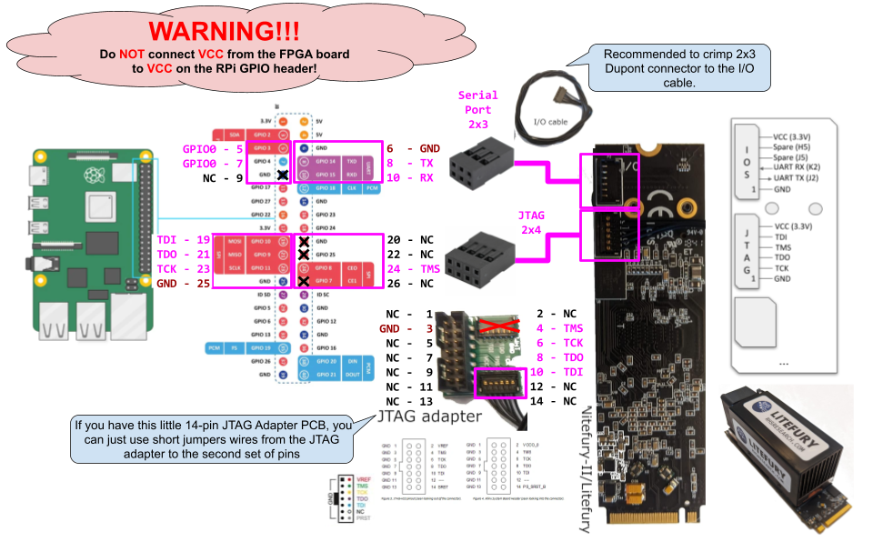

\[[top](./README.md)\] \[[spec](./acorn.md)\]

# Sqrl Acorn CLE-215+ / LiteFury Pinmap and Wiring Guide

Pinmap and step-by-step wiring instructions for connecting a Sqrl Acorn CLE-215+ (or LiteFury/NiteFury) to a Raspberry Pi 5 in the fpgas.online test infrastructure.

See [acorn.md](acorn.md) for board specs and deployment inventory.

## Wiring Diagram



([Edit diagram](https://docs.google.com/drawings/d/1HCOHrvFzj1fIf6DqDMzcqoQgjaD5ZvM39MtgvrAjqEU/edit))

**CRITICAL: The VCC (3.3V) wire on both P1 and P2 must NEVER be connected to the RPi header. Leave VCC wires unconnected or clipped. Connecting VCC between the Acorn and RPi can damage the RPi's power management chip.**

## Bill of Materials

| Item | Description | Qty |
|------|-------------|-----|
| Sqrl Acorn CLE-215+ | M.2 M-key PCIe FPGA accelerator | 1 |
| Raspberry Pi 5 | 8 GB recommended | 1 |
| M.2 PCIe HAT for RPi 5 | M.2 M-key to RPi PCIe adapter (e.g. Pimoroni NVMe Base, Geekworm X1001) | 1 |
| Molex Pico-EZmate cable (6-pin) | [Molex 0369200601](https://www.digikey.fr/en/products/detail/molex/0369200601/10233018) | 1 |
| 2×3 Dupont pin header (2.54 mm) | For P2 (UART/GPIO) connector | 1 |
| 2×4 Dupont pin header (2.54 mm) | For P1 (JTAG) connector | 1 |
| Solder + heat shrink | For cable termination | — |

## Board Connectors

The Acorn exposes two 6-pin Molex Pico-EZmate connectors:

- **P1**: JTAG (programming and debug)
- **P2**: Serial / GPIO (UART and spare I/O)

Take one Pico-EZmate cable (plug at each end), cut it in half. This gives two cables — one for P1, one for P2. Strip ~3 mm of insulation from each wire.

Source: [LiteX Acorn CLE-215 wiki](https://github.com/enjoy-digital/litex/wiki/Use-LiteX-on-the-Acorn-CLE-215)

## P2: Serial / UART + GPIO (2×3 header → RPi pins 5-10)

The P2 connector provides UART and 2 spare GPIO pins. Solder or crimp Dupont connectors onto a **2×3 pin header** arranged to plug into RPi header pins 5-10.

### FPGA Pins

| P2 Pin | FPGA Pin | Function     | I/O Standard |
|--------|----------|--------------|--------------|
| 1      | K2       | Serial TX    | LVCMOS33     |
| 2      | J2       | Serial RX    | LVCMOS33     |
| 3      | J5       | Spare GPIO 0 | LVCMOS33     |
| 4      | H5       | Spare GPIO 1 | LVCMOS33     |
| 5      | GND      | Ground       | —            |
| 6      | VCC      | 3.3V         | —            |

### RPi GPIO Header Connection

```
RPi 40-pin header (top view, showing pins 3-12):

                       Pin 3     Pin 4
                      (GPIO2)   (  5V  )
                    ┌────────────────────┐
P2:3 Spare GPIO 0 ← │  Pin 5     Pin 6   │ → P2:5 GND
                    │ (GPIO3)   ( GND  ) │
                    │                    │
P2:4 Spare GPIO 1 ← │  Pin 7     Pin 8   │ → P2:1 Serial TX
                    │ (GPIO4)   (GPIO14) │
                    │                    │
P2:6 VCC (N/C)    ← │  Pin 9     Pin 10  │ → P2:2 Serial RX
                    │ ( GND )   (GPIO15) │
                    └────────────────────┘
                      Pin 11     Pin 12
                     (GPIO17)   (GPIO18)
```

**CRITICAL: P2 pin 6 (VCC 3.3V) must be left UNCONNECTED.** Clip or insulate the VCC wire. Pin 9 on the RPi header is left unused.

| P2 Pin | Function     | FPGA Pin | → RPi Header Pin | RPi GPIO | BCM Function |
|--------|--------------|----------|-------------------|----------|--------------|
| 1      | Serial TX    | K2       | Pin 8             | GPIO14   | TXD0         |
| 2      | Serial RX    | J2       | Pin 10            | GPIO15   | RXD0         |
| 3      | Spare GPIO 0 | J5       | Pin 5             | GPIO3    | I2C1_SCL     |
| 4      | Spare GPIO 1 | H5       | Pin 7             | GPIO4    | GPCLK0       |
| 5      | GND          | —        | Pin 6             | GND      | —            |
| 6      | VCC (3.3V)   | —        | **unconnected**   | —        | —            |

| Parameter | Value                                   |
|-----------|-----------------------------------------|
| Device    | `/dev/ttyAMA0`                          |
| Baud rate | 115200                                  |
| Pre-test  | `systemctl stop serial-getty@ttyAMA0`   |

## P1: JTAG (2×4 header → RPi pins 19-26)

The P1 connector provides standard Xilinx JTAG signals. Solder or crimp Dupont connectors onto a **2×4 pin header** arranged to plug into RPi header pins 19-26. Only 5 of the 8 header positions are connected — pin 20 (GND), pin 22 (GPIO25), and pin 26 (GPIO7) are unused, and the VCC wire is left unconnected.

### FPGA JTAG Pins

| P1 Pin | Function | Signal Direction |
|--------|----------|------------------|
| 1      | TCK      | RPi → FPGA       |
| 2      | TDI      | RPi → FPGA       |
| 3      | TDO      | FPGA → RPi       |
| 4      | TMS      | RPi → FPGA       |
| 5      | GND      | —                |
| 6      | VCC      | 3.3V (N/C)       |

### RPi GPIO Header Connection

```
RPi 40-pin header (top view, showing pins 17-28):

               Pin 17     Pin 18
              ( 3.3V )   (GPIO24)
            ┌─────────────────────┐
 P1:2 TDI ← │  Pin 19      Pin 20 │ → (unused)
            │ (GPIO10)   ( GND  ) │
            │                     │
 P1:3 TDO ← │  Pin 21     Pin 22  │ → (unused)
            │ (GPIO9 )   (GPIO25) │
            │                     │
 P1:1 TCK ← │  Pin 23     Pin 24  │ → P1:4 TMS
            │ (GPIO11)   (GPIO8 ) │
            │                     │
 P1:5 GND ← │  Pin 25     Pin 26  │ → P1:6 VCC (N/C)
            │ ( GND  )   (GPIO7 ) │
            └─────────────────────┘
               Pin 27     Pin 28
              (GPIO0 )   (GPIO1 )
```

**CRITICAL: P1 pin 6 (VCC 3.3V) must be left UNCONNECTED.** Clip or insulate the VCC wire. Pin 26 (GPIO7) on the RPi header is left unused.

| P1 Pin | Function   | FPGA Pin | → RPi Header Pin | RPi GPIO | BCM Function |
|--------|------------|----------|-------------------|----------|--------------|
| 1      | TCK        | JTAG     | Pin 23            | GPIO11   | SPI0_SCLK    |
| 2      | TDI        | JTAG     | Pin 19            | GPIO10   | SPI0_MOSI    |
| 3      | TDO        | JTAG     | Pin 21            | GPIO9    | SPI0_MISO    |
| 4      | TMS        | JTAG     | Pin 24            | GPIO8    | SPI0_CE0     |
| 5      | GND        | —        | Pin 25            | GND      | —            |
| 6      | VCC (3.3V) | —        | **unconnected**   | —        | —            |

JTAG signals are mapped to the RPi's SPI0 pins for compatibility with openFPGALoader's SPI-based JTAG transport. The SPI kernel modules must be unloaded before use (`rmmod spidev spi_bcm2835`).

## Assembly

1. Plug the P1 Pico-EZmate connector into the Acorn's **P1** (JTAG) socket.
2. Plug the P2 Pico-EZmate connector into the Acorn's **P2** (Serial/GPIO) socket.
3. Route the cables so they don't obstruct the M.2 connector or the PCIe edge fingers.
4. Mount the M.2 PCIe HAT onto the RPi 5.
5. Insert the Acorn into the M.2 M-key slot. Push firmly until fully seated; secure with retention screw.
6. Plug the **P2 header** (2×3) into RPi header pins 5-10.
7. Plug the **P1 header** (2×4) into RPi header pins 19-26.
8. Double-check orientation and verify VCC wires are not connected.

**Important**: Verify the wire order of your specific Pico-EZmate cable with a multimeter before connecting. The pin numbering on the Pico-EZmate connector may not match the wire colour order.

## Verification

### Step 1: Boot and Verify PCIe

```bash
lspci
# Expected: 0001:01:00.0 Processing accelerators: Squirrels Research Labs Acorn CLE-215+
```

If the Acorn doesn't appear: check M.2 seating, FPC cable, `dmesg | grep -i pci`.

### Step 2: Test JTAG Programming

```bash
# Unload SPI modules that claim GPIO7-11
sudo rmmod spidev spi_bcm2835

# Program using GPIO bitbang JTAG
# Pin order: TDI(GPIO10):TDO(GPIO9):TCK(GPIO11):TMS(GPIO8)
openFPGALoader --cable linuxgpiod_bitbang --pins 10:9:11:8 <bitstream.bit>

# On RPi 5 with RP1 PIO support (faster, when available):
openFPGALoader -c rp1pio --pins 10:9:11:8 <bitstream.bit>
```

### Step 3: Test UART and GPIO

```bash
sudo systemctl stop serial-getty@ttyAMA0
sudo systemctl mask serial-getty@ttyAMA0

# Program loopback bitstream
openFPGALoader --cable linuxgpiod_bitbang --pins 10:9:11:8 gpio-loopback-acorn.bit

# Test UART (loopback inverts)
stty -F /dev/ttyAMA0 115200 raw -echo
echo "test" > /dev/ttyAMA0

# Test GPIO (loopback inverts)
gpioset gpiochip0 3=1
gpioget gpiochip0 4
# Expected: 0 (inverted)
```

### Step 4: Test PMOD Pin ID

```bash
openFPGALoader --cable linuxgpiod_bitbang --pins 10:9:11:8 pmod-pin-id-acorn.bit

# Each pin transmits its FPGA ball name at 1200 baud:
# GPIO14 → "K2" (serial TX)
# GPIO15 → "J2" (serial RX)
# GPIO3  → "J5" (spare GPIO 0)
# GPIO4  → "H5" (spare GPIO 1)
```

### Step 5: Test PCIe Bitstream

```bash
openFPGALoader --cable linuxgpiod_bitbang --pins 10:9:11:8 pcie-acorn.bit
echo 1 > /sys/bus/pci/rescan
lspci | grep -i xilinx
# Expected: device with Xilinx vendor ID 10ee
```

## Troubleshooting

| Problem | Likely Cause | Fix |
|---------|-------------|-----|
| Acorn not on PCIe | M.2 not seated, FPC cable loose | Reseat M.2, check FPC |
| JTAG programming fails | SPI modules loaded, wrong pins | `rmmod spidev spi_bcm2835`, verify pin order |
| No UART output | serial-getty holding port, wrong baud | Mask serial-getty, use 115200 |
| GPIO pins don't respond | Cable wired incorrectly | Check Pico-EZmate pin order with multimeter |
| PCIe device not appearing after programming | Need PCIe rescan | `echo 1 > /sys/bus/pci/rescan` |

## Compatible Boards

All boards share the same PCB layout and pin assignments. The LiteX platform file `sqrl_acorn.py` works for all variants — change only the device string.

| Board          | FPGA            | Speed Grade | DDR3   | PCIe    |
|----------------|-----------------|-------------|--------|---------|
| LiteFury       | XC7A100T-FBG484 | -2          | 512 MB | Gen2 x4 |
| NiteFury       | XC7A200T-FBG484 | -2          | 512 MB | Gen2 x4 |
| Acorn CLE-215  | XC7A200T-FBG484 | -2          | 1 GB   | Gen2 x4 |
| Acorn CLE-215+ | XC7A200T-FBG484 | -3          | 1 GB   | Gen2 x4 |

## References

- Board spec: [acorn.md](acorn.md)
- LiteX wiki: [Use LiteX on the Acorn CLE-215](https://github.com/enjoy-digital/litex/wiki/Use-LiteX-on-the-Acorn-CLE-215)
- LiteX platform: [sqrl_acorn.py](https://github.com/litex-hub/litex-boards/blob/master/litex_boards/platforms/sqrl_acorn.py)
- NiteFury/LiteFury: [RHSResearchLLC/NiteFury-and-LiteFury](https://github.com/RHSResearchLLC/NiteFury-and-LiteFury)
- OpenOCD flashing: [NiteFury/Acorn flashing guide](https://github.com/Gbps/nitefury-openocd-flashing-guide)
- Molex Pico-EZmate cable: <https://www.digikey.fr/en/products/detail/molex/0369200601/10233018>
