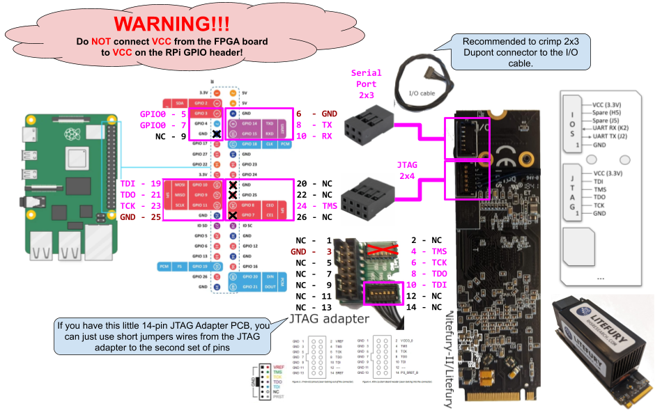
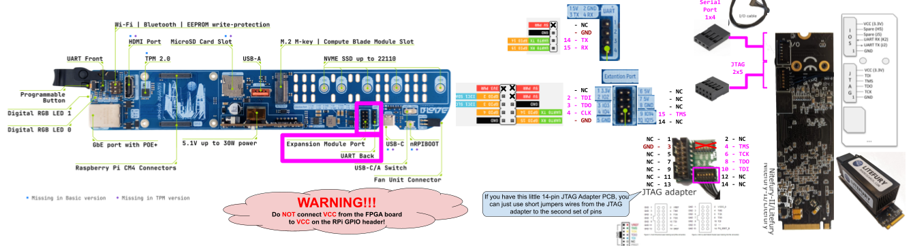

\[[top](./README.md)\] \[[spec](./acorn.md)\]

# Sqrl Acorn CLE-215+ / LiteFury Pinmap and Wiring Guide

Pinmap and step-by-step wiring instructions for connecting a Sqrl Acorn CLE-215+ (or LiteFury/NiteFury) to a Raspberry Pi 5 in the fpgas.online test infrastructure.

See [acorn.md](acorn.md) for board specs and deployment inventory.

> **Revised 2026-09-03.** The P2 serial wiring below was corrected after the
> pin-ID design was run on the Welland boards on 2026-08-31 (see
> [Measured P2 wiring](#measured-p2-wiring-welland-2026-08-31)). The earlier
> revision of this page wired FPGA TX (K2) to the Pi's TXD0, i.e. transmitter
> into transmitter, which cannot work with the hardware UART (`/dev/ttyAMA0`)
> that every host and test script uses. The crossover is the fleet standard,
> not a Compute Blade special case.

## Wiring Diagram



([Edit diagram](https://docs.google.com/drawings/d/1HCOHrvFzj1fIf6DqDMzcqoQgjaD5ZvM39MtgvrAjqEU/edit))

**The diagram still shows the old, non-crossover P2 serial wiring (P2:1 → pin 8).
Follow the tables below, not the picture, until the drawing is updated.**

**CRITICAL: The VCC (3.3V) wire on both P1 and P2 must NEVER be connected to the RPi header. Leave VCC wires unconnected or clipped. Connecting VCC between the Acorn and RPi can damage the RPi's power management chip.**

## Bill of Materials

| Item | Description | Qty |
|------|-------------|-----|
| Sqrl Acorn CLE-215+ | M.2 M-key PCIe FPGA accelerator | 1 |
| Raspberry Pi 5 | 8 GB recommended | 1 |
| M.2 PCIe HAT for RPi 5 | M.2 M-key to RPi PCIe adapter (e.g. Pimoroni NVMe Base, Geekworm X1001) | 1 |
| Molex Pico-EZmate cable (6-pin) | [Molex 0369200601](https://www.digikey.fr/en/products/detail/molex/0369200601/10233018) | 1 |
| 2×3 Dupont pin header (2.54 mm) | For P2 (UART/GPIO) connector | 1 |
| 2×4 Dupont pin header (2.54 mm) | For P1 (JTAG) connector | 1 |
| Solder + heat shrink | For cable termination | — |

## Board Connectors

The Acorn exposes two 6-pin Molex Pico-EZmate connectors:

- **P1**: JTAG (programming and debug)
- **P2**: Serial / GPIO (UART and spare I/O)

Take one Pico-EZmate cable (plug at each end), cut it in half. This gives two cables — one for P1, one for P2. Strip ~3 mm of insulation from each wire.

Source: [LiteX Acorn CLE-215 wiki](https://github.com/enjoy-digital/litex/wiki/Use-LiteX-on-the-Acorn-CLE-215)

## P2: Serial / UART + GPIO (2×3 header → RPi pins 5-10)

The P2 connector provides UART and 2 spare GPIO pins. Solder or crimp Dupont connectors onto a **2×3 pin header** arranged to plug into RPi header pins 5-10.

### FPGA Pins

| P2 Pin | FPGA Pin | Function                    | I/O Standard |
|--------|----------|-----------------------------|--------------|
| 1      | K2       | Serial TX (FPGA drives)     | LVCMOS33     |
| 2      | J2       | Serial RX (FPGA input)      | LVCMOS33     |
| 3      | J5       | Spare GPIO 0                | LVCMOS33     |
| 4      | H5       | Spare GPIO 1                | LVCMOS33     |
| 5      | GND      | Ground                      | —            |
| 6      | VCC      | 3.3V                        | —            |

### RPi GPIO Header Connection

The serial pair is a **null-modem crossover**: the FPGA's transmitter (K2) lands
on the Pi's receiver (GPIO15 / RXD0) and the FPGA's receiver (J2) on the Pi's
transmitter (GPIO14 / TXD0). This follows the Raspberry Pi header convention
(pin 8 = TXD, pin 10 = RXD) that `/dev/ttyAMA0` uses on every Pi generation,
and it is the same convention the NeTV2 boards on this site use
([site-welland.md](site-welland.md#gpio-uart): FPGA TX → GPIO15, FPGA RX → GPIO14).

How hard that convention is depends on the host:

- **BCM2711 / BCM2837 hosts (Pi 3, Pi 4, CM4):** the PL011 mux is fixed —
  GPIO14 can only be a UART transmitter and GPIO15 only a receiver — so the
  crossover is the one wiring that can work.
- **RP1 hosts (Pi 5, CM5):** the hardware UART0 is likewise only offered as
  GPIO14 = `TXD0`, GPIO15 = `RXD0` (`pinctrl funcs 14,15` on pi-sw2-p29 lists
  no alt where they swap), so a non-crossover cable cannot use `/dev/ttyAMA0`
  either. But the RP1 also exposes `PIO14`/`PIO15` (`/dev/pio0`, `rp1_pio`
  module loaded on the fleet), and a PIO UART program can put TX or RX on any
  header pin — see option 2 under the
  [Compute Blade wiring variant](#compute-blade-wiring-variant). Nobody has written that driver for the test
  scripts, so the fleet standardises on the crossover and one cable design
  works on every host.

```
RPi 40-pin header (top view, showing pins 3-12):

                       Pin 3     Pin 4
                      (GPIO2)   (  5V  )
                    ┌────────────────────┐
P2:3 Spare GPIO 0 ← │  Pin 5     Pin 6   │ → P2:5 GND
                    │ (GPIO3)   ( GND  ) │
                    │                    │
P2:4 Spare GPIO 1 ← │  Pin 7     Pin 8   │ → P2:2 Serial RX (J2)
                    │ (GPIO4)   (GPIO14) │     Pi TXD0 → FPGA
                    │                    │
P2:6 VCC (N/C)    ← │  Pin 9     Pin 10  │ → P2:1 Serial TX (K2)
                    │ ( GND )   (GPIO15) │     FPGA → Pi RXD0
                    └────────────────────┘
                      Pin 11     Pin 12
                     (GPIO17)   (GPIO18)
```

**CRITICAL: P2 pin 6 (VCC 3.3V) must be left UNCONNECTED.** Clip or insulate the VCC wire. Pin 9 on the RPi header is left unused.

| P2 Pin | Function     | FPGA Pin | → RPi Header Pin | RPi GPIO | BCM Function | Direction        |
|--------|--------------|----------|-------------------|----------|--------------|------------------|
| 1      | Serial TX    | K2       | Pin 10            | GPIO15   | RXD0         | FPGA → Pi        |
| 2      | Serial RX    | J2       | Pin 8             | GPIO14   | TXD0         | Pi → FPGA        |
| 3      | Spare GPIO 0 | J5       | Pin 5             | GPIO3    | I2C1_SCL     | either           |
| 4      | Spare GPIO 1 | H5       | Pin 7             | GPIO4    | GPCLK0       | either           |
| 5      | GND          | —        | Pin 6             | GND      | —            | —                |
| 6      | VCC (3.3V)   | —        | **unconnected**   | —        | —            | —                |

| Parameter | Value                                                                 |
|-----------|-----------------------------------------------------------------------|
| Device    | `/dev/ttyAMA0` (RP1 uart0; see the Pi 5 note below)                   |
| Baud rate | 115200                                                                |
| Pre-test  | `systemctl stop serial-getty@ttyAMA0` (already inactive on the fleet) |

**Pi 5 needs an explicit overlay for this UART.** `bcm2712-rpi-5-b.dtb` ships the
RP1 header UART (`serial0`) as `status="disabled"`, and `dtoverlay=disable-bt`
— which frees the header UART on Pi 0–4 as a side effect — resolves to
`disable-bt-pi5.dtbo` on a Pi 5, whose only fragment targets `bluetooth`. So
without `[pi5] dtoverlay=uart0-pi5` in `config.txt` there is no `/dev/ttyAMA0`
at all. Enabling it also makes the firmware resolve `console=serial0` to
`ttyAMA0`, which would put the kernel console (and its getty) on the FPGA's
serial pins — see [Kernel console SysRq](#known-issue-kernel-console-sysrq-on-the-fpga-uart)
— so the Pi 5s are pinned to `console=ttyAMA10` (the dedicated debug connector)
via `[pi5] cmdline=cmdline-pi5.txt`. Both are applied to the Welland NFS root by
fpgas.online-infra PR #32 (rolled out 2026-08-30) and asserted by its
`verify-pi.yml --tags uart` play. Verified live 2026-09-03 on all six Welland
Acorn hosts: `/dev/ttyAMA0` present, `console=ttyAMA10`, `serial-getty@ttyAMA0`
inactive.

**Hazard — never drive a Pi GPIO against an FPGA output.** With the pin-ID design
loaded every P2 ball is an FPGA *output* (J2 included), so setting GPIO14 to
`a4` (TXD0) or `op` while pin-ID is running is output-vs-output contention on
the J2 wire. Doing exactly that crashed **both** pi-sw2-p47 and pi-sw2-p48
instantly on 2026-08-31 (p47 needed a PoE cycle). Probe with
`pinctrl set 14 ip pn` (input, no pull) and only restore `pinctrl set 14 a4`
once a design that treats J2 as an input is loaded.

## P1: JTAG (2×4 header → RPi pins 19-26)

The P1 connector provides standard Xilinx JTAG signals. Solder or crimp Dupont connectors onto a **2×4 pin header** arranged to plug into RPi header pins 19-26. Only 5 of the 8 header positions are connected — pin 20 (GND), pin 22 (GPIO25), and pin 26 (GPIO7) are unused, and the VCC wire is left unconnected.

### FPGA JTAG Pins

| P1 Pin | Function | Signal Direction |
|--------|----------|------------------|
| 1      | TCK      | RPi → FPGA       |
| 2      | TDI      | RPi → FPGA       |
| 3      | TDO      | FPGA → RPi       |
| 4      | TMS      | RPi → FPGA       |
| 5      | GND      | —                |
| 6      | VCC      | 3.3V (N/C)       |

### RPi GPIO Header Connection

```
RPi 40-pin header (top view, showing pins 17-28):

               Pin 17     Pin 18
              ( 3.3V )   (GPIO24)
            ┌─────────────────────┐
 P1:2 TDI ← │  Pin 19      Pin 20 │ → (unused)
            │ (GPIO10)   ( GND  ) │
            │                     │
 P1:3 TDO ← │  Pin 21     Pin 22  │ → (unused)
            │ (GPIO9 )   (GPIO25) │
            │                     │
 P1:1 TCK ← │  Pin 23     Pin 24  │ → P1:4 TMS
            │ (GPIO11)   (GPIO8 ) │
            │                     │
 P1:5 GND ← │  Pin 25     Pin 26  │ → P1:6 VCC (N/C)
            │ ( GND  )   (GPIO7 ) │
            └─────────────────────┘
               Pin 27     Pin 28
              (GPIO0 )   (GPIO1 )
```

**CRITICAL: P1 pin 6 (VCC 3.3V) must be left UNCONNECTED.** Clip or insulate the VCC wire. Pin 26 (GPIO7) on the RPi header is left unused.

| P1 Pin | Function   | FPGA Pin | → RPi Header Pin | RPi GPIO | BCM Function |
|--------|------------|----------|-------------------|----------|--------------|
| 1      | TCK        | JTAG     | Pin 23            | GPIO11   | SPI0_SCLK    |
| 2      | TDI        | JTAG     | Pin 19            | GPIO10   | SPI0_MOSI    |
| 3      | TDO        | JTAG     | Pin 21            | GPIO9    | SPI0_MISO    |
| 4      | TMS        | JTAG     | Pin 24            | GPIO8    | SPI0_CE0     |
| 5      | GND        | —        | Pin 25            | GND      | —            |
| 6      | VCC (3.3V) | —        | **unconnected**   | —        | —            |

JTAG signals are mapped to the RPi's SPI0 pins for compatibility with openFPGALoader's SPI-based JTAG transport. On Pi 0–4 the SPI kernel modules must be unloaded before use (`rmmod spidev spi_bcm2835`). On the Pi 5 fleet this is not needed — `pinctrl` shows GPIO8–11 as `none` (unclaimed) even with the modules loaded — but it is harmless.

### Pi 5: openFPGALoader and `gpiochip0`

The 40-pin header on a Pi 5 is **`/dev/gpiochip15`** on the deployed kernel
(6.12.x: only `gpiochip11`–`gpiochip15` exist; verified 2026-09-03). The
Welland NFS root ships Debian's openFPGALoader **v0.10.0**, whose libgpiod
backend opens `/dev/gpiochip0` unconditionally and fails with:

```
JTAG init failed with: Unable to open gpio chip
```

Workaround used in the field (devtmpfs, so it vanishes on reboot):

```bash
sudo ln -sfn /dev/gpiochip15 /dev/gpiochip0
```

The proper fix is a newer openFPGALoader: v0.12+ adds the `rp1pio` cable
(RP1 PIO-driven JTAG) and v0.13.1 (already on the PS1 blades) adds
`--read-dna`, `--read-xadc` and `--read-register`, all read-only. Shipping the
`openfpgaloader-rp1pio` build from
[mithro/rp1-jtag](https://github.com/mithro/rp1-jtag) in the NFS root is
fpgas.online-infra PR #48 (open; blocked on the package reaching the apt repo).

`--detect` is read-only and safe to run against a live PCIe endpoint. Loading a
bitstream is not — see the PCIe detach rule under
[Step 2](#step-2-test-jtag-programming).

## Assembly

1. Plug the P1 Pico-EZmate connector into the Acorn's **P1** (JTAG) socket.
2. Plug the P2 Pico-EZmate connector into the Acorn's **P2** (Serial/GPIO) socket.
3. Route the cables so they don't obstruct the M.2 connector or the PCIe edge fingers.
4. Mount the M.2 PCIe HAT onto the RPi 5.
5. Insert the Acorn into the M.2 M-key slot. Push firmly until fully seated; secure with retention screw.
6. Plug the **P2 header** (2×3) into RPi header pins 5-10.
7. Plug the **P1 header** (2×4) into RPi header pins 19-26.
8. Double-check orientation and verify VCC wires are not connected.

**Important**: Verify the wire order of your specific Pico-EZmate cable with a multimeter before connecting. The pin numbering on the Pico-EZmate connector may not match the wire colour order.

## Verification

### Step 1: Boot and Verify PCIe

```bash
lspci -nn -s 0001:01:00.0
# Factory Sqrl firmware in flash:
#   0001:01:00.0 Processing accelerators [1200]: Squirrels Research Labs Acorn CLE-215+ [1e24:021f]
# A LiteX/Vivado design in flash (pi-sw2-p44 today):
#   0001:01:00.0 Processing accelerators [1200]: Xilinx Corporation 7-Series FPGA Hard PCIe block (AXI/debug) [10ee:7011]
```

If the Acorn doesn't appear: check M.2 seating, FPC cable, `dmesg | grep -i pci`.

### Step 2: Test JTAG Programming

**Detach the PCIe endpoint before every JTAG reconfiguration.** Reconfiguring
the FPGA while its endpoint is enumerated is a surprise removal that the
BCM2712 root complex does not survive: on 2026-08-31 it crashed pi-sw2-p47
outright mid-load (SSH dropped, Pi rebooted). With the endpoint removed first
the same load completes cleanly and the host is unaffected.

```bash
# 0. Detach the endpoint (restore later with a rescan, or just reboot)
echo 1 | sudo tee /sys/bus/pci/devices/0001:01:00.0/remove

# 1. Read-only sanity check (safe even without step 0)
sudo ln -sfn /dev/gpiochip15 /dev/gpiochip0   # openFPGALoader 0.10.0 on Pi 5 only
openFPGALoader --cable libgpiod --pins 10:9:11:8 --detect
# Expected: idcode 0x3636093 (XC7A200T; the .bit header reads 7a200tfbg484)

# 2. Load to SRAM (volatile). Pin order: TDI(GPIO10):TDO(GPIO9):TCK(GPIO11):TMS(GPIO8)
openFPGALoader --cable libgpiod --pins 10:9:11:8 <bitstream.bit>
# ~16 s for a 1.6 MB XC7A200T bitstream over bit-banged libgpiod (measured 2026-08-31)

# With the rp1pio build (openFPGALoader 0.12+, infra PR #48):
openFPGALoader -c rp1pio --pins 10:9:11:8 <bitstream.bit>
```

Never pass `--write-flash` here: SRAM loads are lost on power cycle, so a
reboot always restores whatever is in flash, which makes every experiment safe.
See [acorn-pcie-programming.md](acorn-pcie-programming.md) for the flash story.

**Files staged under `/home/pi` do not survive a reboot.** The Pi root is
`overlayroot=tmpfs` on a read-only NFS root. The symptom is openFPGALoader
printing `Open file … FAIL` in under 0.1 s — re-copy the bitstream.

### Step 3: Test UART and GPIO

```bash
sudo systemctl stop serial-getty@ttyAMA0
sudo systemctl mask serial-getty@ttyAMA0

# Program loopback bitstream (detach PCIe first, see Step 2)
openFPGALoader --cable libgpiod --pins 10:9:11:8 gpio-loopback-acorn.bit

# Test UART (loopback inverts)
stty -F /dev/ttyAMA0 115200 raw -echo
echo "test" > /dev/ttyAMA0

# Test GPIO (loopback inverts). The header is gpiochip15 on a Pi 5 (line N == GPIO N).
gpioset gpiochip15 3=1
gpioget gpiochip15 4
# Expected: 0 (inverted)
```

### Step 4: Test PMOD Pin ID

```bash
openFPGALoader --cable libgpiod --pins 10:9:11:8 pmod-pin-id-acorn.bit

# Each pin transmits its FPGA ball name at 1200 baud. With correct wiring:
# GPIO15 → "K2" (serial TX, on the Pi's RXD0)
# GPIO14 → "J2" (serial RX, on the Pi's TXD0)
# GPIO3  → "J5" (spare GPIO 0)
# GPIO4  → "H5" (spare GPIO 1)
```

Only GPIO15 can be a hardware UART receiver on a Pi 5, so decode the other
three from sampled GPIO values (the repo scanner
`designs/pmod-pin-id/host/identify_pmod_pins.py` bit-bangs 1200 baud over
gpiod and finds the header chip by label, so it works on a Pi 5) or from
`gpiomon` edge timestamps (833 µs per bit against nanosecond stamps). Keep
GPIO14 as an input throughout — see the hazard above. Validate the method on
a positive control before trusting a negative: drive a spare Pi GPIO and
confirm the monitor sees it.

**Historical note:** the Acorn pin-ID design had no clock until test-designs
PR #10 (merged 2026-08-31). The Acorn's default clock is the differential
200 MHz `clk200` pair (J19/H19), which migen's implicit default-clock wiring
cannot turn into a usable `sys` clock, so the design built, configured and
every pin sat idle — which read as "cable not connected" and hid the real
wiring for a day. Use the release bitstreams built after that fix.

### Step 5: Test PCIe Bitstream

```bash
echo 1 | sudo tee /sys/bus/pci/devices/0001:01:00.0/remove   # detach first
openFPGALoader --cable libgpiod --pins 10:9:11:8 pcie-acorn.bit
echo 1 | sudo tee /sys/bus/pci/rescan
lspci -nn | grep -i xilinx
# Expected: device with Xilinx vendor ID 10ee (LitePCIe default 10ee:7011)
```

## Measured P2 wiring (Welland, 2026-08-31)

Read off each wire with the fixed pin-ID bitstream
(`pmod-pin-id_acorn-cle-215p_vivado-vivado_sqrl_acorn.bit`, see
[acorn-pcie-programming.md](acorn-pcie-programming.md#prebuilt-vivado-bitstreams)):
GPIO15 decoded through `/dev/ttyAMA0`, the other three lines decoded in software
from `gpiomon` edge timestamps.

| Host       | GPIO14 | GPIO15 | GPIO3 | GPIO4 | Verdict                                              |
|------------|--------|--------|-------|-------|------------------------------------------------------|
| pi-sw2-p29 | J2     | K2     | dead  | H5    | Serial pair correct; **J5 wire dead** (0 edges)       |
| pi-sw2-p46 | J2     | K2     | J5    | H5    | Correct                                              |
| pi-sw2-p48 | J2     | K2     | J5    | H5    | Correct                                              |
| pi-sw2-p47 | K2     | J2     | H5    | J5    | **Both pairs transposed** — reversed connector        |
| pi-sw2-p43 | —      | —      | —     | —     | Not testable: JTAG scans an empty chain (see below)   |
| pi-sw2-p44 | —      | —      | —     | —     | Not testable: JTAG scans an empty chain (see below)   |

- **p47 fix:** transpose *both* pairs (K2↔J2 and J5↔H5) so that K2 → GPIO15,
  J2 → GPIO14, J5 → GPIO3, H5 → GPIO4. This is **not** a 180° re-seat of the
  2×3 header — rotating it maps pin 5↔10 and 7↔8, which does not give the
  target. Only the serial pair is functionally critical; the J5/H5 order is
  cosmetic.
- **p43 / p44:** both enumerate on PCIe (p43 with the Sqrl factory ID, p44
  with `10ee:7011`), but `openFPGALoader --detect` reports `found 0 devices`
  on both, so nothing can be loaded. The P1 (JTAG) cable or its wiring needs
  a physical check; the same "TCK has no pull-up when P1 is unmated" test used
  on the PS1 blades applies.
- P2 was previously believed to be unconnected on these boards; that
  conclusion came from the clockless pin-ID design and was wrong.

Before the pin-ID run, a zero-risk passive check gives the same answer with no
bitstream loaded: toggle the Pi's internal pull-up then pull-down on each line
and see whether it follows. A ~50 kΩ internal pull loses to any real driver, so
a line that follows is floating (far end is an FPGA input, i.e. J2), and a line
that stays put is driven (far end is an FPGA output, i.e. K2). Do not read
GPIO2/GPIO3 this way — they are SDA1/SCL1 and carry board pull-ups.

**Device DNA is not readable on the Welland boards yet.** With openFPGALoader
0.10.0 (no `--read-dna`) a hand-rolled `ISC_ENABLE` + `ISC_DNA` openocd
sequence returned `ffffffffffffffff` on both configured and unconfigured
devices while IDCODE/USERCODE read fine, so the value has to wait for the
openFPGALoader upgrade (PR #48), where `--read-dna` works first time on PS1.

## Compute Blade Wiring Variant

The [Compute Blade](https://computeblade.com/) carrier board for CM4/CM5 does **not** expose the full RPi 40-pin GPIO header. Only a subset of GPIOs are available on physical connectors. This requires a different pin mapping from the standard RPi 5 wiring above.



([Edit diagram](https://docs.google.com/drawings/d/1hKt7O_IR60R6uT8VOg2O9PEAp4a8fNmp7BFqi3YYjgQ/edit))

### Available Connectors

| Connector | GPIOs | Physical Pins |
|-----------|-------|---------------|
| Expansion Module Port | GPIO2, GPIO3, GPIO4, GPIO14, GPIO15 | RPi header pins 1-10 |
| UART Front (3-pin) | GPIO14, GPIO15 | TX, RX, GND |
| UART Back (4-pin) | GPIO14, GPIO15 | TX, RX, GND, V5 |
| Fan Unit (4-pin) | GPIO12, GPIO13 | PWM0/UART5-TX, PWM1/UART5-RX |

GPIO14/15 are shared across the Expansion Port, UART Front, and UART Back — they are the same electrical lines. GPIO8-11 (SPI0) are **not** exposed on the Compute Blade.

Source: [Compute Blade GPIO documentation](https://docs.computeblade.com/blade/guides/gpio)

### Pin Mapping

Since JTAG and UART are never active simultaneously (JTAG programs the FPGA first, then UART communicates with the running design), GPIO14 can be time-shared between TMS (during JTAG) and UART TX (during testing).

Both P1 (JTAG) and P2 (UART/GPIO) connect to the **Expansion Module Port** (pins 1-10):

```
Compute Blade Expansion Module Port
(RPi header pins 1-10, top view):

                     Pin 1      Pin 2
                    ( 3.3V )   (  5V  )
                  ┌──────────────────────┐
  P1:2 TDI     ← │  Pin 3      Pin 4    │ → (unused, 5V)
                  │ (GPIO2)    (  5V  )  │
                  │                      │
  P1:3 TDO     ← │  Pin 5      Pin 6    │ → P1:5 GND
                  │ (GPIO3)    ( GND  )  │
                  │                      │
  P1:1 TCK     ← │  Pin 7      Pin 8    │ → P1:4 TMS / P2:1 TX
                  │ (GPIO4)    (GPIO14)  │
                  │                      │
  P2:5 GND     ← │  Pin 9      Pin 10   │ → P2:2 RX
                  │ ( GND  )   (GPIO15)  │
                  └──────────────────────┘
```

**P1 (JTAG) → Expansion Port:**

| P1 Pin | Function   | → Expansion Port Pin | GPIO   |
|--------|------------|----------------------|--------|
| 1      | TCK        | Pin 7                | GPIO4  |
| 2      | TDI        | Pin 3                | GPIO2  |
| 3      | TDO        | Pin 5                | GPIO3  |
| 4      | TMS        | Pin 8                | GPIO14 |
| 5      | GND        | Pin 6                | GND    |
| 6      | VCC (3.3V) | **unconnected**      | —      |

**P2 (UART) → Expansion Port (with null modem crossover):**

To use the hardware UART (`/dev/ttyAMA0`), the FPGA TX (K2) must connect to the RPi RX (GPIO15) and FPGA RX (J2) to RPi TX (GPIO14) — the same crossover as the standard RPi 5 wiring above. On a CM4 the BCM2711 mux is fixed, so this is the only option; on a CM5 the RP1 offers a second one. Two options:

1. **Physical crossover** (simplest, and what the fleet uses): P2:1 (K2) to the RXD0 pin, P2:2 (J2) to the TXD0 pin.
2. **RP1 PIO UART** (Pi 5 / CM5 only, future): Use the RP1's PIO (`/dev/pio0`, `rp1_pio` module — both present on the Welland Pi 5s; `pinctrl set 14 a7` / `pinctrl set 15 a7` select `PIO14`/`PIO15`) to implement a software UART with TX on GPIO15 and RX on GPIO14, or on any other header pins. The [raspberrypi/utils piolib](https://github.com/raspberrypi/utils/tree/master/piolib) user-space API clones the Pico SDK PIO API, so the pico-sdk `uart_rx.pio` / `uart_tx.pio` programs should port with little change. No ready-made driver or PTY bridge exists yet — this would need to be written (test-designs issue #4).

| P2 Pin | Function     | → Expansion Port Pin | GPIO   | RPi UART0 Function |
|--------|--------------|----------------------|--------|--------------------|
| 1      | Serial TX    | Pin 10               | GPIO15 | RXD0 (RPi receives)|
| 2      | Serial RX    | Pin 8                | GPIO14 | TXD0 (RPi sends)  |
| 3      | Spare GPIO 0 | (not connected)      | —      | —                  |
| 4      | Spare GPIO 1 | (not connected)      | —      | —                  |
| 5      | GND          | Pin 9                | GND    | —                  |
| 6      | VCC (3.3V)   | **unconnected**      | —      | —                  |

**CRITICAL: VCC (3.3V) on both P1 and P2 must NEVER be connected.** Clip or insulate the VCC wires.

Note: P2 spare GPIOs (J5, H5) are not connected on the Compute Blade variant — only 5 GPIOs are available. P1:4 (TMS) and P2:2 (FPGA RX/J2) share GPIO14 (pin 8) — see switching procedure below.

### Shared Pin: GPIO14 (TMS + FPGA RX)

GPIO14 (Expansion Port pin 8) is shared between JTAG TMS and FPGA RX (J2). With the null modem crossover, FPGA RX (J2) is an **input** on the FPGA side for normal designs, so it does not drive GPIO14 and does not conflict with JTAG TMS. Designs that drive J2 as an output (pin-ID drives every P2 ball) do contend with TMS and cost JTAG until a PoE cycle — see the measured state above.

**JTAG programming:**

```bash
# Compute Blade JTAG pin order: TDI(GPIO2):TDO(GPIO3):TCK(GPIO4):TMS(GPIO14)
openFPGALoader --cable libgpiod --pins 2:3:4:14 <bitstream.bit>
```

**UART testing** (after openFPGALoader exits and releases GPIOs):

```bash
# Restore GPIO14/15 to UART function
pinctrl set 14 a4  # GPIO14 = TXD0
pinctrl set 15 a4  # GPIO15 = RXD0

stty -F /dev/ttyAMA0 115200 raw -echo
```

After openFPGALoader exits, GPIO14 may be left as a plain GPIO output. Use `pinctrl set 14 a4` to restore TXD0 function before opening the serial port.

### Physical Wiring

Since both P1 and P2 share the same Expansion Module Port, the Pico-EZmate wires are soldered to a single connector (or individual Dupont wires) that plugs into Expansion Port pins 3-10:

| Expansion Port Pin | Wire 1 (P1 JTAG) | Wire 2 (P2 UART)              |
|--------------------|-------------------|-------------------------------|
| Pin 3 (GPIO2)      | P1:2 TDI          | —                             |
| Pin 4 (5V)         | —                 | —                             |
| Pin 5 (GPIO3)      | P1:3 TDO          | —                             |
| Pin 6 (GND)        | P1:5 GND          | P2:5 GND                     |
| Pin 7 (GPIO4)      | P1:1 TCK          | —                             |
| Pin 8 (GPIO14)     | P1:4 TMS          | P2:2 Serial RX (FPGA J2→RPi TXD0) |
| Pin 9 (GND)        | —                 | (extra GND)                   |
| Pin 10 (GPIO15)    | —                 | P2:1 Serial TX (FPGA K2→RPi RXD0) |

Pin 8 (GPIO14) has two wires: TMS from P1 and FPGA RX (J2) from P2. These are soldered/crimped to the same header pin. Since JTAG and UART never run simultaneously, this is safe.

**Note the crossover**: P2:1 (FPGA TX/K2) goes to pin 10 (GPIO15/RXD0), and P2:2 (FPGA RX/J2) goes to pin 8 (GPIO14/TXD0). This is the same serial crossover as the standard RPi 5 wiring; the only Compute Blade differences are the JTAG pins and the absence of the two spare GPIOs.

**Important**: Pin 4 is 5V power — do NOT connect anything to it. VCC wires from both P1 and P2 must be left unconnected.

### Measured state of the PS1 blades (2026-08-31)

| Host | Module   | PCIe                              | JTAG                         | P2 serial                          |
|------|----------|-----------------------------------|------------------------------|------------------------------------|
| pi14 | CM4      | Acorn CLE-101 `1e24:0101`         | no response — P1 unmated     | untested (needs JTAG)              |
| pi16 | CM5 Lite | Acorn CLE-101 `1e24:0101`         | no response — P1 unmated     | untested (needs JTAG)              |
| pi18 | CM4      | none (M.2 empty)                  | n/a — negative control       | n/a                                |
| pi20 | CM5 Lite | XC7A100T design `10ee:7011`       | OK, DNA `0x0028e5c45e304854` | **crossover present**: K2→GPIO15, J2→GPIO14 |

pi20's wiring was read with the pin-ID design (`GPIO14 ← "J2"`, `GPIO15 ← "K2"`),
i.e. exactly the table above; test-designs issue #4 recorded the opposite and
the cable was evidently swapped after it was filed. "P1 unmated" comes from
GPIO4 (TCK): the Acorn's own JTAG pull-up shows only on pi20, while pi14/pi16
float exactly like pi18, which has no FPGA at all. Reseating P1 is the fix.

**CM4 has one correct wiring.** On a CM4 `GPIO14 = TXD0` and `GPIO15 = RXD0` are
alt0 on the BCM2711 and no mux option makes GPIO15 a transmitter, so FPGA TX
*must* land on GPIO15. On CM5/Pi 5 the RP1's hardware UART0 has the same
pin assignment, but its PIO block could implement a UART with either direction
on either pin; the fleet uses the same crossover everywhere so one cable design
works on both module types.

**Loading a TX-driving design costs JTAG until a PoE cycle** (issue #4 item 1):
after pin-ID the FPGA drives J2 → GPIO14, which is also TMS on the blade. A PoE
cycle of the blade's switch port restores everything in about 60 s (flash
bitstream reloads, `--detect` and DNA read again, PCIe endpoint back).

### Known Issue: Kernel Console SysRq on the FPGA UART

**WARNING**: If the host's kernel cmdline puts the console on the FPGA's UART
(`console=ttyAMA0`, or `console=serial0` on a Pi 5 once `uart0-pi5` is enabled),
loading any FPGA design that drives serial TX will **reboot/crash the system**.
This affects all designs with serial output (UART SoC, Pin-ID, GPIO loopback)
and applies to Pi 5 hosts as much as to Compute Blades.

**Root cause**: The FPGA drives K2 at the design's baud rate (e.g. 1200 for pin-id, 115200 for UART SoC). The kernel console receives this as garbage bytes due to baud rate mismatch or because the FPGA output starts before the UART framing is established. These garbage bytes trigger **SysRq commands** — including `reboot(b)`, `crash(c)`, `poweroff(o)`, and `kill-all-tasks(i)` — which destroy the running system. Netconsole from pi20 showed `sysrq: HELP` flooding every ~400 ms after programming until a destructive command hit.

**Fix** (apply both):
1. Move the kernel console off the FPGA UART. PS1 Compute Blades: `console=tty1`
   (all four blades, verified 2026-08-31). Welland Pi 5s: `console=ttyAMA10`
   (the debug connector) via `[pi5] cmdline=cmdline-pi5.txt`, so the getty
   systemd derives from the console lands there too (infra PR #32, verified
   2026-09-03 on all six hosts).
2. Disable SysRq: add `kernel.sysrq=0` to the kernel cmdline or `/etc/sysctl.d/`.

See [fpgas-online/todo#22](https://github.com/fpgas-online/todo/issues/22) and
test-designs issue #3 for tracking.

## Troubleshooting

| Problem | Likely Cause | Fix |
|---------|-------------|-----|
| Acorn not on PCIe | M.2 not seated, FPC cable loose | Reseat M.2, check FPC |
| JTAG programming fails | SPI modules loaded, wrong pins | `rmmod spidev spi_bcm2835`, verify pin order |
| `JTAG init failed with: Unable to open gpio chip` (Pi 5) | openFPGALoader 0.10.0 opens `/dev/gpiochip0`; header is `gpiochip15` | `ln -sfn /dev/gpiochip15 /dev/gpiochip0`, or upgrade to the rp1pio build (infra PR #48) |
| `--detect` says `found 0 devices` but PCIe enumerates | P1 (JTAG) cable unmated or miswired (pi-sw2-p43/p44, PS1 pi14/pi16) | Check TCK for the board's pull-up; reseat P1 |
| Pi reboots / SSH drops during a JTAG load | FPGA reconfigured while its PCIe endpoint was enumerated | `echo 1 > /sys/bus/pci/devices/0001:01:00.0/remove` before loading |
| `Open file … FAIL` in < 0.1 s | Bitstream vanished — `/home/pi` is tmpfs overlay, lost on reboot | Re-copy the file |
| Pi crashes the instant a Pi GPIO is set to output | Contention with an FPGA output on the same wire (pin-ID drives all four P2 balls) | Keep GPIO14 as input (`pinctrl set 14 ip pn`) while pin-ID runs |
| No `/dev/ttyAMA0` on a Pi 5 | RP1 uart0 disabled; `disable-bt` does not enable it on bcm2712 | `[pi5] dtoverlay=uart0-pi5` (infra PR #32) |
| No UART output | serial-getty holding port, wrong baud, or K2/J2 not crossed over | Mask serial-getty, use 115200, run pin-ID and check GPIO15 reads `K2` |
| Pi reboots when a serial design loads | Kernel console on the FPGA UART; SysRq | Console to `ttyAMA10` (Pi 5) / `tty1` (blade), `kernel.sysrq=0` |
| GPIO pins don't respond | Cable wired incorrectly | Check Pico-EZmate pin order with multimeter |
| PCIe device not appearing after programming | Need PCIe rescan | `echo 1 > /sys/bus/pci/rescan` |
| JTAG fails on Compute Blade | Wrong pin order | Use `--pins 2:3:4:14` not `--pins 10:9:11:8` |
| UART not working after JTAG on Compute Blade | GPIO14 still held by gpiod | Ensure openFPGALoader exited cleanly, then open `/dev/ttyAMA0` |
| Board hung, ~0.4 W on PoE instead of ~8 W | Wedged Pi 5 | PoE cycle the switch port (S3300 write community via gdoc2netcfg); a Pi 5 needs > 90 s to come back |

## Compatible Boards

All boards share the same PCB layout and pin assignments. The LiteX platform file `sqrl_acorn.py` works for all variants — change only the device string.

| Board          | FPGA            | Speed Grade | DDR3   | PCIe    |
|----------------|-----------------|-------------|--------|---------|
| LiteFury       | XC7A100T-FBG484 | -2          | 512 MB | Gen2 x4 |
| NiteFury       | XC7A200T-FBG484 | -2          | 512 MB | Gen2 x4 |
| Acorn CLE-215  | XC7A200T-FBG484 | -2          | 1 GB   | Gen2 x4 |
| Acorn CLE-215+ | XC7A200T-FBG484 | -3          | 1 GB   | Gen2 x4 |

## References

- Board spec: [acorn.md](acorn.md)
- LiteX wiki: [Use LiteX on the Acorn CLE-215](https://github.com/enjoy-digital/litex/wiki/Use-LiteX-on-the-Acorn-CLE-215)
- LiteX platform: [sqrl_acorn.py](https://github.com/litex-hub/litex-boards/blob/master/litex_boards/platforms/sqrl_acorn.py)
- NiteFury/LiteFury: [RHSResearchLLC/NiteFury-and-LiteFury](https://github.com/RHSResearchLLC/NiteFury-and-LiteFury)
- OpenOCD flashing: [NiteFury/Acorn flashing guide](https://github.com/Gbps/nitefury-openocd-flashing-guide)
- Molex Pico-EZmate cable: <https://www.digikey.fr/en/products/detail/molex/0369200601/10233018>
- Compute Blade: <https://computeblade.com/>
- Compute Blade GPIO docs: <https://docs.computeblade.com/blade/guides/gpio>
- Compute Blade GitHub: <https://github.com/uptime-lab/compute-blade>
