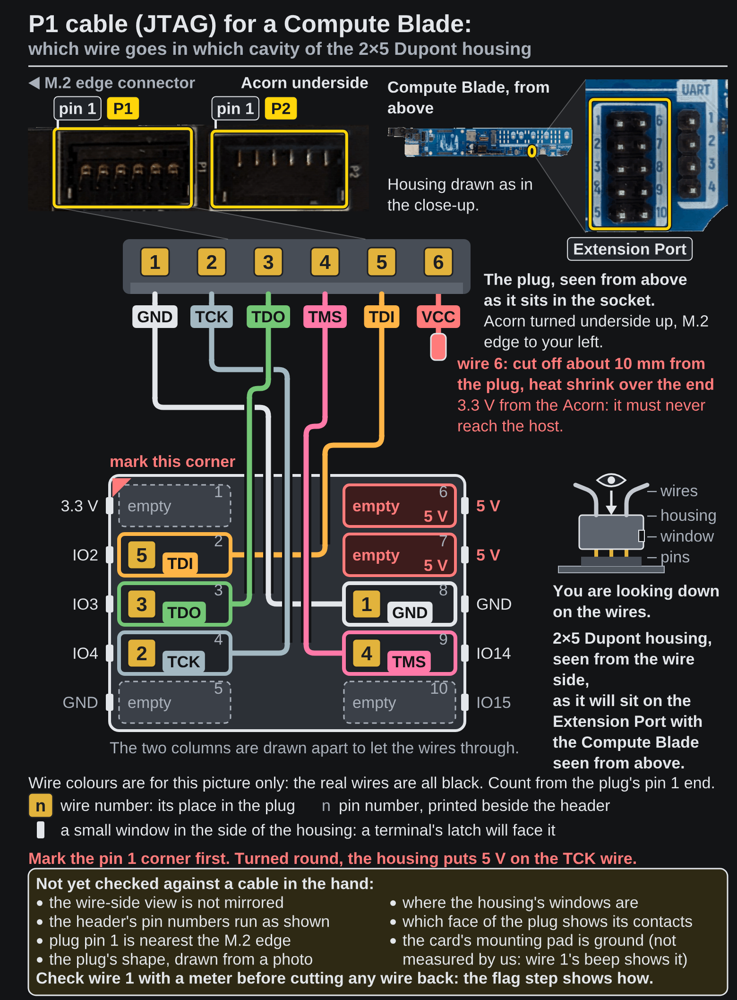

<!-- Generated by fpgas.online-test-designs docs/wiring/acorn/gen.py from wiring.toml. Edit wiring.toml there, not this file. -->

This procedure is waiting for its bench run: [issue #219](https://github.com/fpgas-online/fpgas.online-test-designs/issues/219).

Photos: Uptime Lab (Compute Blade), RHS Research (LiteFury underside; the Acorn is the same PCB).

## What you need

**Parts**

- the P1 cable with its wires flagged and a terminal crimped on each ([How to prepare the JTAG cable's wires (Compute Blade)](https://docs.fpgas.online/en/latest/boards/acorn/setup/compute-blade/jtag-wires.html))
- the empty 2×5 Dupont housing

**Tools**

- a paint pen, or a dot of tape
- a multimeter with a continuity buzzer, and a fine probe or a sewing pin

## Steps

**1.** Hold the empty 2×5 housing with the wire openings facing you and its long side upright, as in the picture. Until it is marked, either way up is the same. Mark the top left corner with a paint pen or a dot of tape: that is the pin 1 corner. For each wire, read the number on its flag and find the same number in the picture: that is the cavity its terminal goes in. Turned round, the housing puts 5 V on the TCK wire. That is above the most AMD's Artix 7 data sheet allows on an FPGA pin (DS181, Table 1). The most it allows is VCCO + 0.55 V, with VCCO at most 3.6 V. That can destroy the FPGA pin on the Acorn that wire reaches. Wire 6 goes in no cavity.

{.only-light}
{.only-dark}

**2.** Push each terminal into its cavity, latch tab towards the window, until it clicks. Pull each wire gently: the terminal must stay in. The P1 cavity picture is shown again under the picture of how a terminal goes in, to read each wire's cavity from.

{.only-light}
{.only-dark}

{.only-light}
{.only-dark}

**3.** Check each wire with a meter on continuity. Set the meter to continuity. The probes go as in the picture: one on a contact of the plug, the other on a terminal, through the opening on the pin side of the housing. The plug's contacts are 1.2 mm apart: use a fine probe or a sewing pin held to the probe.

{.only-light}
{.only-dark}

**4.** Now check each wire against its cavity. For each wire: read the number on its flag and find it in the picture; one probe on that wire's contact on the plug, the other on the terminal in that cavity: it must beep. Every other cavity must stay silent for that contact. The P1 cavity picture is shown again below, to read each wire's cavity from.

{.only-light}
{.only-dark}

## If it fails

A terminal is in the wrong cavity: a Dupont housing holds each terminal by a small plastic tab over its latch, in the window. Lift that tab a little with a pin and pull the wire gently: the terminal comes out, and can be pushed into the right cavity.
