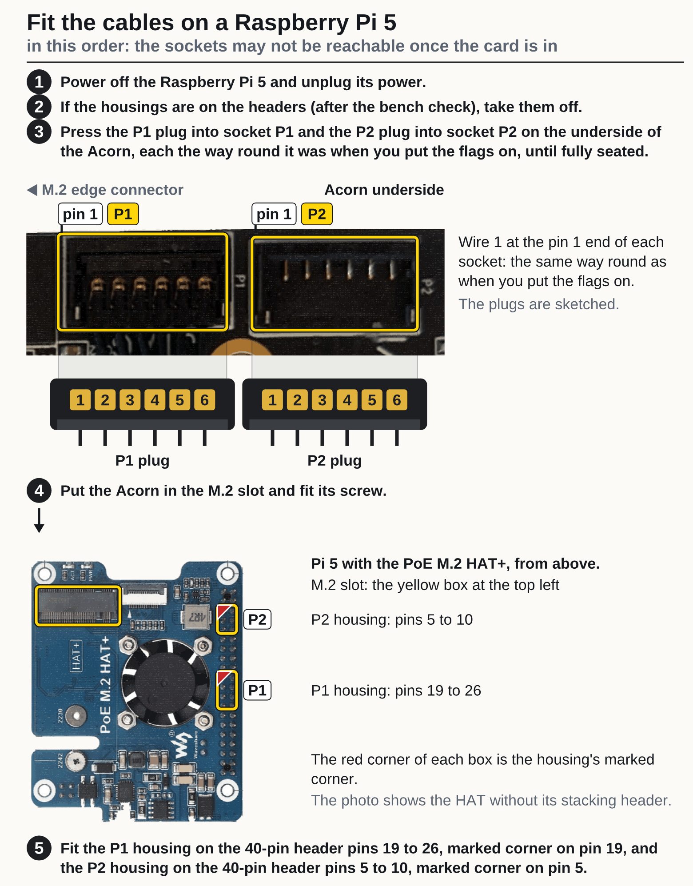
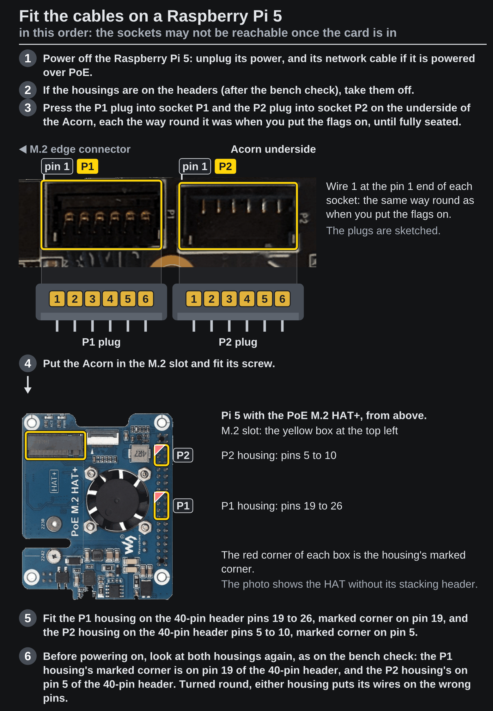

<!-- Generated by fpgas.online-test-designs docs/wiring/acorn/gen.py from wiring.toml. Edit wiring.toml there, not this file. -->

Not yet run by us on this hardware: written from the design. Photos: Waveshare (PoE M.2 HAT+ (B)), RHS Research (LiteFury underside; the Acorn is the same PCB).

## What you need

Both cables, checked on the bench (the page before this one), the Acorn and the Raspberry Pi 5. As before: touch bare metal of the unplugged host before you pick up the card, and hold it by its edges.

## Steps

**1.** Fit the cables, in this order. The sockets are on the underside of the card and may not be reachable once it is in the slot.

1. Power off the Raspberry Pi 5: unplug its power, and its network cable if it is powered over PoE.
2. If the housings are on the headers (after the bench check), take them off.
3. Press the P1 plug into socket P1 and the P2 plug into socket P2 on the underside of the Acorn, each the way round it was when you put the flags on, until fully seated.
4. Put the Acorn in the M.2 slot and fit its screw, in the standoff marked 2280 at the far end of the Waveshare PoE M.2 HAT+ (B).
5. Fit the P1 housing on the 40-pin header pins 19 to 26, marked corner on pin 19, and the P2 housing on the 40-pin header pins 5 to 10, marked corner on pin 5.
6. Before powering on, look at both housings again, as on the bench check: the P1 housing's marked corner is on pin 19 of the 40-pin header, and the P2 housing's on pin 5 of the 40-pin header. Turned round, either housing puts its wires on the wrong pins. Fitted, the housings get only this look; the meter check was the bench check's.

{.only-light}
{.only-dark}

## Next

Power the host on and run the check: the page "verifying 1".
