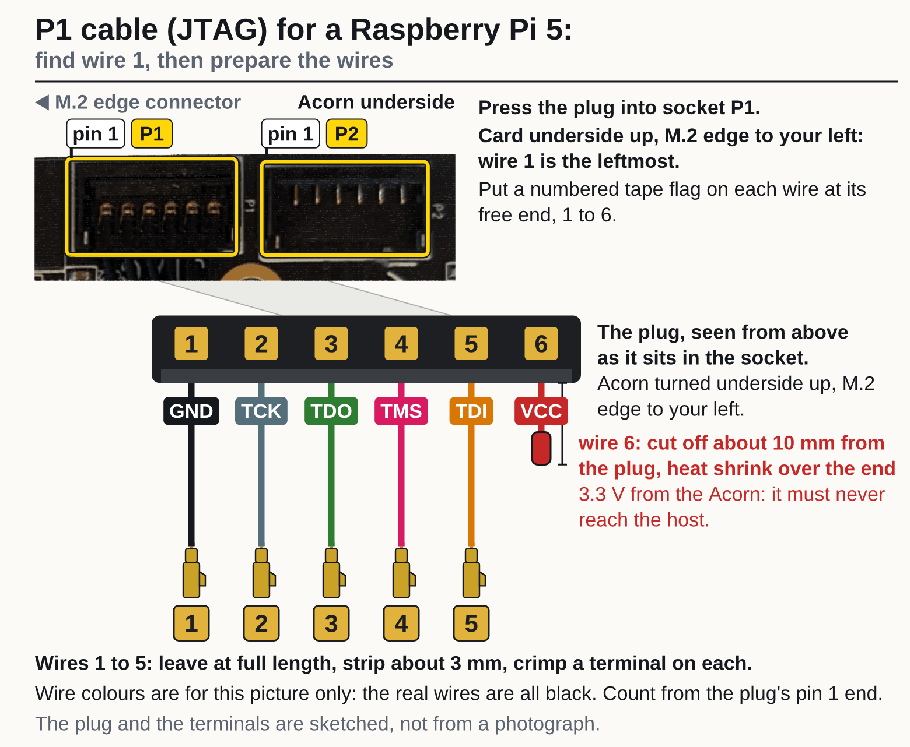

<!-- Generated by fpgas.online-test-designs docs/wiring/acorn/gen.py from wiring.toml. Edit wiring.toml there, not this file. -->

Not yet run by us on this hardware: written from the design. Photos: Waveshare (PoE M.2 HAT+), RHS Research (LiteFury underside; the Acorn is the same PCB).

## What you need

For this cable: one half of the Molex Pico-EZmate cable (a plug with six black wires); the 2×4 Dupont housing; 5 Dupont crimp terminals, and a few spare; 2 mm heat-shrink tube. Tools: a multimeter with a continuity buzzer, side cutters, wire strippers, the crimping tool, a hot-air tool, masking tape and a fine pen. The Acorn itself, out of any slot, is needed for the first steps: if it is fitted, power off the Raspberry Pi 5: unplug its power, and its network cable if it is powered over PoE. Then take the card out.

## Steps

**1.** Cut the Molex cable in half with side cutters. Each half is one cable.

**2.** Find wire 1 of the P1 cable and flag the wires, before cutting any wire back.

1. Press the plug of one half into socket P1 on the underside of the Acorn. Hold the card underside up with the M.2 edge to your left: wire 1 is the leftmost.
2. Put a numbered tape flag on each of the 6 wires, 1 at the left to 6, about 25 mm back from the tip, clear of the end that will be cut and stripped later. Write P1 on the flag of wire 1 as well: off the card, the two halves look alike.
3. With the plug still in the socket (the Acorn out of any slot, unpowered), set the meter to continuity. Press the probe tip, or a pin held to it, against the cut face of the wire flagged 1 (it is not stripped yet), and put the other probe on the plated half-round mounting pad at the end of the card: it must beep.
4. Do the same with the wire flagged 6: it must stay silent.
5. If wire 6 beeps instead, stop: the numbering is reversed; take the flags off and number from the other end. If neither wire beeps, strip about 3 mm from wires 1 and 6 and try again; if still neither beeps, stop: the ground point is not confirmed.
6. Take the plug out again.

**3.** Cut wire 6 off about 10 mm from the plug and shrink a piece of the 2 mm tube over the cut end. It goes in no cavity. Wire 6 is VCC, 3.3 V from the Acorn: it must never reach the host. Leave wires 1 to 5 at full length.

**4.** Strip about 3 mm from wires 1 to 5. Crimp a Dupont terminal on each.

