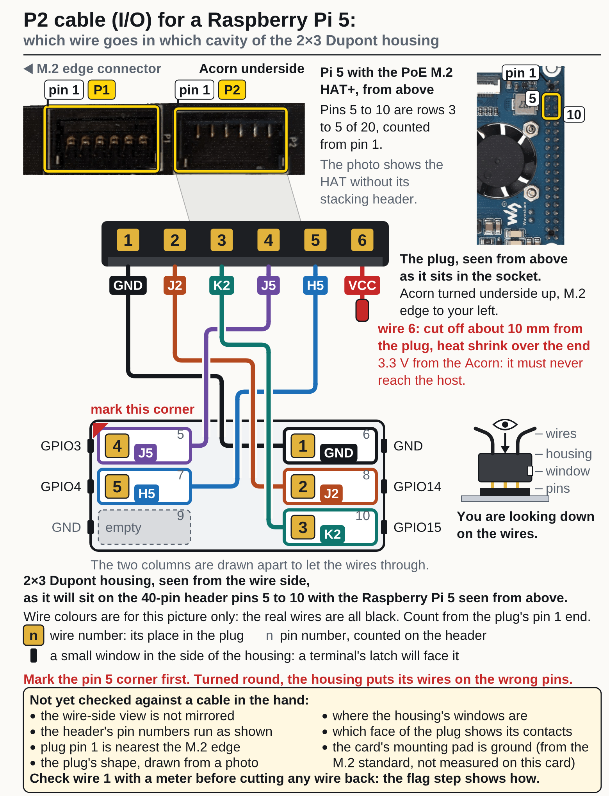
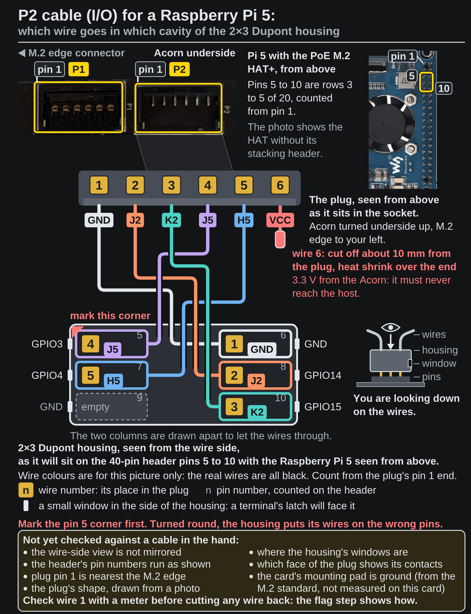
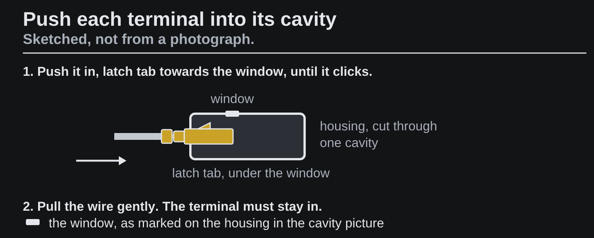
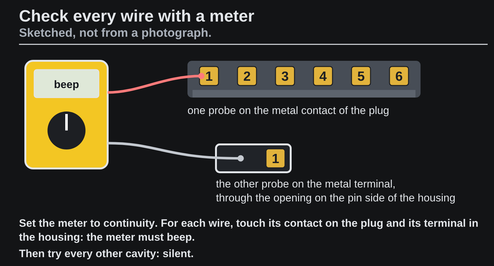

<!-- Generated by fpgas.online-test-designs docs/wiring/acorn/gen.py from wiring.toml. Edit wiring.toml there, not this file. -->

Not yet run by us on this hardware: written from the design. Photos: Waveshare (PoE M.2 HAT+), RHS Research (LiteFury underside; the Acorn is the same PCB).

## What you need

The P2 cable with its wires flagged and a terminal crimped on each (the page before this one), the empty 2×3 Dupont housing, a paint pen or a dot of tape, and a multimeter with a continuity buzzer and a fine probe or a sewing pin.

## Steps

**1.** Hold the empty 2×3 housing with the wire openings facing you and its long side upright, as in the picture. Until it is marked, either way up is the same. Mark the top left corner with a paint pen or a dot of tape: that is the pin 5 corner. For each wire, read the number on its flag, find the same number in the picture, and push its terminal into that cavity, latch tab towards the window, until it clicks. Turned round, the housing puts its wires on the wrong pins. Wire 6 goes in no cavity. Pull each wire gently: the terminal must stay in.

{.only-light}
{.only-dark}

{.only-light}
{.only-dark}

**2.** Check each wire with a meter on continuity. For each wire: one probe on its contact on the plug, the other on the terminal in the cavity the picture gives for that wire number, through the opening on the pin side of the housing: it must beep. Every other cavity must stay silent for that contact. The plug's contacts are 1.2 mm apart: use a fine probe or a sewing pin held to the probe.

{.only-light}
{.only-dark}

The P2 cavity picture again, to read each wire's cavity from:

{.only-light}
{.only-dark}

## If a terminal is in the wrong cavity

A Dupont housing holds each terminal by a small plastic tab over its latch, in the window. Lift that tab a little with a pin and pull the wire gently: the terminal comes out, and can be pushed into the right cavity. (How these housings release; not yet done by us on these cables.)
