<!-- Generated by fpgas.online-test-designs docs/wiring/acorn/gen.py from wiring.toml. Edit wiring.toml there, not this file. -->

Not yet run by us on this hardware: written from the design.

### What you will have

Two short cables from the Acorn's two connectors to the Compute Blade: the P1 cable carries JTAG, the P2 cable carries the serial port.

GND, TCK, TDO, TMS, TDI, J2 and K2 are the names on the pictures for each wire; J2 and K2 are the FPGA's pin names.

### Parts and tools

The parts for **one** Compute Blade host; for several hosts, that many of each.

| Have it | Qty | Part | Part number | What it is for |
|---|---|---|---|---|
| ☐ | 1 | Compute Blade (Uptime Lab) | — | its M.2 slot takes the card |
| ☐ | 1 | Raspberry Pi Compute Module 4 or 5 | — | the host: it sits on the Compute Blade |
| ☐ | 1 | SQRL Acorn CLE-215+, CLE-215 or CLE-101 (the same card is sold as LiteFury and NiteFury) | — | M.2 M-key, 2280 |
| ☐ | 1 | Molex Pico-EZmate cable assembly, 6 circuits, a plug at each end | Molex 0369200601 | cut in half: one half is the P1 cable, the other the P2 cable. All six wires are black |
| ☐ | 1 | heat-shrink tube, about 2 mm, a few centimetres | — | over each cut-back wire end |
| ☐ | 1 | Dupont housing, 2×5, 2.54 mm pitch | — | over Extension Port pins 1 to 10; 5 of its 10 cavities stay empty |
| ☐ | 1 | Dupont housing, 1×4, 2.54 mm pitch | — | over UART pins 1 to 4; 1 of its 4 cavities stays empty |
| ☐ | 8 | Dupont female crimp terminal, 2.54 mm | — | one for each connected wire: GND, TCK, TDO, TMS, TDI, GND, J2, K2; buy a few more than this, as spares |
| ☐ | 1 | resistor, 470 Ω, 1/8 W axial | — | in series with J2 |
| ☐ | 1 | heat-shrink tube, about 3 mm, a few centimetres | — | over the resistor and both joints |

The tools to build its two cables, once for any number of hosts:

| Have it | Tool | What it is for |
|---|---|---|
| ☐ | multimeter with a continuity buzzer | all six wires of the cable are black: each is checked from the plug to its cavity before the cable is fitted |
| ☐ | wire strippers for fine wire, and side cutters | to cut the cable in half, strip about 3 mm from each wire, and cut back the wires that are not connected |
| ☐ | crimping tool for 2.54 mm Dupont terminals | one crimp for each connected wire |
| ☐ | soldering iron and solder | to join the series resistor into its wire |
| ☐ | hot-air tool for the heat-shrink tube | to shrink the tube over each cut-back end (VCC always), and over the series resistor |
| ☐ | a fine probe tip for the multimeter, or a sewing pin to hold against a probe | the plug's contacts are 1.2 mm apart, and a terminal is reached through a small opening |
| ☐ | masking tape and a fine marker pen, or a paint pen | to flag the six wires with their numbers, and to mark the pin 1 corner of each housing |

### Steps

**1.** Cut the Molex cable in half with side cutters. Each half is one cable.

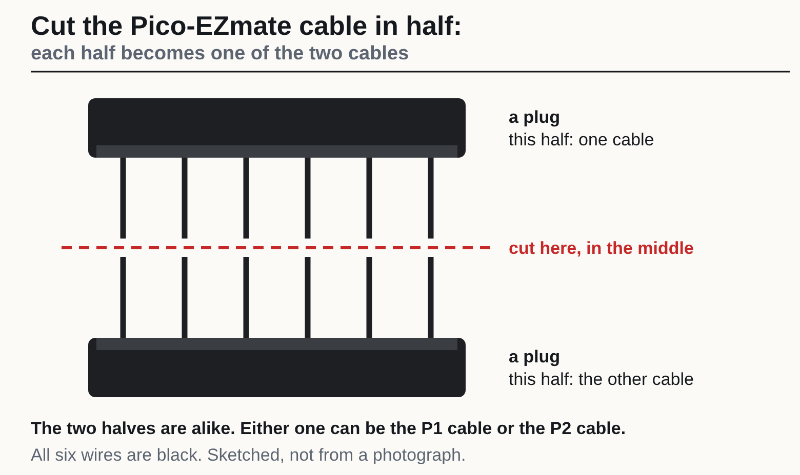

#### The P1 cable (JTAG)

**2.** Find wire 1 of the P1 cable and flag the wires, before cutting any wire back.

1. Press the plug of one half into socket P1 on the underside of the Acorn. Hold the card underside up with the M.2 edge to your left: wire 1 is the leftmost.
2. Put a numbered tape flag on each of the 6 wires, 1 at the left to 6, about 25 mm back from the tip, clear of the end that will be cut and stripped later. Write P1 on the flag of wire 1 as well: off the card, the two halves look alike.
3. With the plug still in the socket (the Acorn out of any slot, unpowered), set the meter to continuity. Press the probe tip, or a pin held to it, against the cut face of the wire flagged 1 (it is not stripped yet), and put the other probe on the plated half-round mounting pad at the end of the card: it must beep.
4. Do the same with the wire flagged 6: it must stay silent.
5. If wire 6 beeps instead, stop: the numbering is reversed; take the flags off and number from the other end. If neither wire beeps, strip about 3 mm from wires 1 and 6 and try again; if still neither beeps, stop: the ground point is not confirmed.
6. Take the plug out again.

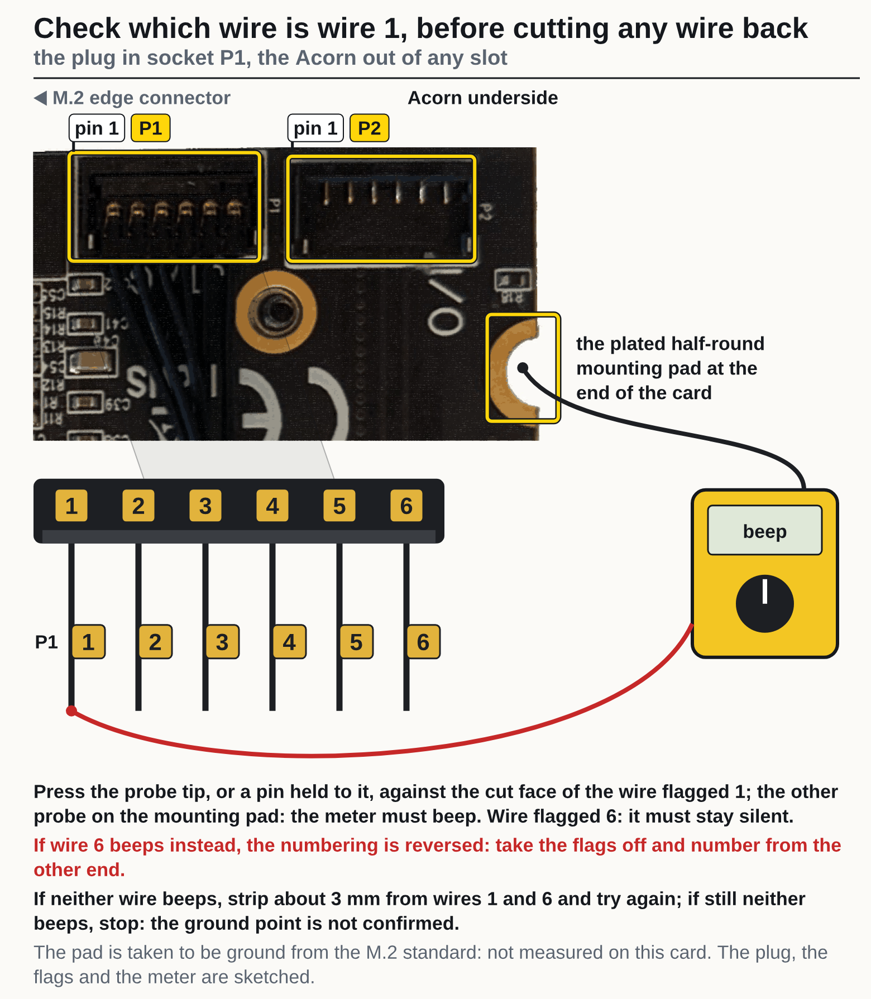

**3.** Cut wire 6 off about 10 mm from the plug and shrink a piece of the 2 mm tube over the cut end. It goes in no cavity. Wire 6 is VCC, 3.3 V from the Acorn: it must never reach the host. Leave wires 1 to 5 at full length.

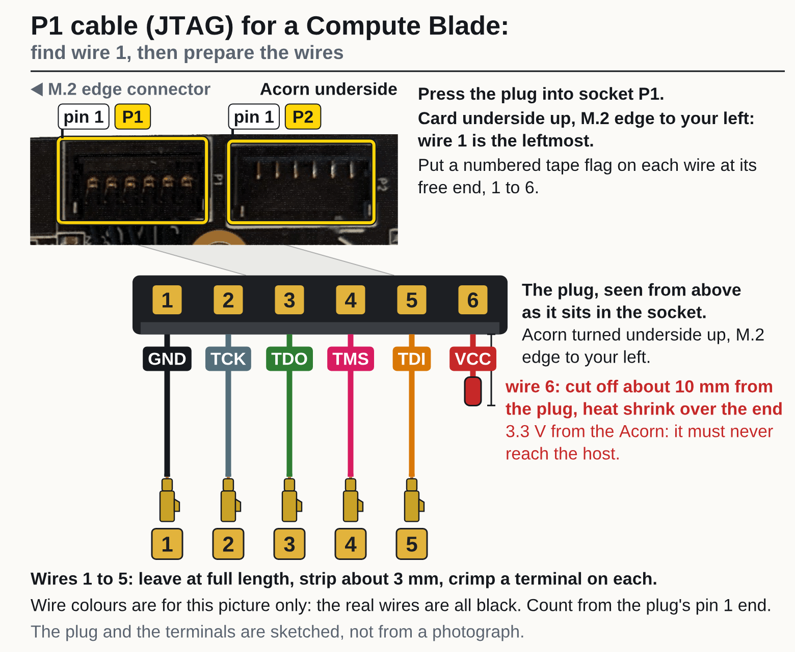

**4.** Strip about 3 mm from wires 1 to 5. Crimp a Dupont terminal on each.

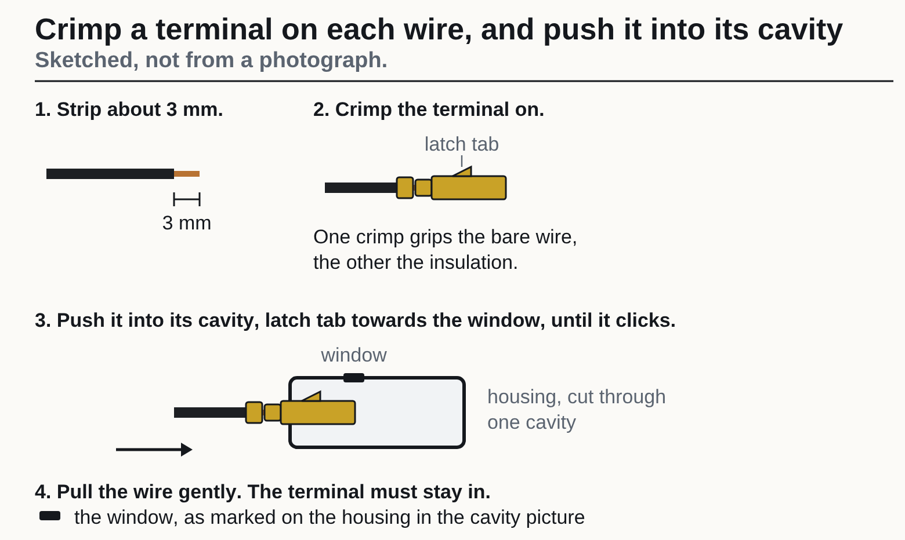

**5.** Hold the empty 2×5 housing with the wire openings facing you and its long side upright, as in the picture. Until it is marked, either way up is the same. Mark the top left corner with a paint pen or a dot of tape: that is the pin 1 corner. For each wire, read the number on its flag, find the same number in the picture, and push its terminal into that cavity, latch tab towards the window, until it clicks. Turned round, the housing puts 5 V on the TCK wire, which can destroy the host. Wire 6 goes in no cavity. Pull each wire gently: the terminal must stay in.

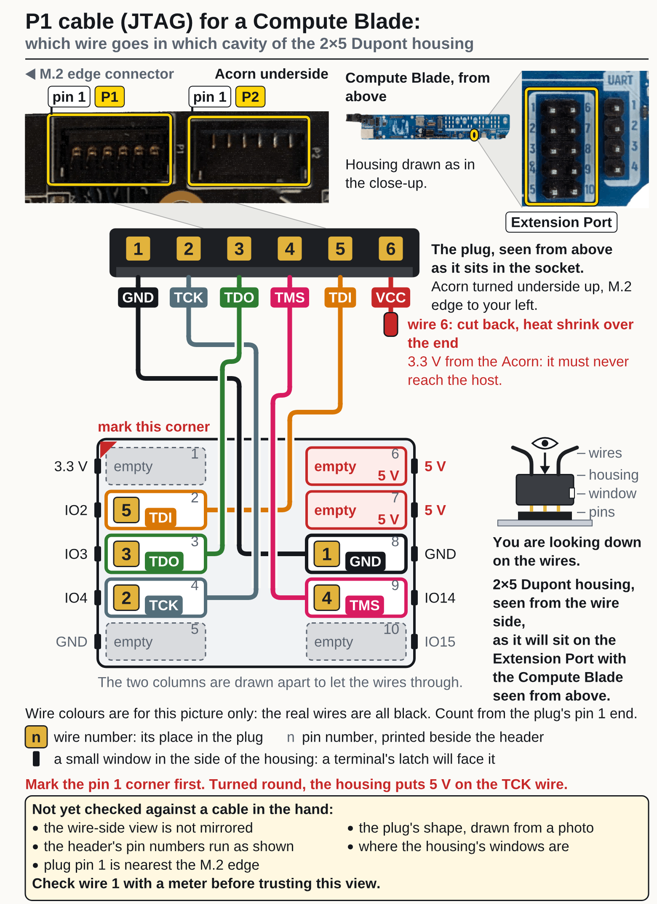

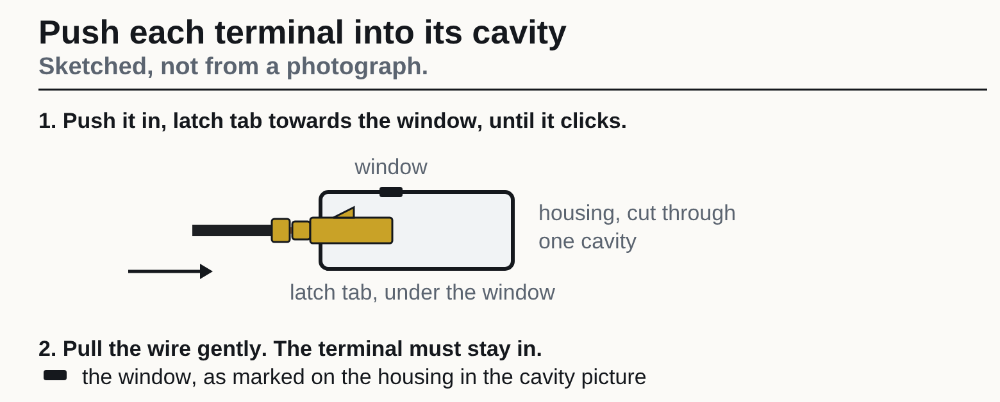

**6.** Check each wire with a meter on continuity. For each wire: one probe on its contact on the plug, the other on the terminal in the cavity the picture gives for that wire number, through the opening on the pin side of the housing: it must beep. Every other cavity must stay silent for that contact. The plug's contacts are 1.2 mm apart: use a fine probe or a sewing pin held to the probe.

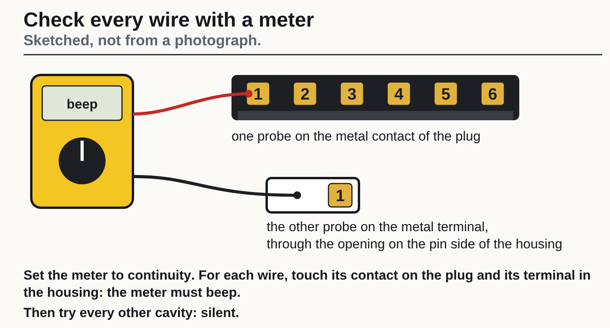

The P1 cavity picture again, to read each wire's cavity from:

#### The P2 cable (I/O)

**7.** Find wire 1 of the P2 cable and flag the wires, before cutting any wire back.

1. Press the plug of the other half into socket P2 on the underside of the Acorn. Hold the card underside up with the M.2 edge to your left: wire 1 is the leftmost.
2. Put a numbered tape flag on each of the 6 wires, 1 at the left to 6, about 25 mm back from the tip, clear of the end that will be cut and stripped later. Write P2 on the flag of wire 1 as well: off the card, the two halves look alike.
3. With the plug still in the socket (the Acorn out of any slot, unpowered), set the meter to continuity. Press the probe tip, or a pin held to it, against the cut face of the wire flagged 1 (it is not stripped yet), and put the other probe on the plated half-round mounting pad at the end of the card: it must beep.
4. Do the same with the wire flagged 6: it must stay silent.
5. If wire 6 beeps instead, stop: the numbering is reversed; take the flags off and number from the other end. If neither wire beeps, strip about 3 mm from wires 1 and 6 and try again; if still neither beeps, stop: the ground point is not confirmed.
6. Take the plug out again.

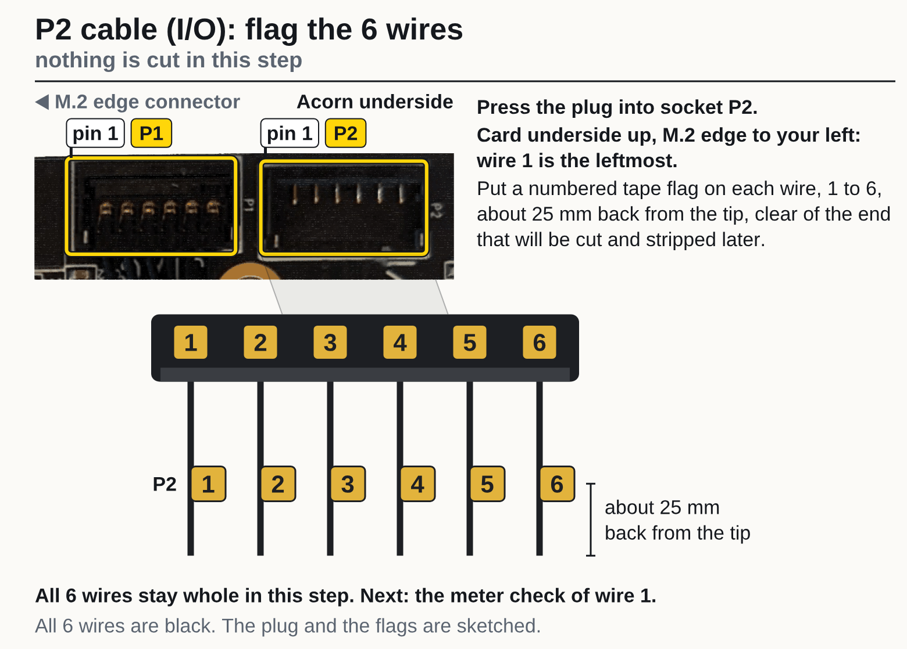

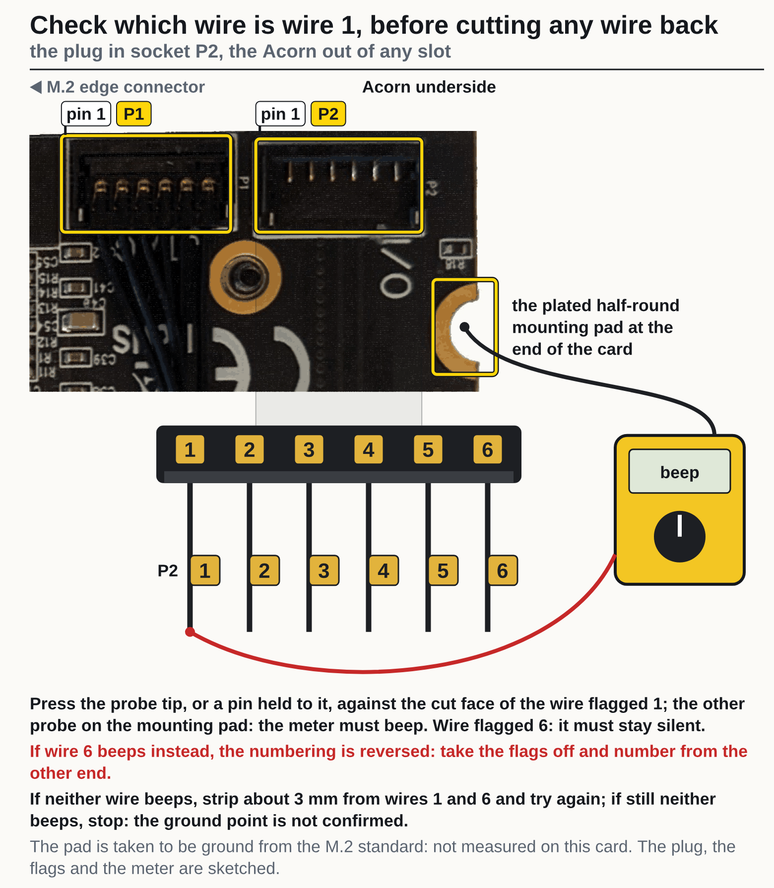

**8.** Cut wires 4, 5 and 6 off about 10 mm from the plug and shrink a piece of the 2 mm tube over each cut end. They go in no cavity. Wire 6 is VCC, 3.3 V from the Acorn: it must never reach the host. Leave wires 1, 2 and 3 at full length.

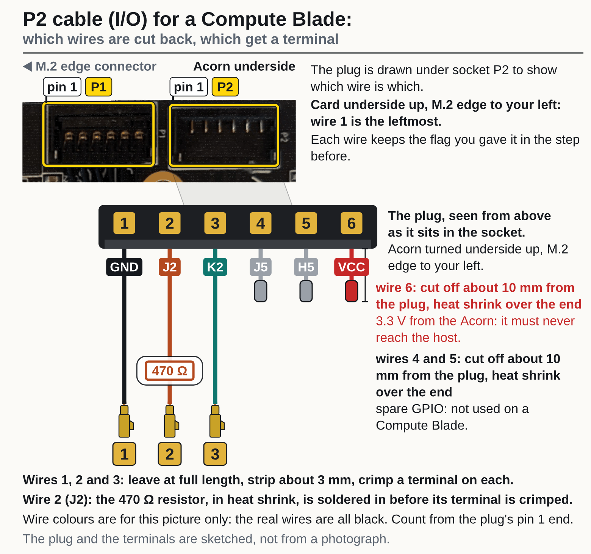

**9.** Cut wire 2 (J2) about 15 mm from its free end. Slide a piece of the 3 mm tube onto the wire, clear of the cut. Strip about 3 mm from each cut end. Trim the resistor's leads to about 5 mm each. Solder the 470 Ω resistor between the two cut ends. Slide the tube over the resistor and both joints and shrink it. Crimp the terminal only after this. The resistor is there because J2 lands on GPIO14, which is also JTAG TMS: with 470 Ω in the wire, JTAG still gets through if the FPGA drives J2 (designed so, not yet measured).

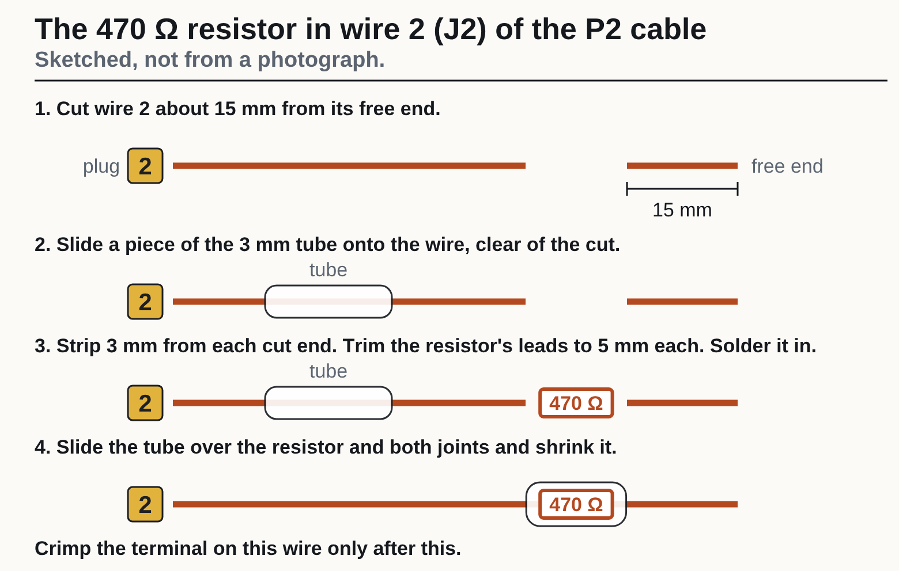

**10.** Strip about 3 mm from wires 1, 2 and 3. Crimp a Dupont terminal on each.

**11.** Hold the empty 1×4 housing with the wire openings facing you and its long side upright, as in the picture. Until it is marked, either way up is the same. Mark the top end with a paint pen or a dot of tape: that is the pin 1 corner. For each wire, read the number on its flag, find the same number in the picture, and push its terminal into that cavity, latch tab towards the window, until it clicks. Turned round, the housing puts 5 V on the K2 wire, which can destroy the host. Wires 4, 5 and 6 go in no cavity. Pull each wire gently: the terminal must stay in.

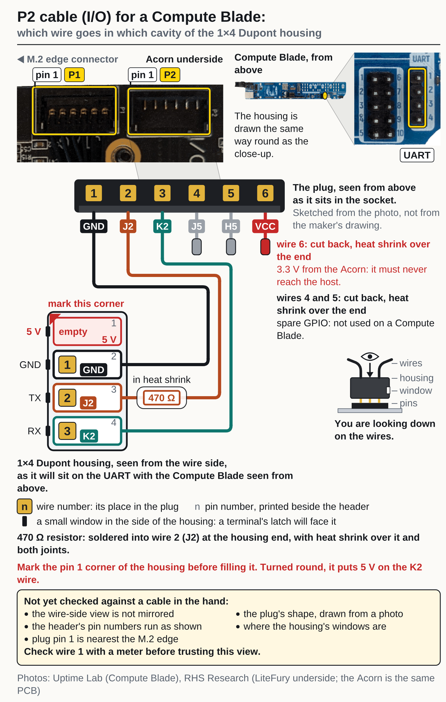

**12.** Check each wire with a meter on continuity. For each wire: one probe on its contact on the plug, the other on the terminal in the cavity the picture gives for that wire number, through the opening on the pin side of the housing: it must beep. Every other cavity must stay silent for that contact. The plug's contacts are 1.2 mm apart: use a fine probe or a sewing pin held to the probe.

The P2 cavity picture again, to read each wire's cavity from:

#### Fit the cables

**13.** This is a bench check; the housings come off again before the cables are fitted. Fit the P1 housing on the Extension Port with its marked corner on the pin printed 1 beside the header, and the P2 housing on the UART with its marked corner on the pin printed 1 beside the header. The Acorn is not in its slot and the plugs are free. With the host unplugged from power, put one meter probe on contact 1 (GND) of a plug and the other on the metal shell of a USB socket on the Compute Blade: it must beep. Do the same for the other plug. Then contact 6 of each plug (VCC, the wire you cut back): against the shell and against every other contact it must be silent.

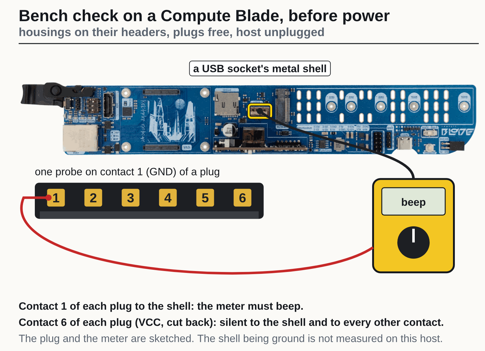

The P1 cavity picture again, for where its housing sits and which corner is marked:

The P2 cavity picture again, for where its housing sits and which corner is marked:

**14.** Fit the cables, in this order. The sockets are on the underside of the card and may not be reachable once it is in the slot.

1. Power off the Compute Blade: unplug its PoE cable, and a USB-C cable if one is plugged in.
2. If the housings are on the headers (after the bench check), take them off.
3. Press the P1 plug into socket P1 and the P2 plug into socket P2 on the underside of the Acorn, each the way round it was when you put the flags on, until fully seated.
4. Put the Acorn in the M.2 slot and fit its screw.
5. Fit the P1 housing on the Extension Port, marked corner on pin 1, and the P2 housing on the UART, marked corner on pin 1.

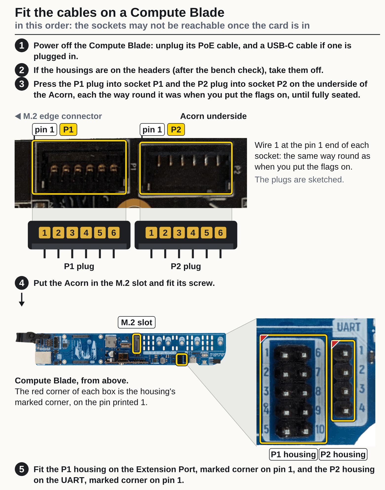

Photos: Uptime Lab (Compute Blade), RHS Research (LiteFury underside; the Acorn is the same PCB).
