<!-- Generated by fpgas.online-test-designs docs/wiring/acorn/gen.py from wiring.toml. Edit wiring.toml there, not this file. -->

This procedure is waiting for its bench run: [issue #219](https://github.com/fpgas-online/fpgas.online-test-designs/issues/219).

### What you will have

Two short cables from the Acorn's two connectors to the Compute Blade. The P1 cable carries JTAG. The P2 cable carries the serial port.

GND, TCK, TDO, TMS, TDI, J2 and K2 are the names on the pictures for each wire. J2 and K2 are the FPGA's pin names.

{.only-light}
{.only-dark}

### Parts and tools

The parts for **one** Compute Blade host; for several hosts, that many of each.

| Have it | Qty | Part | Part number | What it is for |
|---|---|---|---|---|
| ☐ | 1 | Compute Blade (Uptime Lab) | — | its M.2 slot takes the card |
| ☐ | 1 | Raspberry Pi Compute Module 4 or 5 | — | the host: it sits on the Compute Blade |
| ☐ | 1 | SQRL Acorn CLE-215+, CLE-215 or CLE-101 (the same card is sold as LiteFury and NiteFury) | — | M.2 M-key, 2280 |
| ☐ | 1 | Molex Pico-EZmate cable assembly, 6 circuits, a plug at each end | Molex 0369200601 | cut in half: one half is the P1 cable, the other the P2 cable. All six wires are black |
| ☐ | 1 | heat-shrink tube, about 2 mm, a few centimetres | — | over each cut-back wire end |
| ☐ | 1 | Dupont housing, 2×5, 2.54 mm pitch | — | over Extension Port pins 1 to 10; 5 of its 10 cavities stay empty |
| ☐ | 1 | Dupont housing, 1×4, 2.54 mm pitch | — | over UART pins 1 to 4; 1 of its 4 cavities stays empty |
| ☐ | 8 | Dupont female crimp terminal, 2.54 mm | — | one for each connected wire: GND, TCK, TDO, TMS, TDI, GND, J2, K2; buy a few more than this, as spares |
| ☐ | 1 | resistor, 470 Ω, 1/8 W axial | — | in series with J2 |
| ☐ | 1 | heat-shrink tube, about 3 mm, a few centimetres | — | over the resistor and both joints |

The tools to build, fit and check its two cables, once for any number of hosts:

| Have it | Tool | What it is for |
|---|---|---|
| ☐ | multimeter with a continuity buzzer | all six wires of the cable are black: each is checked from the plug to its cavity before the cable is fitted |
| ☐ | wire strippers for fine wire, and side cutters | to cut the cable in half, strip about 3 mm from each wire, and cut back the wires that are not connected |
| ☐ | crimping tool for 2.54 mm Dupont terminals | one crimp for each connected wire |
| ☐ | soldering iron and solder | to join the series resistor into its wire |
| ☐ | hot-air tool for the heat-shrink tube | to shrink the tube over each cut-back end (VCC always), and over the series resistor |
| ☐ | a fine probe tip for the multimeter, or a sewing pin to hold against a probe | the plug's contacts are 1.2 mm apart, and a terminal is reached through a small opening |
| ☐ | masking tape and a fine marker pen, or a paint pen | to flag the six wires with their numbers, and to mark the pin 1 corner of each housing |
| ☐ | a ruler marked in millimetres | the steps give lengths in millimetres: where a flag goes, how much of a wire is left, cut back or stripped |
| ☐ | a PH1 (Phillips size 1) screwdriver | for the M2x2.5 screw that holds the card in the M.2 slot. Uptime Lab's assembly guide for the Compute Blade names a PH1 driver for that screw (and a 5 mm hex driver for its standoff, where the standoff is not fitted) |
| ☐ | a computer with ssh, on a network that reaches the blade | to log in to the blade and run the check ([How to run the Acorn check on a Compute Blade](https://docs.fpgas.online/en/latest/boards/acorn/checks/compute-blade.html)) |

### Steps

**1.** Have the Acorn out of its slot. If it is fitted, the Compute Blade must be off first. Ask the site operator, then power off the Compute Blade: unplug its PoE cable, and a USB-C cable if one is plugged in. Then take the card out. Take its screw out first: an M2x2.5 screw with an M2 nylon washer, which takes a PH1 driver ([the Compute Blade's assembly guide](https://github.com/uptime-lab/compute-blade/blob/main/docs/docs/blade/getting-started/assembly.mdx)). The Acorn is a bare circuit board. Before you pick it up, touch bare metal of the host, or wear an anti-static wrist strap; hold the card by its edges.

**2.** Cut the Molex cable in half with side cutters. Each half is one cable. The cut comes before the reach check on purpose. A half is what goes between the card and the Compute Blade, so a half is what is checked for reach, below.

{.only-light}
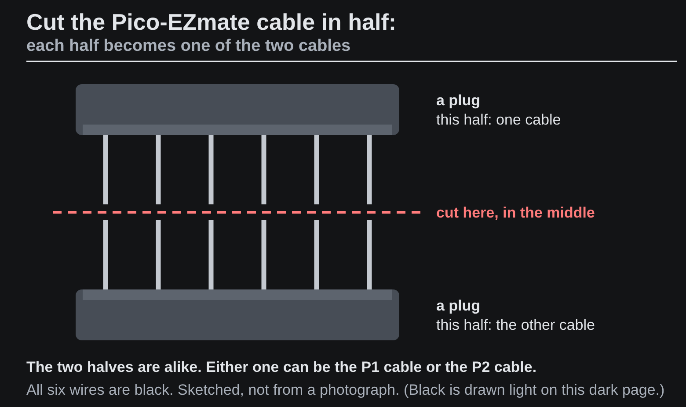{.only-dark}

**3.** Check that each half reaches, before any wire is cut back or crimped. If the Compute Blade is on, it must be off first. Ask the site operator, then power off the Compute Blade: unplug its PoE cable, and a USB-C cable if one is plugged in. With the card out of its slot, hold the card over the slot where it will sit. Lay the half for P1 from socket P1 to the Extension Port, along the way that cable will run. Lay the half for P2 from socket P2 to the UART header, along the way that cable will run. Its cut end must reach the header with some slack left to bend into the housing. If a half does not reach, stop: this guide uses each half at the length it has. Tell the site operator.

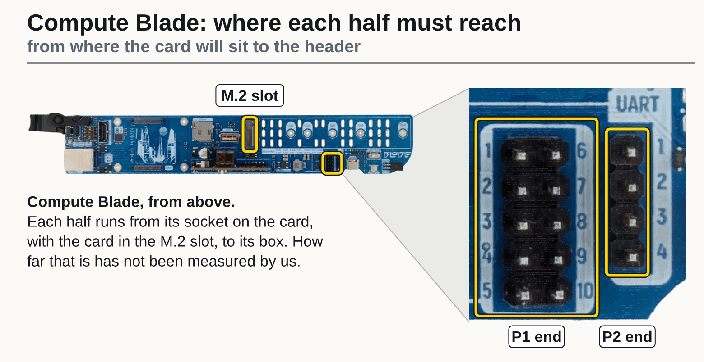{.only-light}
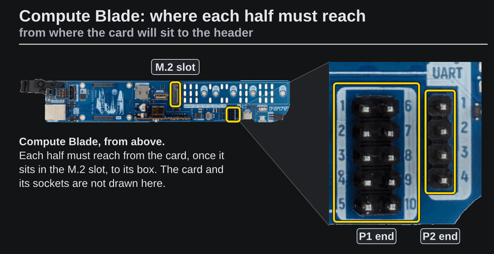{.only-dark}

#### The P1 cable (JTAG)

**4.** Find wire 1 of the P1 cable and flag the wires, before cutting any wire back.

1. Press the plug of one half into socket P1 on the underside of the Acorn. Hold the card underside up with the M.2 edge to your left: wire 1 is the leftmost.
2. Put a numbered tape flag on each of the 6 wires, 1 at the left to 6, about 25 mm back from the tip. Keep each flag clear of the end that will be cut and stripped later. Write P1 on the flag of wire 1 as well: off the card, the two halves look alike.

{.only-light}
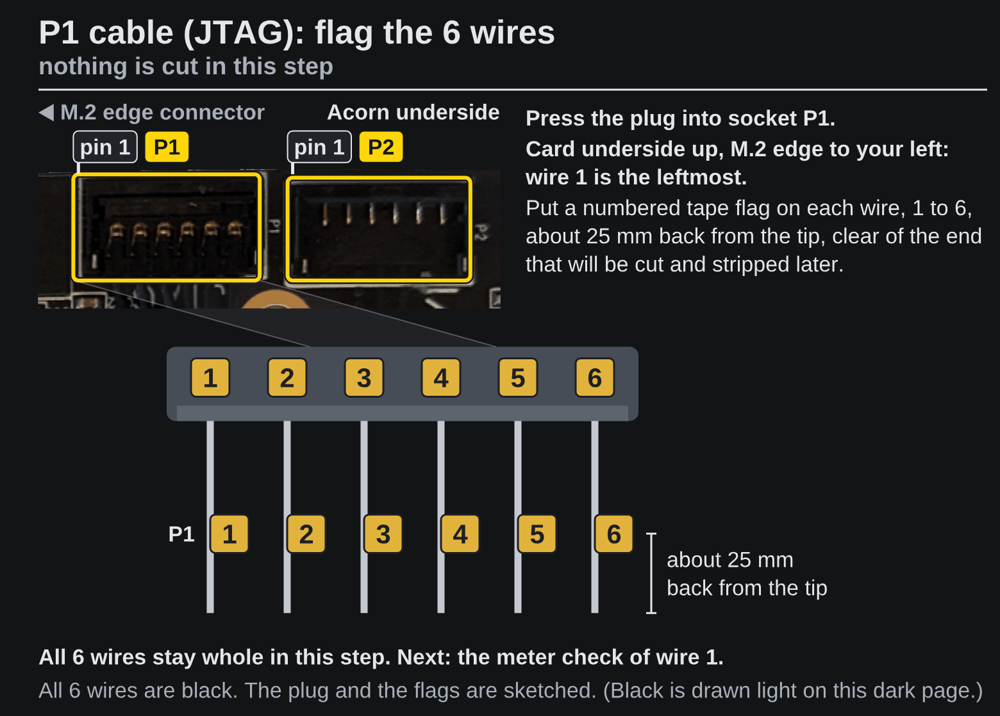{.only-dark}

**5.** Check which wire of the P1 cable is wire 1, with a meter, before cutting any wire back.

1. With the plug still in the socket (the Acorn out of any slot), set the meter to continuity. Press the probe tip, or a pin held to it, against the cut face of the wire flagged 1 (it is not stripped yet). Put the other probe on the plated half-round mounting pad at the end of the card: it must beep.
2. Do the same with the wire flagged 6: it must stay silent.
3. If wire 6 beeps instead, stop: the numbering is reversed; take the flags off and number from the other end. If neither wire beeps, strip about 3 mm from wires 1 and 6 and try again. If still neither beeps, stop: the ground point is not confirmed.
4. If both wires beep, first see that the two probes do not touch each other. See also that the cut faces of wires 1 and 6 do not touch. If both still beep, stop and cut nothing: the check cannot tell the wires apart. Leave the flags on and take the plug out. Wire 6 is the card's 3.3 V by the LiteX wiki's legend. It is expected to stay silent to ground on a card with no power. Set the meter to ohms. Write down what each of the two wires reads to the pad, and send both readings to the site operator.
5. Take the plug out again.

{.only-light}
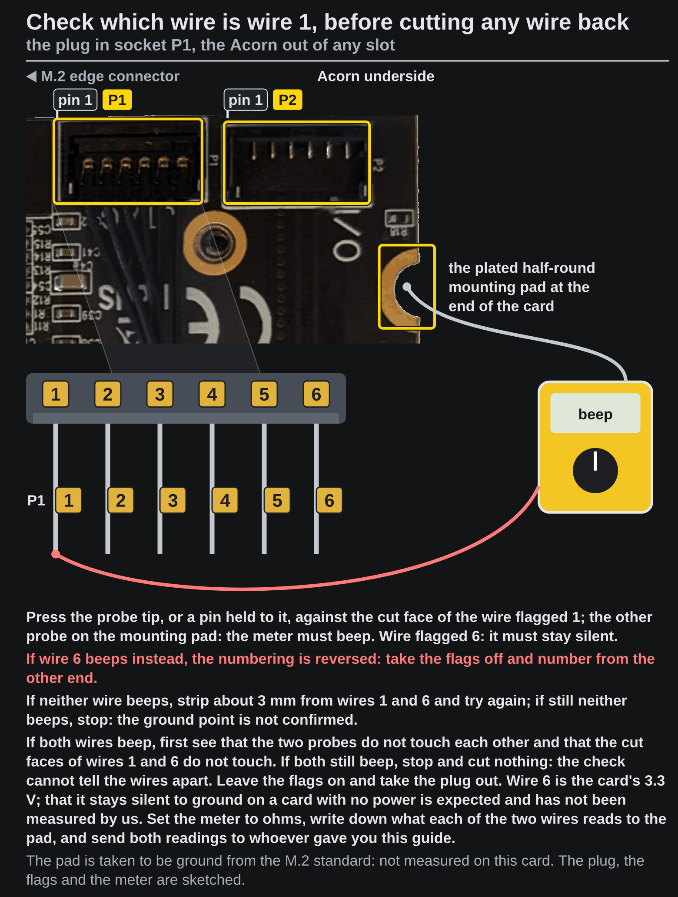{.only-dark}

**6.** Cut wire 6 off about 10 mm from the plug. Shrink a piece of the 2 mm tube over the cut end. It goes in no cavity. Wire 6 is VCC, 3.3 V from the Acorn by the LiteX wiki's legend: it must never reach the host. Leave wires 1 to 5 at full length.

{.only-light}
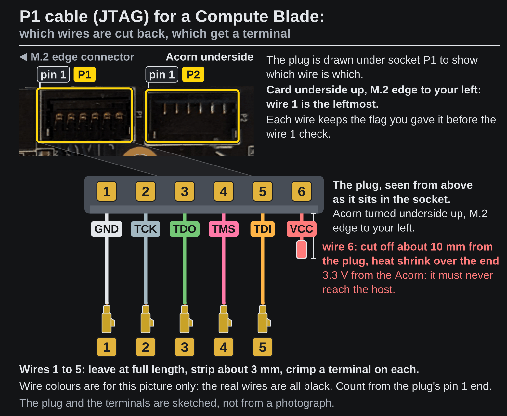{.only-dark}

**7.** Strip about 3 mm from wires 1 to 5. Crimp a Dupont terminal on each.

{.only-light}
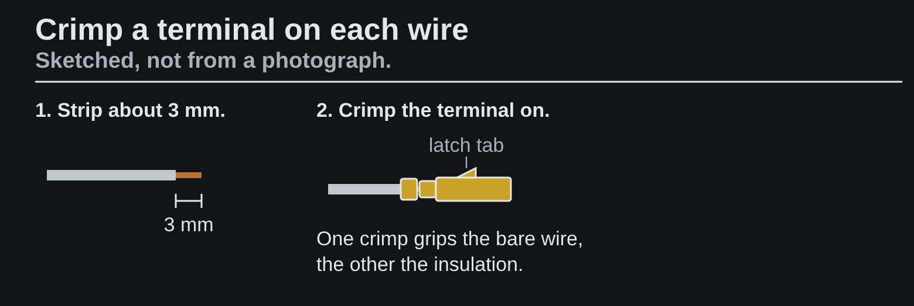{.only-dark}

**8.** Hold the empty 2×5 housing with the wire openings facing you and its long side upright, as in the picture. Until it is marked, either way up is the same. Mark the top left corner with a paint pen or a dot of tape: that is the pin 1 corner. For each wire, read the number on its flag and find the same number in the picture: that is the cavity its terminal goes in. Turned round, the housing puts 5 V on the TCK wire. That is above the most AMD's Artix 7 data sheet allows on an FPGA pin (DS181, Table 1). The most it allows is VCCO + 0.55 V, with VCCO at most 3.6 V. That can destroy the FPGA pin on the Acorn that wire reaches. Wire 6 goes in no cavity.

{.only-light}
{.only-dark}

**9.** Push each terminal into its cavity, latch tab towards the window, until it clicks. Pull each wire gently: the terminal must stay in. The P1 cavity picture is shown again under the picture of how a terminal goes in, to read each wire's cavity from.

{.only-light}
{.only-dark}

{.only-light}
{.only-dark}

**10.** Check each wire with a meter on continuity. Set the meter to continuity. The probes go as in the picture: one on a contact of the plug, the other on a terminal. The other probe goes through the opening on the pin side of the housing. The plug's contacts are 1.2 mm apart: use a fine probe or a sewing pin held to the probe.

{.only-light}
{.only-dark}

**11.** Now check each wire against its cavity. For each wire: read the number on its flag and find it in the picture. Put one probe on that wire's contact on the plug and the other on the terminal in that cavity: it must beep. Every other cavity must stay silent for that contact. The P1 cavity picture is shown again below, to read each wire's cavity from.

{.only-light}
{.only-dark}

#### The P2 cable (I/O)

**12.** Have the Acorn out of its slot. If it is fitted, the Compute Blade must be off first. Ask the site operator, then power off the Compute Blade: unplug its PoE cable, and a USB-C cable if one is plugged in. Then take the card out. Take its screw out first: an M2x2.5 screw with an M2 nylon washer, which takes a PH1 driver ([the Compute Blade's assembly guide](https://github.com/uptime-lab/compute-blade/blob/main/docs/docs/blade/getting-started/assembly.mdx)). The Acorn is a bare circuit board. Before you pick it up, touch bare metal of the host, or wear an anti-static wrist strap; hold the card by its edges. If the Molex cable is still whole, cut it in the middle with side cutters: each half is one cable.

**13.** Find wire 1 of the P2 cable and flag the wires, before cutting any wire back.

1. Press the plug of the other half into socket P2 on the underside of the Acorn. Hold the card underside up with the M.2 edge to your left: wire 1 is the leftmost.
2. Put a numbered tape flag on each of the 6 wires, 1 at the left to 6, about 25 mm back from the tip. Keep each flag clear of the end that will be cut and stripped later. Write P2 on the flag of wire 1 as well: off the card, the two halves look alike.

{.only-light}
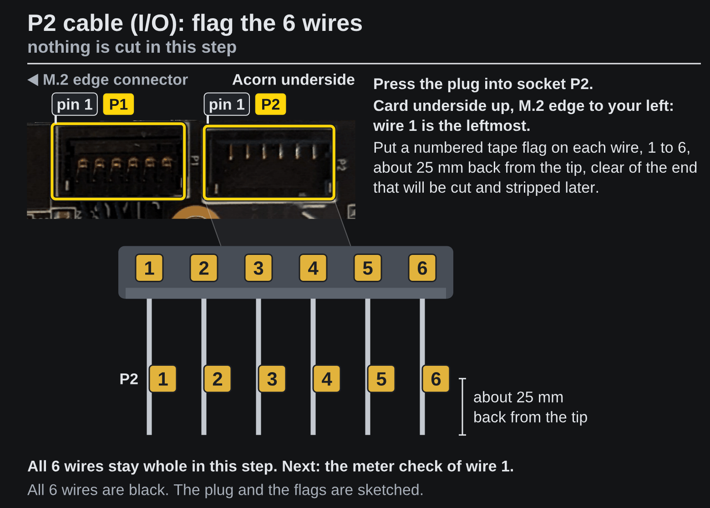{.only-dark}

**14.** Check which wire of the P2 cable is wire 1, with a meter, before cutting any wire back.

1. With the plug still in the socket (the Acorn out of any slot), set the meter to continuity. Press the probe tip, or a pin held to it, against the cut face of the wire flagged 1 (it is not stripped yet). Put the other probe on the plated half-round mounting pad at the end of the card: it must beep.
2. Do the same with the wire flagged 6: it must stay silent.
3. If wire 6 beeps instead, stop: the numbering is reversed; take the flags off and number from the other end. If neither wire beeps, strip about 3 mm from wires 1 and 6 and try again. If still neither beeps, stop: the ground point is not confirmed.
4. If both wires beep, first see that the two probes do not touch each other. See also that the cut faces of wires 1 and 6 do not touch. If both still beep, stop and cut nothing: the check cannot tell the wires apart. Leave the flags on and take the plug out. Wire 6 is the card's 3.3 V by the LiteX wiki's legend. It is expected to stay silent to ground on a card with no power. Set the meter to ohms. Write down what each of the two wires reads to the pad, and send both readings to the site operator.
5. Take the plug out again.

{.only-light}
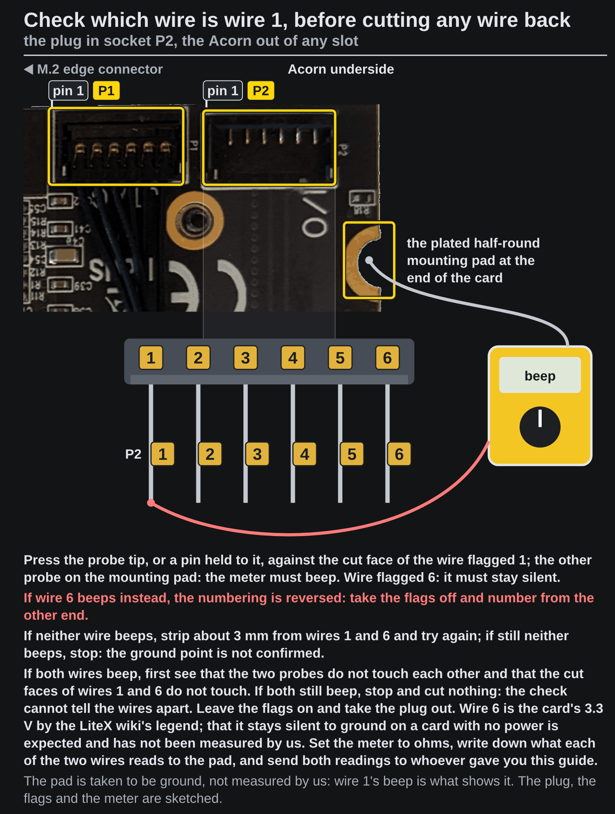{.only-dark}

**15.** Cut wires 4, 5 and 6 off about 10 mm from the plug. Shrink a piece of the 2 mm tube over each cut end. They go in no cavity. Wire 6 is VCC, 3.3 V from the Acorn by the LiteX wiki's legend: it must never reach the host. Leave wires 1, 2 and 3 at full length.

{.only-light}
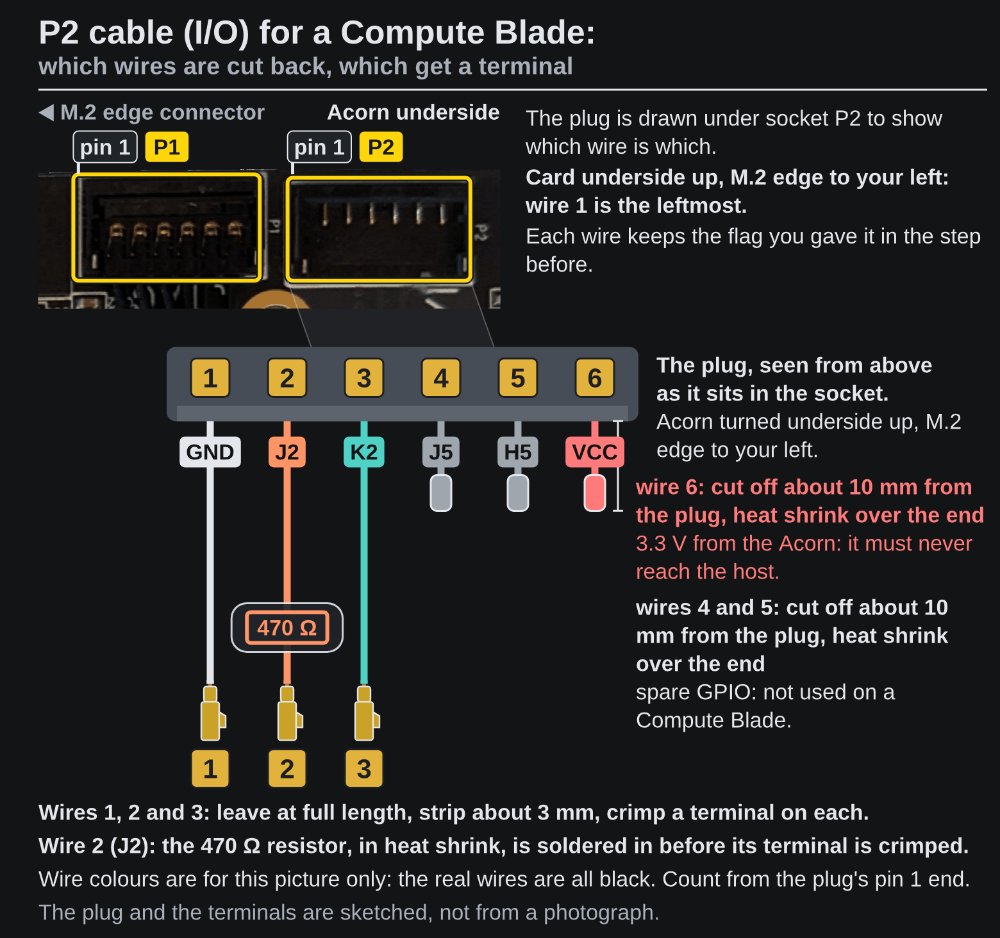{.only-dark}

**16.** Cut wire 2 (J2) about 15 mm from its free end. Slide a piece of the 3 mm tube onto the wire, clear of the cut. Strip about 3 mm from each cut end. Trim the resistor's leads to about 5 mm each. Solder the 470 Ω resistor between the two cut ends. Slide the tube over the resistor and both joints and shrink it. Crimp the terminal only after this. The resistor is there because J2 lands on GPIO14, which is also JTAG TMS. The 470 Ω in the wire is meant to let JTAG through if the FPGA drives J2.

{.only-light}
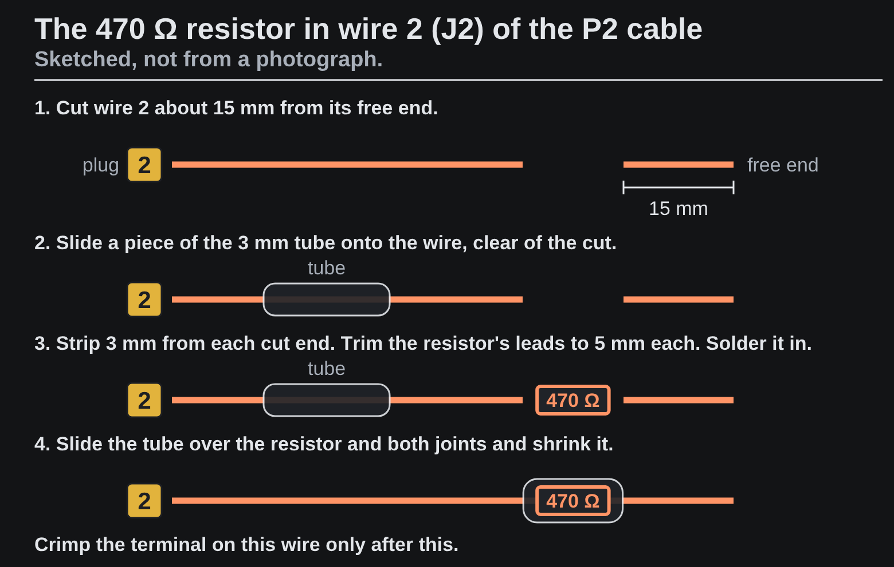{.only-dark}

**17.** Strip about 3 mm from wires 1, 2 and 3. Crimp a Dupont terminal on each.

{.only-light}
{.only-dark}

**18.** Hold the empty 1×4 housing with the wire openings facing you and its long side upright, as in the picture. Until it is marked, either way up is the same. Mark the top end with a paint pen or a dot of tape: that is the pin 1 corner. For each wire, read the number on its flag and find the same number in the picture: that is the cavity its terminal goes in. Turned round, the housing puts 5 V on the K2 wire. That is above the most AMD's Artix 7 data sheet allows on an FPGA pin (DS181, Table 1). The most it allows is VCCO + 0.55 V, with VCCO at most 3.6 V. That can destroy the FPGA pin on the Acorn that wire reaches. Wires 4, 5 and 6 go in no cavity.

{.only-light}
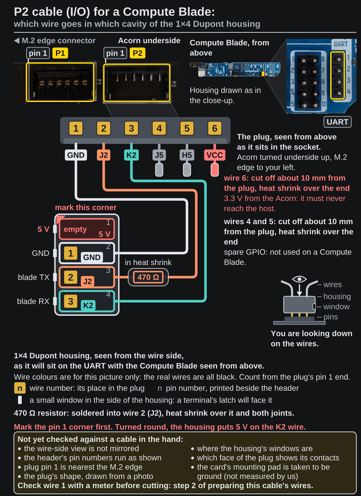{.only-dark}

**19.** Push each terminal into its cavity, latch tab towards the window, until it clicks. Pull each wire gently: the terminal must stay in. The P2 cavity picture is shown again under the picture of how a terminal goes in, to read each wire's cavity from.

{.only-light}
{.only-dark}

{.only-light}
{.only-dark}

**20.** Check each wire with a meter on continuity. Set the meter to continuity. The probes go as in the picture: one on a contact of the plug, the other on a terminal. The other probe goes through the opening on the pin side of the housing. The plug's contacts are 1.2 mm apart: use a fine probe or a sewing pin held to the probe.

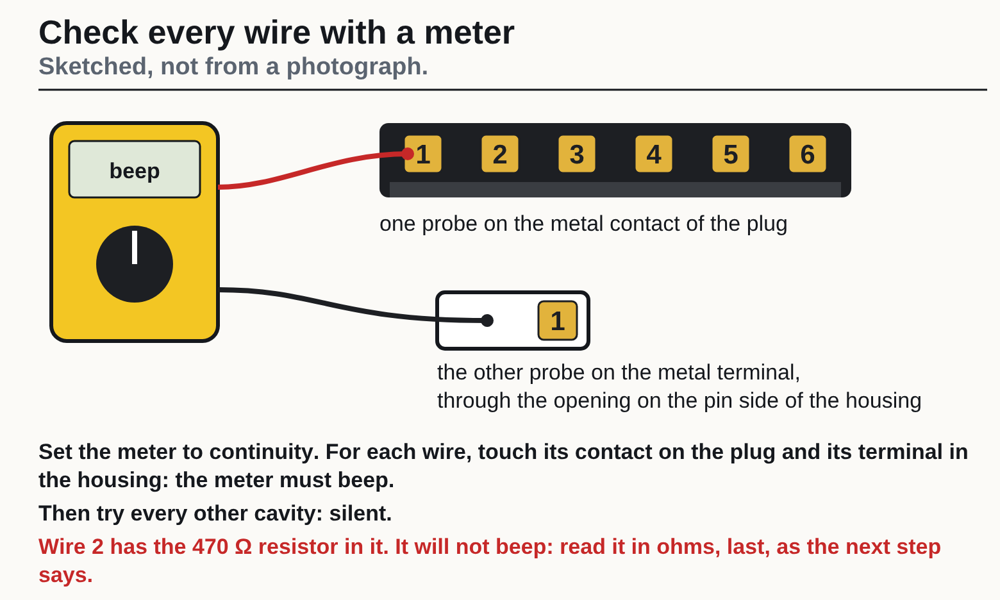{.only-light}
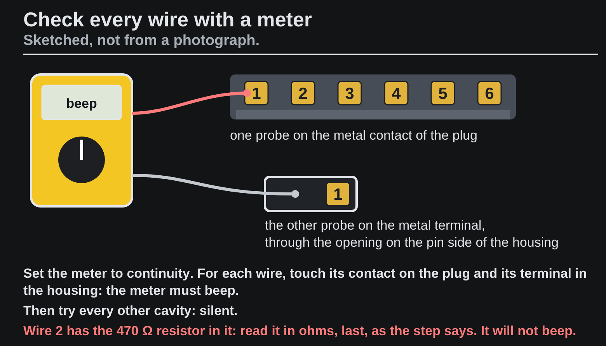{.only-dark}

**21.** Now check each wire against its cavity. For each wire: read the number on its flag and find it in the picture. Put one probe on that wire's contact on the plug and the other on the terminal in that cavity: it must beep. Every other cavity must stay silent for that contact. **Wire 2 is the exception: it has the 470 Ω resistor in it. Leave wire 2 until last and read it in ohms, not by the buzzer**. A continuity buzzer usually sounds only below some tens of ohms, so through the resistor it will usually stay silent. Set the meter to ohms, on auto-range or the 2 kΩ range, and touch the two probes together first: it must read close to 0. Then, between wire 2's contact on the plug and its terminal, it must read close to 470 Ω. Close to 0 there means the resistor is bridged or was left out. Over-range (OL, or a lone 1 at the left of the display) means a bad joint or the wrong wire. So does a value far from 470 Ω. Between wire 2's contact and every other cavity it must show over-range. The P2 cavity picture is shown again below, to read each wire's cavity from.

{.only-light}
{.only-dark}

#### Fit the cables

**22.** This is a bench check; the housings come off again before the cables are fitted. If the Compute Blade is on, it must be off first. Ask the site operator, then power off the Compute Blade: unplug its PoE cable, and a USB-C cable if one is plugged in. The Acorn stays out of its slot; if it is fitted, take it out. Take its screw out first: an M2x2.5 screw with an M2 nylon washer, which takes a PH1 driver ([the Compute Blade's assembly guide](https://github.com/uptime-lab/compute-blade/blob/main/docs/docs/blade/getting-started/assembly.mdx)). Then fit the P1 housing on the Extension Port with its marked corner on the pin printed 1 beside the header. The P1 cavity picture is shown again below, for which wire goes in which cavity, and which corner is marked.

{.only-light}
{.only-dark}

**23.** Fit the P2 housing on the UART with its marked corner on the pin printed 1 beside the header. The P2 cavity picture is shown again below, for which wire goes in which cavity, and which corner is marked.

{.only-light}
{.only-dark}

**24.** The Acorn is not in its slot and the plugs are free. Put one meter probe on contact 1 (GND) of a plug. Put the other on the metal shell of a USB socket on the Compute Blade: it must beep. Do the same for the other plug. Then contact 6 of each plug (VCC, the wire you cut back): against the shell and against every other contact it must be silent. Contact 1's beep shows only that contact 1 and the shell are joined. Turned round, the P1 housing's GND wire would sit on IO3 and the P2 housing's GND wire would sit on TX, not a ground pin. Do not rely on the beep for which way round a housing is: look at each marked corner.

{.only-light}
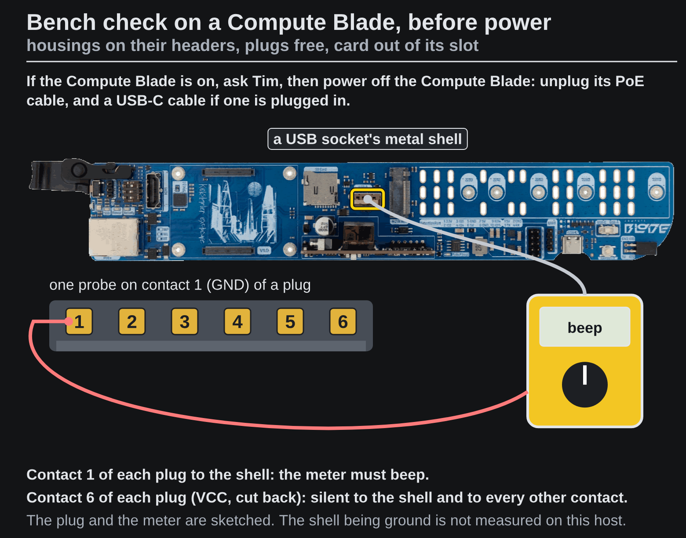{.only-dark}

**25.** Fit the plugs into the card. The sockets are on the underside of the card and may not be reachable once it is in the slot. So the plugs go in first, in this order. After action 1, touch bare metal of the host before you pick up the card, and hold it by its edges.

1. Ask the site operator, then power off the Compute Blade: unplug its PoE cable, and a USB-C cable if one is plugged in.
2. If the housings are on the headers (after the bench check), take them off.
3. Press the P1 plug into socket P1 and the P2 plug into socket P2 on the underside of the Acorn. Each goes the way round it was when you put the flags on. Press each until fully seated.

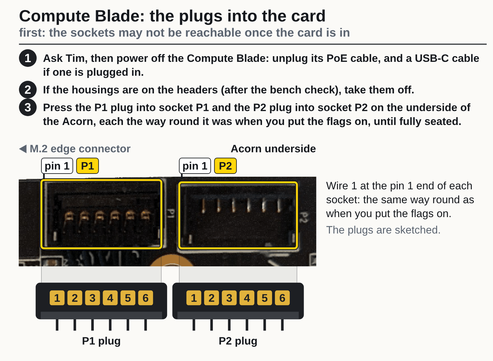{.only-light}
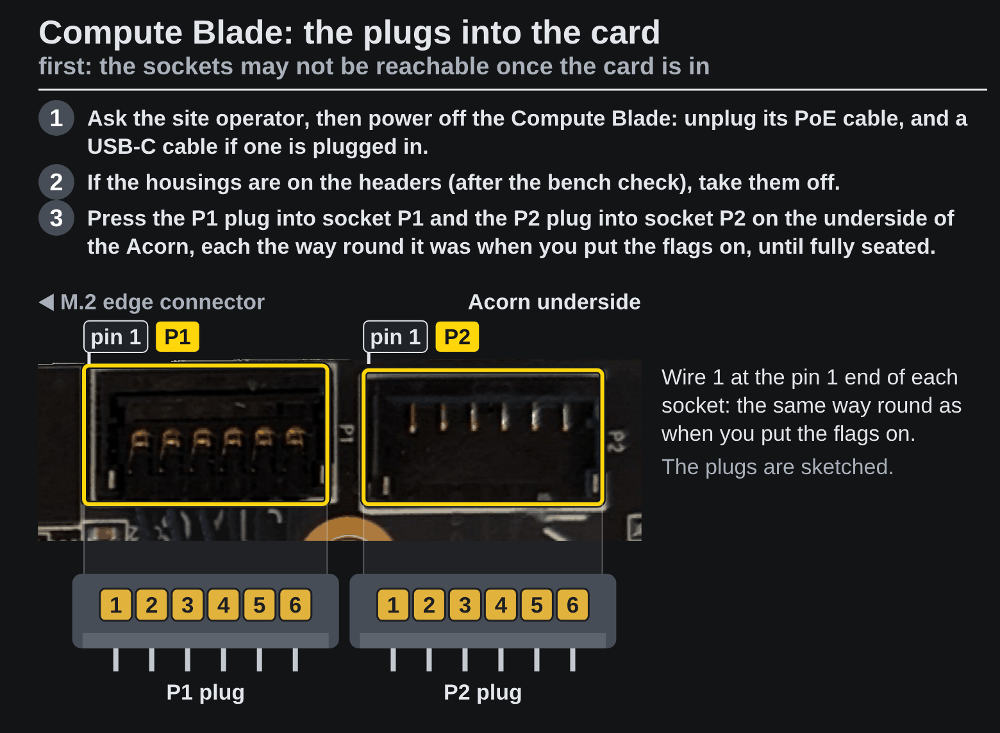{.only-dark}

**26.** Fit the card, then the housings, in this order. How the card goes in (action 4) is from [the Compute Blade's assembly guide](https://github.com/uptime-lab/compute-blade/blob/main/docs/docs/blade/getting-started/assembly.mdx).

4. Put the Acorn in the M.2 slot and fit its screw. The M2x2.5 standoff goes in the threaded insert for the card's size, with a 5 mm hex driver. Put the M2 nylon washer on the M2x2.5 screw, insert the card at a 30° angle and press down. Then secure the screw to the standoff with a PH1 driver.
5. Fit the P1 housing on the Extension Port, marked corner on pin 1. Fit the P2 housing on the UART, marked corner on pin 1.
6. Before powering on, look at both housings again, as on the bench check. The P1 housing's marked corner is on pin 1 of the Extension Port, and the P2 housing's on pin 1 of the UART. Turned round, the P1 housing puts 5 V on the TCK wire and the P2 housing puts 5 V on the K2 wire. That is above the most AMD's Artix 7 data sheet allows on an FPGA pin (DS181, Table 1). The most it allows is VCCO + 0.55 V, with VCCO at most 3.6 V. That can destroy the FPGA pin on the Acorn that wire reaches. Fitted, the housings get only this look; the meter check was the bench check's.

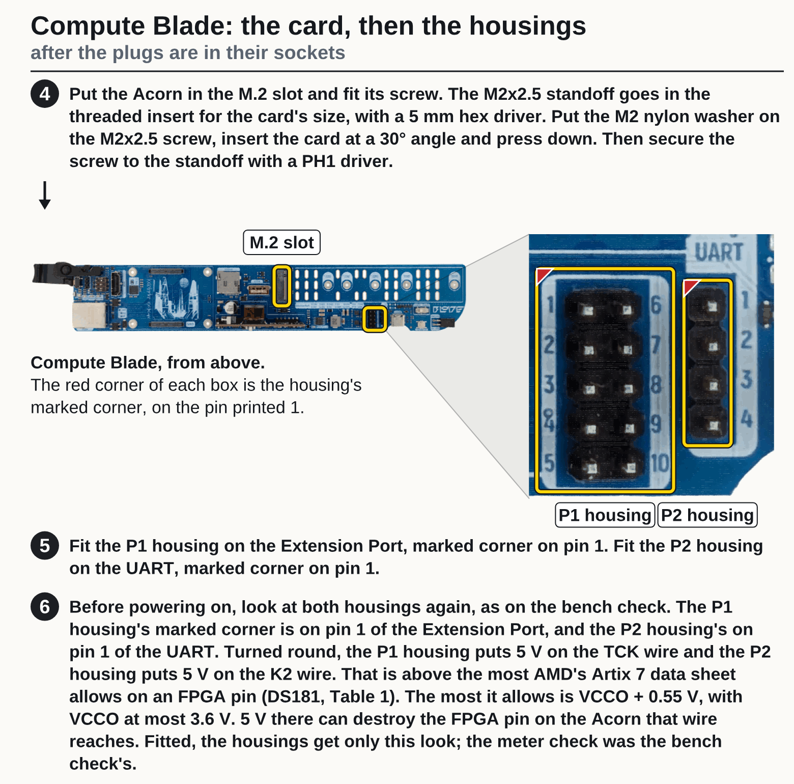{.only-light}
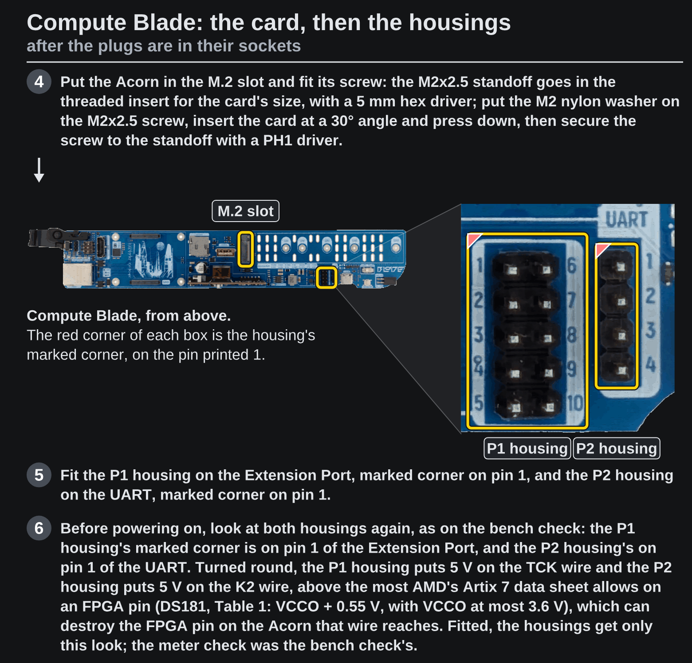{.only-dark}

Photos: Uptime Lab (Compute Blade), RHS Research (LiteFury underside; the Acorn is the same PCB).
