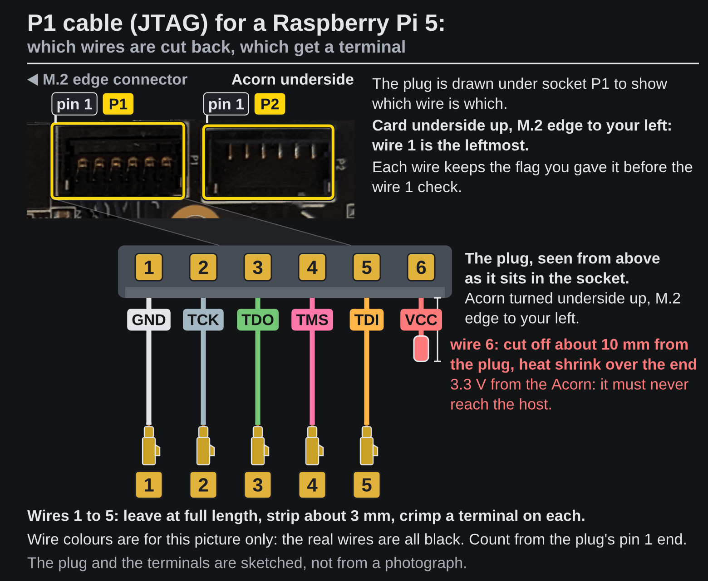
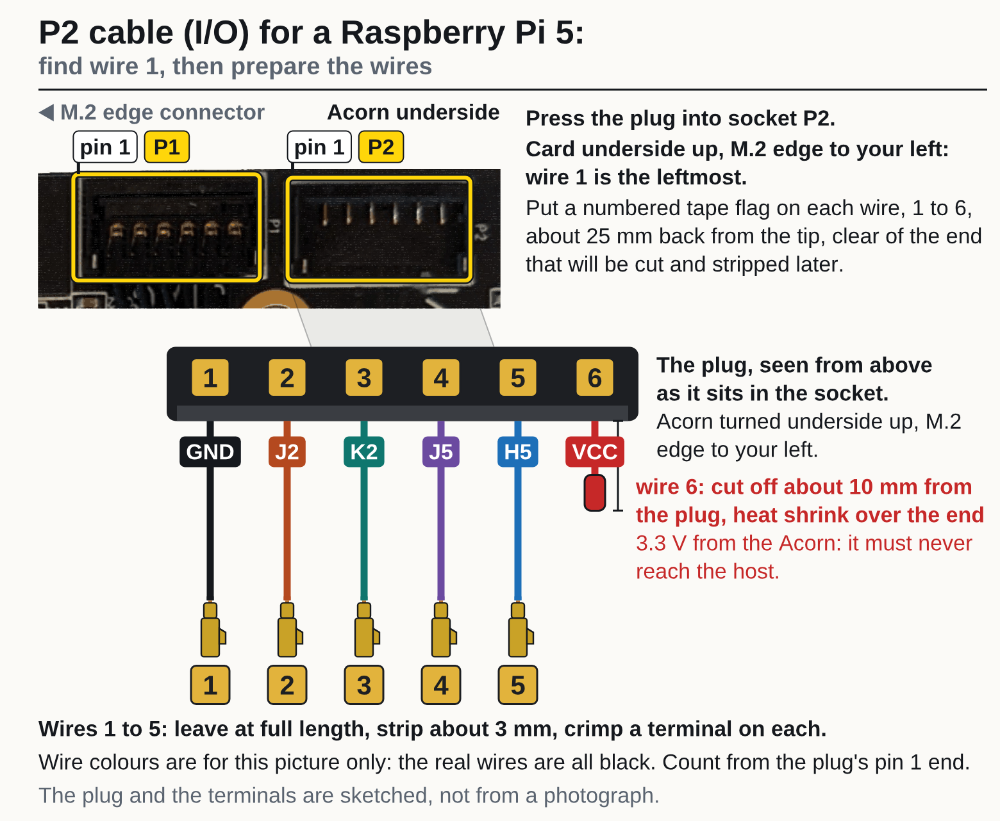
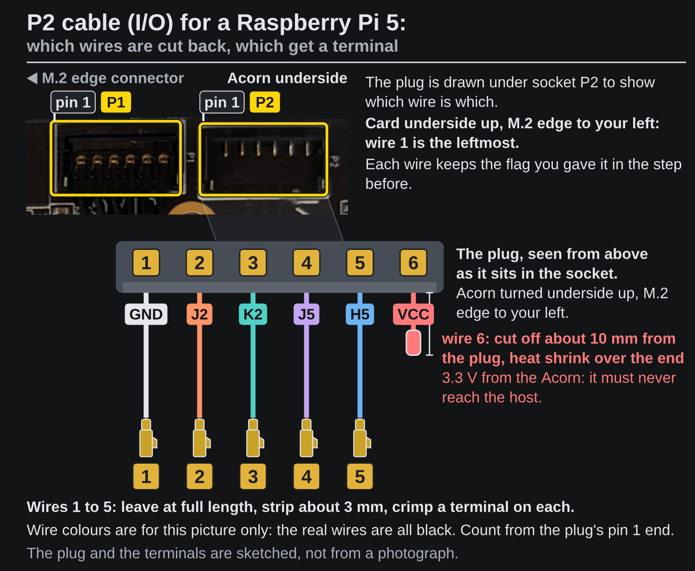
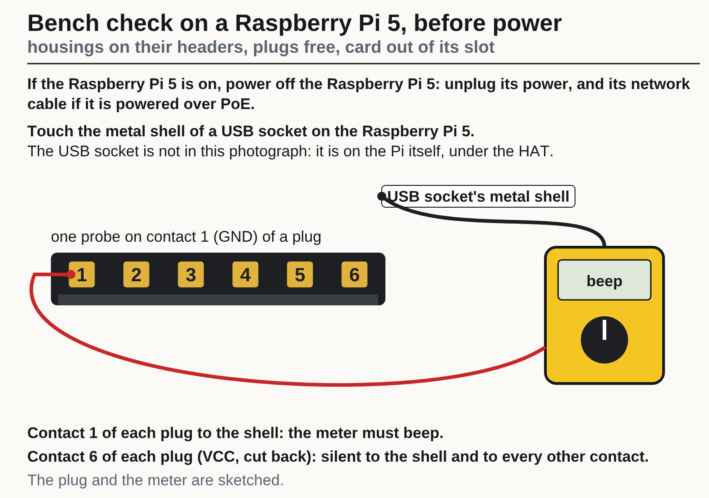
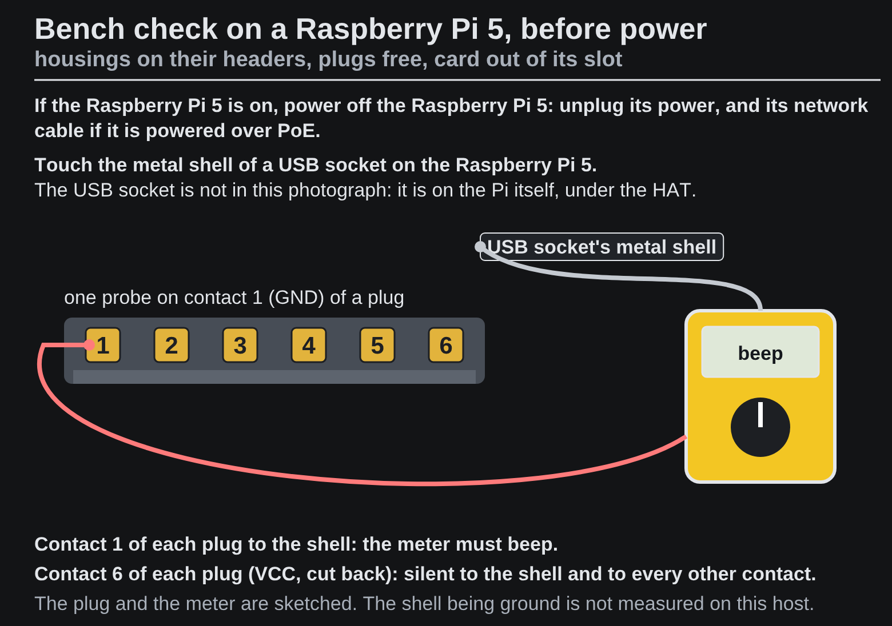

<!-- Generated by fpgas.online-test-designs docs/wiring/acorn/gen.py from wiring.toml. Edit wiring.toml there, not this file. -->

Not yet run by us on this hardware: written from the design.

### What you will have

Two short cables from the Acorn's two connectors to the Raspberry Pi 5: the P1 cable carries JTAG, the P2 cable carries the serial port and two spare GPIOs.

GND, TCK, TDO, TMS, TDI, J2, K2, J5 and H5 are the names on the pictures for each wire; J2, K2, J5 and H5 are the FPGA's pin names.

{.only-light}
{.only-dark}

### Parts and tools

The parts for **one** Raspberry Pi 5 host; for several hosts, that many of each.

| Have it | Qty | Part | Part number | What it is for |
|---|---|---|---|---|
| ☐ | 1 | Raspberry Pi 5 | — | the host |
| ☐ | 1 | Waveshare PoE M.2 HAT+ (B) | — | the M.2 M-key PCIe HAT the pictures show: it takes cards up to 2280 and leaves the 40-pin header free |
| ☐ | 1 | SQRL Acorn CLE-215+, CLE-215 or CLE-101 (the same card is sold as LiteFury and NiteFury) | — | M.2 M-key, 2280 |
| ☐ | 1 | Molex Pico-EZmate cable assembly, 6 circuits, a plug at each end | Molex 0369200601 | cut in half: one half is the P1 cable, the other the P2 cable. All six wires are black |
| ☐ | 1 | heat-shrink tube, about 2 mm, a few centimetres | — | over each cut-back wire end |
| ☐ | 1 | Dupont housing, 2×3, 2.54 mm pitch | — | over 40-pin header pins 5 to 10; 1 of its 6 cavities stays empty |
| ☐ | 1 | Dupont housing, 2×4, 2.54 mm pitch | — | over 40-pin header pins 19 to 26; 3 of its 8 cavities stay empty |
| ☐ | 10 | Dupont female crimp terminal, 2.54 mm | — | one for each connected wire: GND, TCK, TDO, TMS, TDI, GND, J2, K2, J5, H5; buy a few more than this, as spares |

The tools to build, fit and check its two cables, once for any number of hosts:

| Have it | Tool | What it is for |
|---|---|---|
| ☐ | multimeter with a continuity buzzer | all six wires of the cable are black: each is checked from the plug to its cavity before the cable is fitted |
| ☐ | wire strippers for fine wire, and side cutters | to cut the cable in half, strip about 3 mm from each wire, and cut back the wires that are not connected |
| ☐ | crimping tool for 2.54 mm Dupont terminals | one crimp for each connected wire |
| ☐ | hot-air tool for the heat-shrink tube | to shrink the tube over each cut-back end (VCC always) |
| ☐ | a fine probe tip for the multimeter, or a sewing pin to hold against a probe | the plug's contacts are 1.2 mm apart, and a terminal is reached through a small opening |
| ☐ | masking tape and a fine marker pen, or a paint pen | to flag the six wires with their numbers, and to mark the pin 1 corner of each housing |
| ☐ | a ruler marked in millimetres | the steps give lengths in millimetres: where a flag goes, how much of a wire is left, cut back or stripped |

### Steps

**1.** Cut the Molex cable in half with side cutters. Each half is one cable. The cut comes before the reach check on purpose: a half is what goes between the card and the Raspberry Pi 5, so a half is what is checked for reach, below.

{.only-light}
{.only-dark}

**2.** Check that each half reaches, before any wire is cut back or crimped. If the Raspberry Pi 5 is on, power off the Raspberry Pi 5: unplug its power, and its network cable if it is powered over PoE. With the card out of its slot, hold the card over the slot where it will sit, and lay the half for P1 from socket P1 to the 40-pin header and the half for P2 from socket P2 to the 40-pin header, along the way each cable will run. Its cut end must reach the header with some slack left to bend into the housing; how much is needed has not been measured by us. If a half does not reach, stop: this guide uses each half at the length it has, and a longer cable is not written here. Tell whoever gave you this guide. **Not yet done by us on this hardware.**

#### The P1 cable (JTAG)

**3.** Find wire 1 of the P1 cable and flag the wires, before cutting any wire back.

1. Press the plug of one half into socket P1 on the underside of the Acorn. Hold the card underside up with the M.2 edge to your left: wire 1 is the leftmost.
2. Put a numbered tape flag on each of the 6 wires, 1 at the left to 6, about 25 mm back from the tip, clear of the end that will be cut and stripped later. Write P1 on the flag of wire 1 as well: off the card, the two halves look alike.

{.only-light}
{.only-dark}

**4.** Check which wire of the P1 cable is wire 1, with a meter, before cutting any wire back.

1. With the plug still in the socket (the Acorn out of any slot), set the meter to continuity. Press the probe tip, or a pin held to it, against the cut face of the wire flagged 1 (it is not stripped yet), and put the other probe on the plated half-round mounting pad at the end of the card: it must beep.
2. Do the same with the wire flagged 6: it must stay silent.
3. If wire 6 beeps instead, stop: the numbering is reversed; take the flags off and number from the other end. If neither wire beeps, strip about 3 mm from wires 1 and 6 and try again; if still neither beeps, stop: the ground point is not confirmed.
4. If both wires beep, first see that the two probes do not touch each other and that the cut faces of wires 1 and 6 do not touch. If both still beep, stop and cut nothing: the check cannot tell the wires apart. Leave the flags on and take the plug out. Wire 6 is the card's 3.3 V by the LiteX wiki's legend; that it stays silent to ground on a card with no power is expected and has not been measured by us. Set the meter to ohms, write down what each of the two wires reads to the pad, and send both readings to whoever gave you this guide.
5. Take the plug out again.

{.only-light}
{.only-dark}

**5.** Cut wire 6 off about 10 mm from the plug and shrink a piece of the 2 mm tube over the cut end. It goes in no cavity. Wire 6 is VCC, 3.3 V from the Acorn (the LiteX wiki's legend names it so; not measured by us): it must never reach the host. Leave wires 1 to 5 at full length.

{.only-light}
{.only-dark}

**6.** Strip about 3 mm from wires 1 to 5. Crimp a Dupont terminal on each.

{.only-light}
{.only-dark}

**7.** Hold the empty 2×4 housing with the wire openings facing you and its long side upright, as in the picture. Until it is marked, either way up is the same. Mark the top left corner with a paint pen or a dot of tape: that is the pin 19 corner. For each wire, read the number on its flag and find the same number in the picture: that is the cavity its terminal goes in. Turned round, the housing puts its wires on the wrong pins. Wire 6 goes in no cavity.

{.only-light}
{.only-dark}

**8.** Push each terminal into its cavity, latch tab towards the window, until it clicks. Pull each wire gently: the terminal must stay in. The P1 cavity picture is shown again under the picture of how a terminal goes in, to read each wire's cavity from.

{.only-light}
{.only-dark}

{.only-light}
{.only-dark}

**9.** Check each wire with a meter on continuity. Set the meter to continuity. The probes go as in the picture: one on a contact of the plug, the other on a terminal, through the opening on the pin side of the housing. The plug's contacts are 1.2 mm apart: use a fine probe or a sewing pin held to the probe.

{.only-light}
{.only-dark}

**10.** Now check each wire against its cavity. For each wire: read the number on its flag and find it in the picture; one probe on that wire's contact on the plug, the other on the terminal in that cavity: it must beep. Every other cavity must stay silent for that contact. The P1 cavity picture is shown again below, to read each wire's cavity from.

{.only-light}
{.only-dark}

#### The P2 cable (I/O)

**11.** Find wire 1 of the P2 cable and flag the wires, before cutting any wire back.

1. Press the plug of the other half into socket P2 on the underside of the Acorn. Hold the card underside up with the M.2 edge to your left: wire 1 is the leftmost.
2. Put a numbered tape flag on each of the 6 wires, 1 at the left to 6, about 25 mm back from the tip, clear of the end that will be cut and stripped later. Write P2 on the flag of wire 1 as well: off the card, the two halves look alike.

{.only-light}
{.only-dark}

**12.** Check which wire of the P2 cable is wire 1, with a meter, before cutting any wire back.

1. With the plug still in the socket (the Acorn out of any slot), set the meter to continuity. Press the probe tip, or a pin held to it, against the cut face of the wire flagged 1 (it is not stripped yet), and put the other probe on the plated half-round mounting pad at the end of the card: it must beep.
2. Do the same with the wire flagged 6: it must stay silent.
3. If wire 6 beeps instead, stop: the numbering is reversed; take the flags off and number from the other end. If neither wire beeps, strip about 3 mm from wires 1 and 6 and try again; if still neither beeps, stop: the ground point is not confirmed.
4. If both wires beep, first see that the two probes do not touch each other and that the cut faces of wires 1 and 6 do not touch. If both still beep, stop and cut nothing: the check cannot tell the wires apart. Leave the flags on and take the plug out. Wire 6 is the card's 3.3 V by the LiteX wiki's legend; that it stays silent to ground on a card with no power is expected and has not been measured by us. Set the meter to ohms, write down what each of the two wires reads to the pad, and send both readings to whoever gave you this guide.
5. Take the plug out again.

{.only-light}
{.only-dark}

**13.** Cut wire 6 off about 10 mm from the plug and shrink a piece of the 2 mm tube over the cut end. It goes in no cavity. Wire 6 is VCC, 3.3 V from the Acorn (the LiteX wiki's legend names it so; not measured by us): it must never reach the host. Leave wires 1 to 5 at full length.

{.only-light}
{.only-dark}

**14.** Strip about 3 mm from wires 1 to 5. Crimp a Dupont terminal on each.

{.only-light}
{.only-dark}

**15.** Hold the empty 2×3 housing with the wire openings facing you and its long side upright, as in the picture. Until it is marked, either way up is the same. Mark the top left corner with a paint pen or a dot of tape: that is the pin 5 corner. For each wire, read the number on its flag and find the same number in the picture: that is the cavity its terminal goes in. Turned round, the housing puts its wires on the wrong pins. Wire 6 goes in no cavity.

{.only-light}
{.only-dark}

**16.** Push each terminal into its cavity, latch tab towards the window, until it clicks. Pull each wire gently: the terminal must stay in. The P2 cavity picture is shown again under the picture of how a terminal goes in, to read each wire's cavity from.

{.only-light}
{.only-dark}

{.only-light}
{.only-dark}

**17.** Check each wire with a meter on continuity. Set the meter to continuity. The probes go as in the picture: one on a contact of the plug, the other on a terminal, through the opening on the pin side of the housing. The plug's contacts are 1.2 mm apart: use a fine probe or a sewing pin held to the probe.

{.only-light}
{.only-dark}

**18.** Now check each wire against its cavity. For each wire: read the number on its flag and find it in the picture; one probe on that wire's contact on the plug, the other on the terminal in that cavity: it must beep. Every other cavity must stay silent for that contact. The P2 cavity picture is shown again below, to read each wire's cavity from.

{.only-light}
{.only-dark}

#### Fit the cables

**19.** This is a bench check; the housings come off again before the cables are fitted. If the Raspberry Pi 5 is on, power off the Raspberry Pi 5: unplug its power, and its network cable if it is powered over PoE. Then fit the P1 housing on the 40-pin header pins 19 to 26 with its marked corner on pin 19, counted as in the picture, and the P2 housing on the 40-pin header pins 5 to 10 with its marked corner on pin 5, counted as in the picture. The Acorn is not in its slot and the plugs are free. Put one meter probe on contact 1 (GND) of a plug and the other on the metal shell of a USB socket on the Raspberry Pi 5: it must beep. Do the same for the other plug. Then contact 6 of each plug (VCC, the wire you cut back): against the shell and against every other contact it must be silent. That the shell is the host's ground is not measured by us; contact 1's beep is what shows it. The beep does not show which way round the P1 housing is: turned round, its GND wire still sits on a ground pin, so look at its marked corner. The beep does not show which way round the P2 housing is: turned round, its GND wire still sits on a ground pin, so look at its marked corner.

{.only-light}
{.only-dark}

The P1 cavity picture again, for where its housing sits and which corner is marked:

{.only-light}
{.only-dark}

The P2 cavity picture again, for where its housing sits and which corner is marked:

{.only-light}
{.only-dark}

**20.** Fit the plugs into the card. The sockets are on the underside of the card and may not be reachable once it is in the slot, so the plugs go in first, in this order.

1. Power off the Raspberry Pi 5: unplug its power, and its network cable if it is powered over PoE.
2. If the housings are on the headers (after the bench check), take them off.
3. Press the P1 plug into socket P1 and the P2 plug into socket P2 on the underside of the Acorn, each the way round it was when you put the flags on, until fully seated.

{.only-light}
{.only-dark}

**21.** Fit the card, then the housings, in this order.

4. Put the Acorn in the M.2 slot and fit its screw, in the standoff marked 2280 at the far end of the Waveshare PoE M.2 HAT+ (B).
5. Fit the P1 housing on the 40-pin header pins 19 to 26, marked corner on pin 19, and the P2 housing on the 40-pin header pins 5 to 10, marked corner on pin 5.
6. Before powering on, look at both housings again, as on the bench check: the P1 housing's marked corner is on pin 19 of the 40-pin header, and the P2 housing's on pin 5 of the 40-pin header. Turned round, either housing puts its wires on the wrong pins. Fitted, the housings get only this look; the meter check was the bench check's.

{.only-light}
{.only-dark}

Photos: Waveshare (PoE M.2 HAT+ (B)), RHS Research (LiteFury underside; the Acorn is the same PCB).
