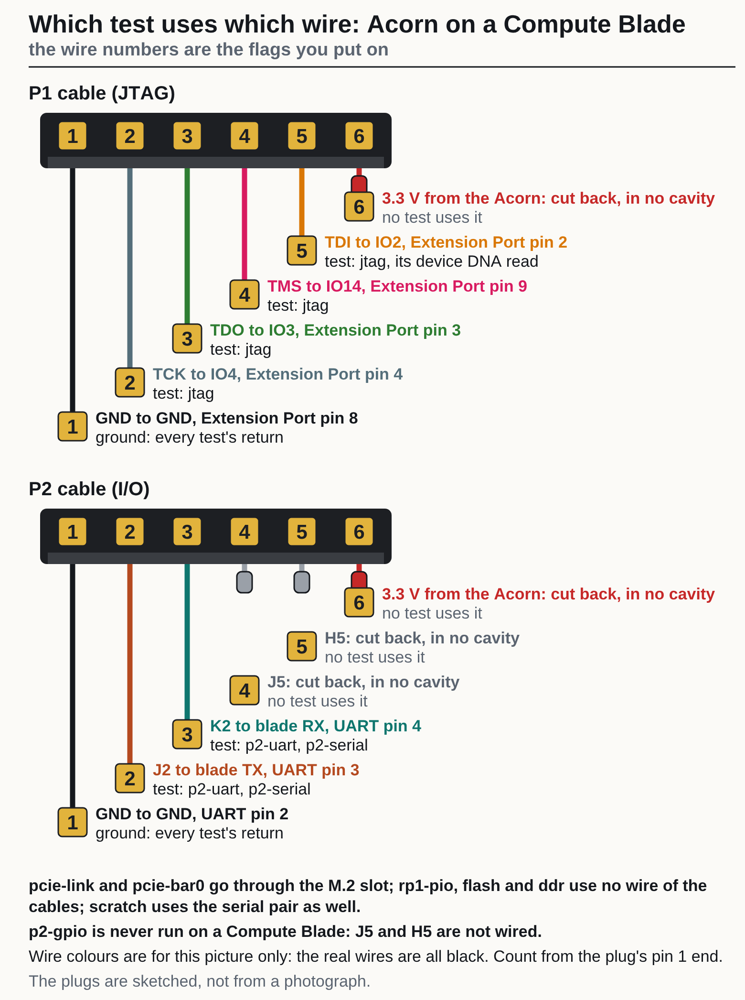
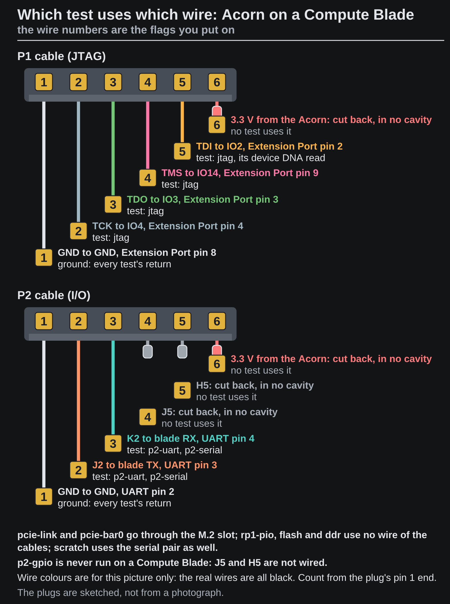

<!-- Generated by fpgas.online-test-designs docs/wiring/acorn/gen.py from wiring.toml. Edit wiring.toml there, not this file. -->

## What the check is

`fpgas-verify` is the program that checks an FPGA board from the machine it is attached to. For an Acorn its check doubles as a wiring test: each of its tests uses a known set of wires between the card and the blade, so which tests pass, and what a failing one says, point at the wire. An Acorn is sold as a CLE-215+ and as a CLE-101; the check covers both, and its summary names the one it found (`acorn cle-101`).

The check never writes the card's flash and never loads a design into the FPGA. It drives the P1 and P2 wires, which is how it tests them, and puts the host's pins back as it found them.

**What to expect on a Compute Blade today.** `pcie-link` passes when the card is seated, on SQRL's factory image or on the vendor's XDMA sample image (version 0.0.post1220 or newer). On a Compute Module 5 `jtag` cannot run in a boot that has the header's serial port on (kernel 6.18): the serial port holds GPIO14, which is also the JTAG TMS wire, so `jtag` fails there whatever the wiring. With the port off at boot (a change to the gateway's boot files, on the page "verifying 3"), `jtag` passes (it reads the IDCODE and device DNA): run on pi20 at ps1 on 7 October 2026. On a Compute Module 4 it has not been run by us. Every other test but `rp1-pio` is `not run` until the card is converted to the fpgas.online design, and converting a card on a blade has not been done by us. So the result today is `fail` even with perfect cables: it shows that the card is seated and its PCIe link is up, and it cannot yet show that the two cables are right. The bench check with a meter, before fitting, is what the cables rest on until then.


## Install it and run it

The Compute Blades at ps1 boot from the network with their root file system in memory (`overlayroot=tmpfs`): what you install is gone at the next boot, and so is the check that would run at boot. So after each boot, install and run by hand:

```bash
# 1. The two apt repositories the packages come from.
sudo install -d -m0755 /etc/apt/keyrings
curl -fsSL https://apt.fpgas.online/apt.gpg | sudo tee /etc/apt/keyrings/apt.gpg > /dev/null
echo "deb [signed-by=/etc/apt/keyrings/apt.gpg] https://apt.fpgas.online/$(. /etc/os-release; echo $VERSION_CODENAME)/ ./" \
  | sudo tee /etc/apt/sources.list.d/apt.list
curl -fsSL https://fpgas.online/fpgas.online-fpga-tools/fpgas.online-fpga-tools.gpg \
  | sudo tee /etc/apt/keyrings/fpgas.online-fpga-tools.gpg > /dev/null
echo "deb [signed-by=/etc/apt/keyrings/fpgas.online-fpga-tools.gpg] https://fpgas.online/fpgas.online-fpga-tools/$(. /etc/os-release; echo $VERSION_CODENAME)/ ./" \
  | sudo tee /etc/apt/sources.list.d/fpgas.online-fpga-tools.list

# 2. The Acorn's packages.
sudo apt update
sudo apt install fpgas-online-acorn

# 3. What is installed, and which board this host is set up to check.
fpgas-verify --list

# 4. The check. Nothing is sent anywhere unless a file on the host says `publish = on`; --no-publish makes sure.
sudo fpgas-acorn-verify --no-publish
```

`fpgas-verify` checks whichever board this host is set up for, as the check at boot does; `fpgas-acorn-verify` checks the Acorn whatever the host is set up for. On a host set up for an Acorn the two print the same.

## Read the result

There is one result, **pass** or **fail**, and only a pass exits 0. The summary on the terminal lists every test in the order it ran with its result; for a check that did not pass it ends with `RESULT:`, a `failed:` line for each failed test, a `not run:` line for the tests that did not run and why, and `What to do:`.

**No Compute Blade has passed the whole check yet.** This is what one prints today: a Compute Blade with a Compute Module 5 and an Acorn CLE-101 still on the image it was sold with (pi16 at ps1, 7 October 2026, installed by the steps above). Two things are wrong and neither is the wiring or the installation: the card has not been converted to the fpgas.online design, and in this boot the JTAG test cannot have its TMS pin, which the header's serial port holds.

```text
$ sudo fpgas-acorn-verify --no-publish

******************************************************************************
*** FPGA VERIFY: FAIL ******************************************************
fpgas-verify: fail (mode acorn, configured: acorn)
  not published: --no-publish
  acorn cle-101: fail
    unconverted: runs SQRL's factory image, not the fpgas.online design
    pcie-link  pass
    rp1-pio    pass
    jtag       fail: P1 JTAG could not be probed: GPIO14 (TMS) is held by 1f00030000.serial (uart0): the kernel does not hand out a pin that is held, so the JTAG chain cannot be scanned
    pcie-bar0  not run: unconverted: runs SQRL's factory image, not the fpgas.online design
    flash      not run: unconverted: runs SQRL's factory image, not the fpgas.online design
    ddr        not run: unconverted: runs SQRL's factory image, not the fpgas.online design
    p2-uart    not run: the board does not run a known build
    p2-serial  not run: unconverted: runs SQRL's factory image, not the fpgas.online design
    scratch    not run: unconverted: runs SQRL's factory image, not the fpgas.online design
    p2-gpio    not run: J5 and H5 are not wired on the Compute Blade setup
  state recorded (first run) in /var/lib/fpgas-online/verify-state.json

RESULT: FAIL: a board did not pass.
  acorn cle-101: fail (2 tests passed, 1 failed, 7 not run)
    fault: unconverted: runs SQRL's factory image, not the fpgas.online design
    failed: jtag: P1 JTAG could not be probed: GPIO14 (TMS) is held by 1f00030000.serial (uart0): the kernel does not hand out a pin that is held, so the JTAG chain cannot be scanned
    not run: pcie-bar0, flash, ddr, p2-serial, scratch: unconverted: runs SQRL's factory image, not the fpgas.online design
    not run: p2-uart: the board does not run a known build
    not run: p2-gpio: J5 and H5 are not wired on the Compute Blade setup
What to do:
  * The Acorn still runs the image it was sold with, not the fpgas.online one,
    so only its PCIe link and its JTAG could be tested. It has to be converted
    once (the fpgas.online image loaded over JTAG, then written to its flash
    with fpgas-acorn-flash):
    https://github.com/fpgas-online/fpgas.online-test-designs/blob/main/docs/hardware/acorn-pcie-programming.md
  * The serial port has a pin JTAG needs, so the JTAG test could not run. On a
    Compute Blade the JTAG TMS wire and the serial port's TX are the same pin
    (GPIO14): while the serial port is on, JTAG cannot be tested there.
    Booting with it off (enable_uart in config.txt) should free the pin; that
    is not yet confirmed on hardware:
    https://github.com/fpgas-online/fpgas.online-test-designs/issues/127
  * To look at the acorn board yourself: sudo fpgas-acorn-debug --help (sudo
    apt install fpgas-online-acorn-debug)
  * What each message means:
    https://docs.fpgas.online/en/latest/verify/fpgas-verify.html#common-failures
The whole report, for a program to read (JSON): /run/fpgas-online/verify.json
******************************************************************************
```

On the blades at ps1 every `sudo` first prints `sudo: unable to resolve host pi16: Name or service not known` (with the blade's own name). It did no harm on the blades it was seen on (7 October 2026), and is left out above.

**A card still on the vendor's XDMA sample image** (pi20 at ps1, 7 October 2026, version 0.0.post1220) gets the same tests as one on SQRL's image: `pcie-link` and `rp1-pio` pass, `jtag` fails on GPIO14 as above, the rest are `not run`. Its summary line reads `acorn -: fail` (no variant is named), and the first `What to do:` line says the board runs Xilinx's XDMA sample design and is to be converted. That was on pi20 at ps1, installed by the steps above; with an earlier version the check printed `acorn: fail (no test ran)` ([#155](https://github.com/fpgas-online/fpgas.online-test-designs/issues/155)).

A pass will list every test with `pass` and end there, with no `RESULT:` part; on a Compute Blade `p2-gpio` stays `not run`, because J5 and H5 are not wired.

## Which test uses which wire

{.only-light}
{.only-dark}

| Test | Wires it uses | A pass shows | Runs on a card still on SQRL's image |
|---|---|---|---|
| `pcie-link` | the M.2 slot | the card is seated and the PCIe link is at the setup's speed and width | yes |
| `jtag` | P1: TCK, TMS, TDO for the IDCODE read; TDI as well for the device DNA read | all four JTAG wires, and that the FPGA is the variant's part | yes |
| `pcie-bar0` | the M.2 slot | the fpgas.online design is running and answers over PCIe | no: the board gets `fault: unconverted: …`; this test, `p2-uart`, `p2-serial`, `p2-gpio`, `flash`, `ddr` and `scratch` are listed as `not run` (`pcie-link`, `jtag` and `rp1-pio` still run) |
| `p2-uart` | P2: K2 (FPGA transmit) to the Pi's RXD (GPIO15), J2 (FPGA receive) from the Pi's TXD (GPIO14) | the serial pair, in the right direction | no |
| `p2-serial` | the same two wires, driven and read as plain pins in both directions | each of J2 and K2 on its own, so a crossed pair or one open wire is told apart | no |
| `p2-gpio` | none: J5 and H5 are not wired on a Compute Blade | nothing: it is listed as `not run` | never runs |
| `rp1-pio` | no wire: `/dev/pio0` on a Pi 5 or CM5 | nothing about the wiring (not run on other hosts) | yes |
| `flash`, `ddr`, `scratch` | no wire of the cable, except that `scratch` also goes over the serial pair | nothing about the wiring | no |

So on a card that has not been converted yet, `pcie-link` and `jtag` are the wiring tests; the P2 wires can
only be tested once the card runs the fpgas.online design
([converting a card](https://docs.fpgas.online/en/latest/boards/acorn/pcie-programming.html)).
