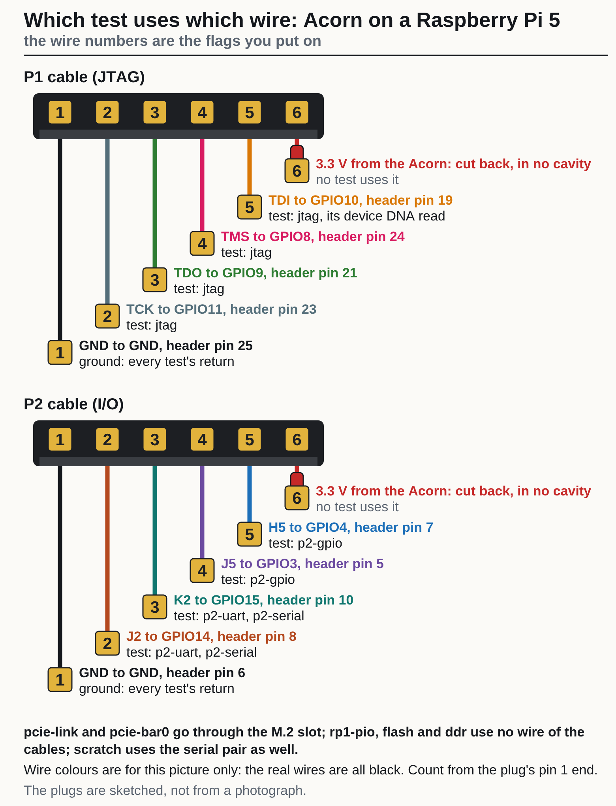

<!-- Generated by fpgas.online-test-designs docs/wiring/acorn/gen.py from wiring.toml. Edit wiring.toml there, not this file. -->

## What the check is

`fpgas-verify` is the program that checks an FPGA board from the machine it is attached to. For an Acorn its check doubles as a wiring test: each of its tests uses a known set of wires between the card and the Pi, so which tests pass, and what a failing one says, point at the wire. An Acorn is sold as a CLE-215+ and as a CLE-101; the check covers both, and its summary names the one it found (`acorn cle-101`).

The check never writes the card's flash and never loads a design into the FPGA. It drives the P1 and P2 wires, which is how it tests them, and puts the host's pins back as it found them.

## Install it and run it

**On a Raspberry Pi 5 of the fleet (welland) there is nothing to install.** The root it boots from carries the packages and runs the check once at each boot. Read that result, or run the check again by hand without telling the site:

```bash
journalctl -b -u fpgas-verify -o cat       # what the check at this boot said
sudo fpgas-verify --no-publish             # run it again now; nothing is sent to the site
```

**On a Raspberry Pi 5 that is not booted from the fleet's root**, install and run by hand. If its root file system is in memory (`overlayroot=tmpfs`), what you install is gone at the next boot:

```bash
# 1. The two apt repositories the packages come from.
sudo install -d -m0755 /etc/apt/keyrings
curl -fsSL https://apt.fpgas.online/apt.gpg | sudo tee /etc/apt/keyrings/apt.gpg > /dev/null
echo "deb [signed-by=/etc/apt/keyrings/apt.gpg] https://apt.fpgas.online/$(. /etc/os-release; echo $VERSION_CODENAME)/ ./" \
  | sudo tee /etc/apt/sources.list.d/apt.list
curl -fsSL https://fpgas.online/fpgas.online-fpga-tools/fpgas.online-fpga-tools.gpg \
  | sudo tee /etc/apt/keyrings/fpgas.online-fpga-tools.gpg > /dev/null
echo "deb [signed-by=/etc/apt/keyrings/fpgas.online-fpga-tools.gpg] https://fpgas.online/fpgas.online-fpga-tools/$(. /etc/os-release; echo $VERSION_CODENAME)/ ./" \
  | sudo tee /etc/apt/sources.list.d/fpgas.online-fpga-tools.list

# 2. The Acorn's packages.
sudo apt update
sudo apt install fpgas-online-acorn

# 3. What is installed, and which board this host is set up to check.
fpgas-verify --list

# 4. The check. Nothing is sent anywhere unless a file on the host says `publish = on`; --no-publish makes sure.
sudo fpgas-acorn-verify --no-publish
```

`fpgas-verify` checks whichever board this host is set up for, as the check at boot does; `fpgas-acorn-verify` checks the Acorn whatever the host is set up for. On a host set up for an Acorn the two print the same.

## Read the result

There is one result, **pass** or **fail**, and only a pass exits 0. The summary on the terminal lists every test in the order it ran with its result; for a check that did not pass it ends with `RESULT:`, a `failed:` line for each failed test, a `not run:` line for the tests that did not run and why, and `What to do:`.

A pass, on an Acorn on a Raspberry Pi 5 at welland (pi-sw2-p47, 2 October 2026):

```text
$ sudo fpgas-verify --no-publish
fpgas-verify: pass (mode auto, auto: USB/PCI IDs)
  not published: --no-publish
  acorn cle-215+: pass
    pcie-link  pass
    pcie-bar0  pass
    rp1-pio    pass
    jtag       pass
    flash      pass
    ddr        pass
    p2-uart    pass
    p2-serial  pass
    scratch    pass
    p2-gpio    pass
    flash 0x000000 match
    flash 0x400000 match
  state recorded (first run) in /var/lib/fpgas-online/verify-state.json
```

## Which test uses which wire



| Test | Wires it uses | A pass shows | Runs on a card still on SQRL's image |
|---|---|---|---|
| `pcie-link` | the M.2 slot | the card is seated and the PCIe link is at the setup's speed and width | yes |
| `jtag` | P1: TCK, TMS, TDO for the IDCODE read; TDI as well for the device DNA read | all four JTAG wires, and that the FPGA is the variant's part | yes |
| `pcie-bar0` | the M.2 slot | the fpgas.online design is running and answers over PCIe | no: the board gets `fault: unconverted: …`; this test, `p2-uart`, `p2-serial`, `p2-gpio`, `flash`, `ddr` and `scratch` are listed as `not run` (`pcie-link`, `jtag` and `rp1-pio` still run) |
| `p2-uart` | P2: K2 (FPGA transmit) to the Pi's RXD (GPIO15), J2 (FPGA receive) from the Pi's TXD (GPIO14) | the serial pair, in the right direction | no |
| `p2-serial` | the same two wires, driven and read as plain pins in both directions | each of J2 and K2 on its own, so a crossed pair or one open wire is told apart | no |
| `p2-gpio` | P2: J5 to GPIO3, H5 to GPIO4, in both directions | the two spare wires | no |
| `rp1-pio` | no wire: `/dev/pio0` on a Pi 5 or CM5 | nothing about the wiring (not run on other hosts) | yes |
| `flash`, `ddr`, `scratch` | no wire of the cable, except that `scratch` also goes over the serial pair | nothing about the wiring | no |

So on a card that has not been converted yet, `pcie-link` and `jtag` are the wiring tests; the P2 wires can
only be tested once the card runs the fpgas.online design
([converting a card](https://docs.fpgas.online/en/latest/boards/acorn/pcie-programming.html)).

## What the check does to the card and the host

* The check never writes the card's flash and never loads a design into the FPGA. It does drive the P1 and P2
  wires, which is how it tests them, and puts the Pi's pins back as it found them; on a converted card it
  writes the design's scratch register and puts the old value back (with the opt-in power-cycle check on, it
  leaves a marker there); and it records what it found on this host
  (`/var/lib/fpgas-online/verify-state.json`).
* It exits 0 only for a pass. The summary is on the terminal; the same as JSON is in
  `/run/fpgas-online/verify.json`.
* To keep the packages across boots, they have to go into the image the host boots from; that is the host
  owner's root image, not something these packages do.
* The check needs no bitstream file of yours. The images it compares the card's flash with, and the design
  that converts a card, are installed with it by `fpgas-online-acorn-bitstreams`, in
  `/usr/share/fpgas-online/acorn-pcie/images/` (for a CLE-101: `acorn-cle-101-sqrl_acorn.bit` and the two
  flash images, [converting a card](https://docs.fpgas.online/en/latest/boards/acorn/pcie-programming.html)). No package installs a pin-id or
  loopback design for the Acorn; the check does not use one.
