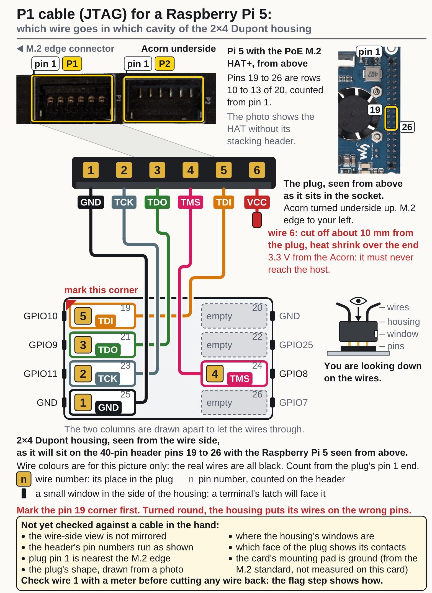
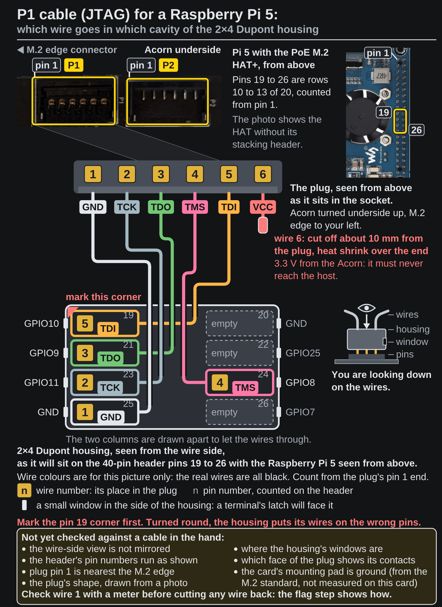

<!-- Generated by fpgas.online-test-designs docs/wiring/acorn/gen.py from wiring.toml. Edit wiring.toml there, not this file. -->

## From a failing line to the wire

Find the failing line in the table, then the wire in the two cavity pictures under it: the number in a cavity is the number on the wire's flag.

**Before you touch a cable: Power off the Raspberry Pi 5: unplug its power, and its network cable if it is powered over PoE.** After moving a wire, boot and run the check again. One test can be run on its own, `sudo fpgas-acorn-verify --test jtag` or `--test p2-serial`; its report is then JSON on the terminal.

| The failing line | Look at |
|---|---|
| `pcie-link fail: link is x2, expected x1` (or a speed) | the M.2 seat; or the setup's expected figures are not this host's |
| `jtag fail: no device on the P1 JTAG chain` | the P1 cable is not plugged in, or TCK, TMS or TDO is open or on the wrong pin |
| `jtag fail: P1 JTAG chain has …, expected one …` | another device answers, or the card is not the variant the host expects |
| `jtag fail: device DNA over P1 JTAG reads 0x0: the DNA port is not being read` (or `reads 0x1ffffffffffffff`), `openFPGALoader --read-dna read no device DNA over P1 JTAG`, or `device DNA over JTAG … is not the one over BAR0 …` | TDI: the IDCODE read worked without it |
| `p2-uart fail: no UARTBone reply on /dev/ttyAMA0 (P2 K2/J2)` | the serial pair: open, or crossed; `p2-serial` says which |
| `p2-serial fail: J2 -> GPIO14: the FPGA drove 1, the Pi read 0; K2 -> GPIO15: the FPGA drove 0, the Pi read 1; …` with the `01` and `10` lines swapped and `00` and `11` right | J2 and K2 are **crossed**: wires 2 and 3 of the P2 cable are in each other's cavity. Take both terminals out of the housing and put each in the other's cavity (the P2 cavity picture below) |
| `p2-serial` or `p2-gpio` naming one of its two signals only (J2 or K2; J5 or H5) | that one wire is **open**, or on the wrong pin. Before the FPGA drives, the test sets the Pi's pull against the level to come, so an open wire reads the opposite of what was driven; GPIO3 (J5's pin) has a pull-up of its own on the Pi, so an open J5 wire reads 1 whatever is driven |
| `p2-gpio fail: J5 -> GPIO3: …; H5 -> GPIO4: …` with the `01` and `10` lines swapped and `00` and `11` right | J5 and H5 are **crossed**: wires 4 and 5 of the P2 cable are in each other's cavity. Take both terminals out of the housing and put each in the other's cavity (the P2 cavity picture below) |

The two cavity pictures are the ones the cables were built from, shown again to find a wire's cavity. Their notes about cutting, marking and the meter check belong to building the cables.

{.only-light}
{.only-dark}

{.only-light}
{.only-dark}

`p2-serial` and `p2-gpio` print what was driven and what was read, eight lines for two wires. The two digits are the two signals: the right-hand digit is J2 (or J5), the left-hand one K2 (or H5).

**A crossed pair**: read on acorn-olive at Welland (an Acorn on a Raspberry Pi 5), 4 October 2026, whose P2 pairs were both crossed. The `p2-serial` test
drives each wire as a plain pin, first from the FPGA and then from the host. `FPGA drives 01` raises J2, which
should arrive on GPIO14; it arrives on GPIO15:

```text
    p2-serial  fail: J2 -> GPIO14: the FPGA drove 1, the Pi read 0; K2 -> GPIO15: the FPGA drove 0, the Pi read 1; J2 -> GPIO14: the FPGA drove 0, the Pi read 1; K2 -> GPIO15: the FPGA drove 1, the Pi read 0; GPIO14 -> J2: the Pi drove 1, the FPGA read 0; GPIO15 -> K2: the Pi drove 0, the FPGA read 1; GPIO14 -> J2: the Pi drove 0, the FPGA read 1; GPIO15 -> K2: the Pi drove 1, the FPGA read 0; the UARTBone does not answer on /dev/ttyAMA0 after the switch (no fpgas.online SoC answered at 1200 baud after a break)
        FPGA drives 00: Pi reads GPIO14=0 GPIO15=0
        FPGA drives 01: Pi reads GPIO14=0 GPIO15=1
        FPGA drives 10: Pi reads GPIO14=1 GPIO15=0
        FPGA drives 11: Pi reads GPIO14=1 GPIO15=1
        Pi drives 00: FPGA reads 00
        Pi drives 01: FPGA reads 10
        Pi drives 10: FPGA reads 01
        Pi drives 11: FPGA reads 11
```

**One open wire**: read on acorn-sycamore at Welland the same day, whose J5 wire did not reach GPIO3. GPIO3
reads 1 whatever the FPGA drives (the Pi's own pull-up on GPIO3 wins over the test's pull-down; on GPIO4 an
open wire would read the opposite of what was driven), and on this card the FPGA read J5 as 1 whatever the Pi
drove; H5 and GPIO4 follow each other:

```text
    p2-gpio    fail: J5 -> GPIO3: the FPGA drove 0, the Pi read 1; J5 -> GPIO3: the FPGA drove 0, the Pi read 1; GPIO3 -> J5: the Pi drove 0, the FPGA read 1; GPIO3 -> J5: the Pi drove 0, the FPGA read 1
        FPGA drives 00: Pi reads GPIO3=1 GPIO4=0
        FPGA drives 01: Pi reads GPIO3=1 GPIO4=0
        FPGA drives 10: Pi reads GPIO3=1 GPIO4=1
        FPGA drives 11: Pi reads GPIO3=1 GPIO4=1
        Pi drives 00: FPGA reads 01
        Pi drives 01: FPGA reads 01
        Pi drives 10: FPGA reads 11
        Pi drives 11: FPGA reads 11
```

A correctly wired pair reads back what was driven: `FPGA drives 01: Pi reads GPIO14=1 GPIO15=0`, `Pi drives 01:
FPGA reads 01`, and so on for every pattern.

A failing line that is not in the table above is not about a wire of the cables: the page "verifying 2b" has every other message the check gives about an Acorn.
