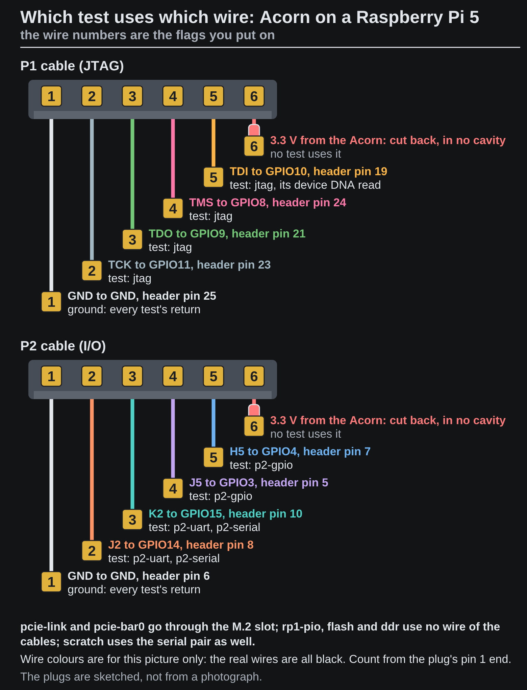

<!-- Generated by fpgas.online-test-designs docs/wiring/acorn/gen.py from wiring.toml. Edit wiring.toml there, not this file. -->

## Which test uses which wire

{.only-light}
{.only-dark}

| Test | Wires it uses | A pass shows | Runs on a card still on SQRL's image |
|---|---|---|---|
| `pcie-link` | the M.2 slot | the card is seated and the PCIe link is at the setup's speed and width | yes |
| `jtag` | P1: TCK, TMS, TDO for the IDCODE read; TDI as well for the device DNA read | all four JTAG wires, and that the FPGA is the variant's part | yes |
| `pcie-bar0` | the M.2 slot | the fpgas.online design is running and answers over PCIe | no: the board gets `fault: unconverted: …`; this test, `p2-uart`, `p2-serial`, `p2-gpio`, `flash`, `ddr` and `scratch` are listed as `not run` (`pcie-link`, `jtag` and `rp1-pio` still run) |
| `p2-uart` | P2: K2 (FPGA transmit) to the Pi's RXD (GPIO15), J2 (FPGA receive) from the Pi's TXD (GPIO14) | the serial pair, in the right direction | no |
| `p2-serial` | the same two wires, driven and read as plain pins in both directions | each of J2 and K2 on its own, so a crossed pair or one open wire is told apart | no |
| `p2-gpio` | P2: J5 to GPIO3, H5 to GPIO4, in both directions | the two spare wires | no |
| `rp1-pio` | no wire: `/dev/pio0` on a Pi 5 or CM5 | nothing about the wiring (not run on other hosts) | yes |
| `flash`, `ddr`, `scratch` | no wire of the cable, except that `scratch` also goes over the serial pair | nothing about the wiring | no |

On a card that has not been converted, `pcie-link` and `jtag` are the wiring tests. The P2 wires are tested once the card runs the fpgas.online design ([converting a card](https://docs.fpgas.online/en/latest/boards/acorn/pcie-programming.html)).
