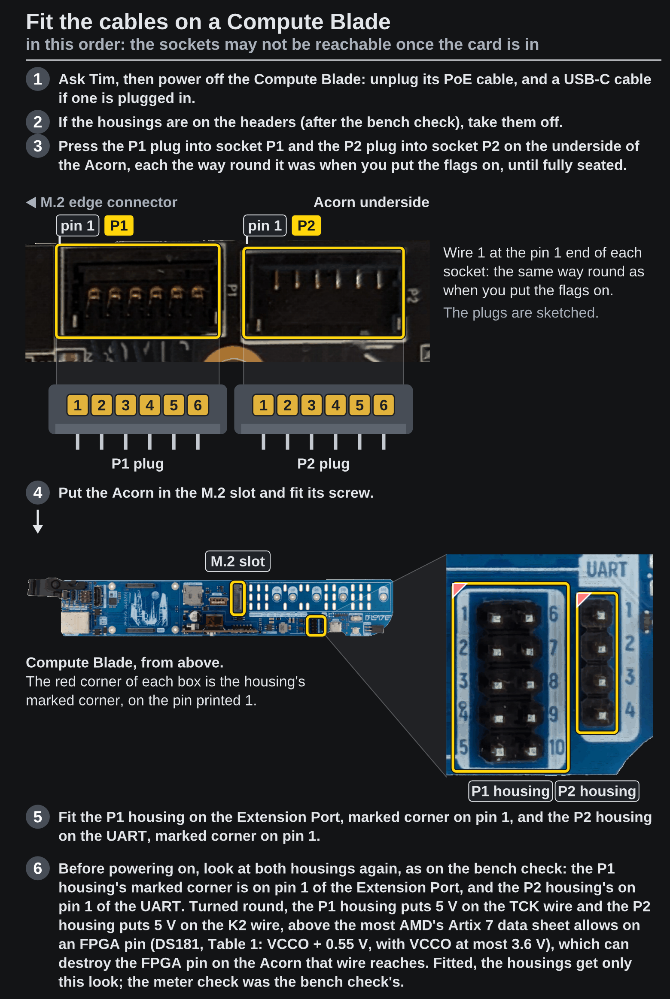

<!-- Generated by fpgas.online-test-designs docs/wiring/acorn/gen.py from wiring.toml. Edit wiring.toml there, not this file. -->

1. Ask Tim, then power off the Compute Blade: unplug its PoE cable, and a USB-C cable if one is plugged in.
2. If the housings are on the headers (after the bench check), take them off.
3. Press the P1 plug into socket P1 and the P2 plug into socket P2 on the underside of the Acorn, each the way round it was when you put the flags on, until fully seated.
4. Put the Acorn in the M.2 slot and fit its screw.
5. Fit the P1 housing on the Extension Port, marked corner on pin 1, and the P2 housing on the UART, marked corner on pin 1.
6. Before powering on, look at both housings again, as on the bench check: the P1 housing's marked corner is on pin 1 of the Extension Port, and the P2 housing's on pin 1 of the UART. Turned round, the P1 housing puts 5 V on the TCK wire and the P2 housing puts 5 V on the K2 wire, above the most AMD's Artix 7 data sheet allows on an FPGA pin (DS181, Table 1: VCCO + 0.55 V, with VCCO at most 3.6 V), which can destroy the FPGA pin on the Acorn that wire reaches. Fitted, the housings get only this look; the meter check was the bench check's.

{.only-light}
{.only-dark}
