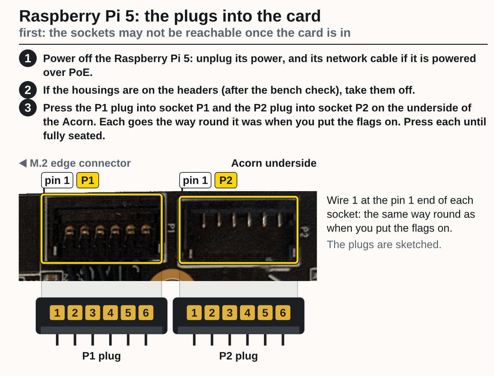
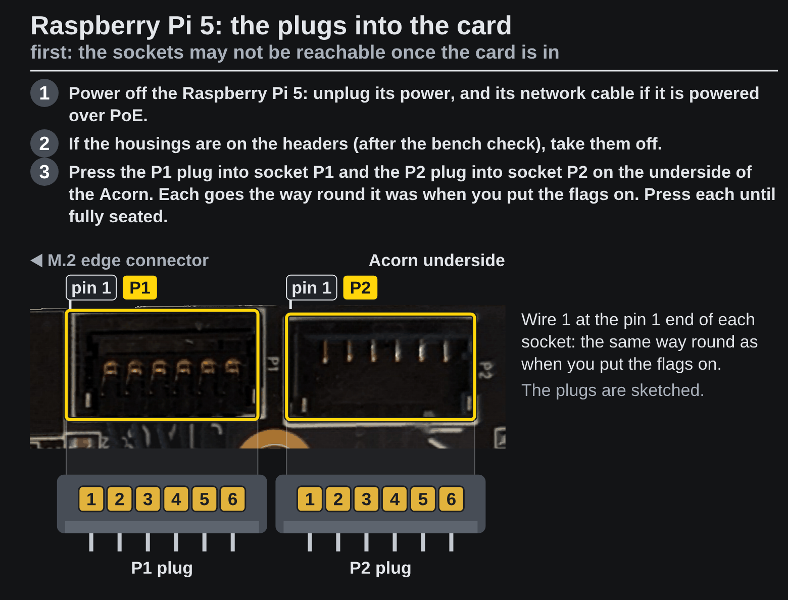
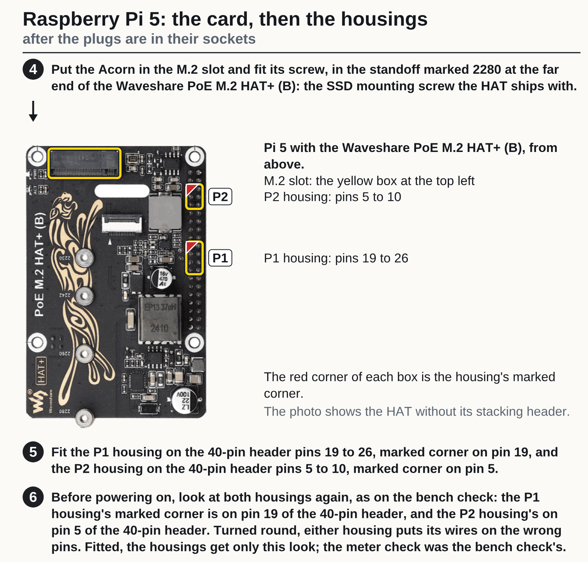
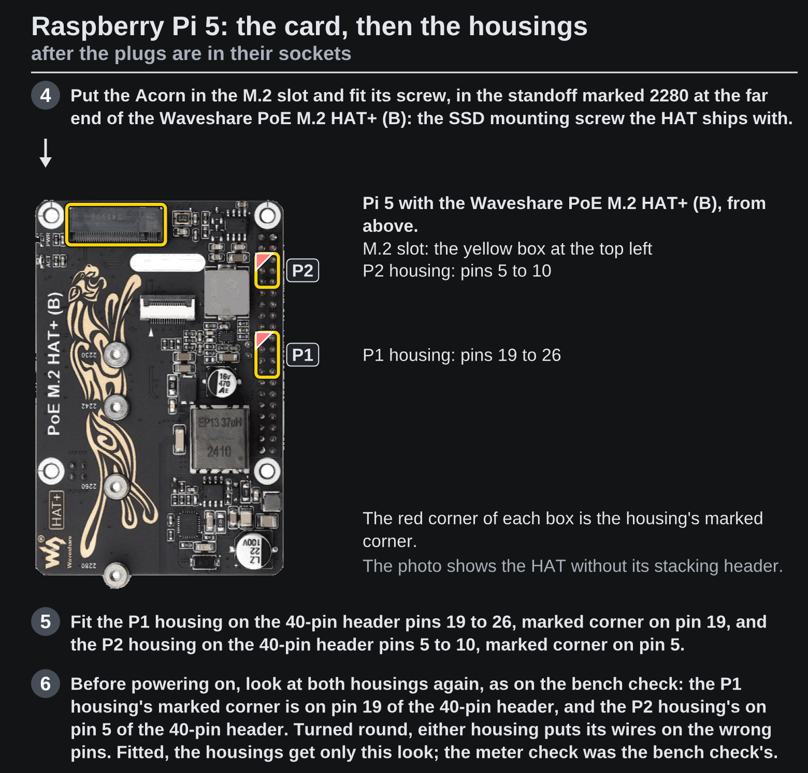

<!-- Generated by fpgas.online-test-designs docs/wiring/acorn/gen.py from wiring.toml. Edit wiring.toml there, not this file. -->

1. Power off the Raspberry Pi 5: unplug its power, and its network cable if it is powered over PoE.
2. If the housings are on the headers (after the bench check), take them off.
3. Press the P1 plug into socket P1 and the P2 plug into socket P2 on the underside of the Acorn, each the way round it was when you put the flags on, until fully seated.

{.only-light}
{.only-dark}

Then the card and the housings:

4. Put the Acorn in the M.2 slot and fit its screw, in the standoff marked 2280 at the far end of the Waveshare PoE M.2 HAT+ (B): the SSD mounting screw the HAT ships with.
5. Fit the P1 housing on the 40-pin header pins 19 to 26, marked corner on pin 19, and the P2 housing on the 40-pin header pins 5 to 10, marked corner on pin 5.
6. Before powering on, look at both housings again, as on the bench check: the P1 housing's marked corner is on pin 19 of the 40-pin header, and the P2 housing's on pin 5 of the 40-pin header. Turned round, either housing puts its wires on the wrong pins. Fitted, the housings get only this look; the meter check was the bench check's.

{.only-light}
{.only-dark}
