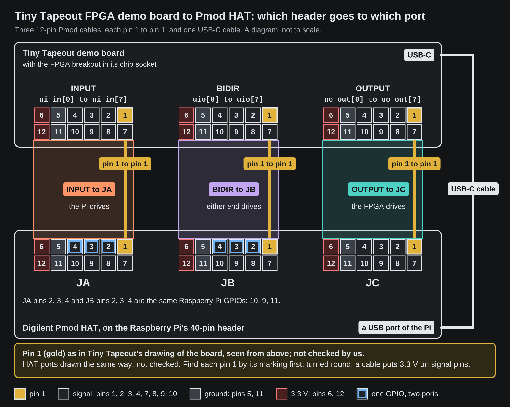

<!-- Generated by fpgas.online-test-designs docs/wiring/tt-fpga/gen.py from wiring.toml. Edit wiring.toml there, not this file. -->

For the person at the bench with a Tiny Tapeout demo board that has the FPGA breakout in its chip socket, joined to a Raspberry Pi carrying a Digilent Pmod HAT. This part shows which cable goes where.

{.only-light}
{.only-dark}

**Pin 1 on the picture.** Pin 1 (gold) is drawn where Tiny Tapeout's drawing of the demo board puts it, not checked by us: seen from above, Pmod edge toward you, the right-hand end of the row farther from the edge. The HAT's ports are drawn the same way; where their printed 1 is has not been checked by us. Find pin 1 on each connector by its marking before plugging a cable in. A 2x6 cable turned round puts 3.3 V on signal pins.

**Finding the headers.** The demo board's three Pmod connectors are printed INPUT (`ui_in`), BIDIR (`uio`) and OUTPUT (`uo_out`). They are on the bottom edge, in that order from left to right, with the board held so that its "Tiny Tapeout Demoboard" text reads upright. A 12-pin Pmod cable joins each header to its port on the Digilent Pmod HAT, pin 1 to pin 1: INPUT to JA, BIDIR to JB and OUTPUT to JC. A USB-C cable joins the demo board to a USB port of the Raspberry Pi.

**From the makers' documents, not checked by us on a board.**

**The demo board's sockets**

- The demo board's three Pmod connectors are printed INPUT (`ui_in`), BIDIR (`uio`) and OUTPUT (`uo_out`).
- Each is a female right-angle 2x6 socket, numbered as Digilent numbers a host port.
- The board's own 3.3 V supply is on pins 6 and 12 of each.
- In the maker's drawing of the board, pin 1 is the square pad under the label i0, b0 or o0, at the right-hand end of the row farther from the board edge. No "1" is printed there.

**The Pmod HAT's ports**

- JA, JB and JC are 2x6 Pmod host ports (female sockets).
- Pins 6 and 12 of each port are tied to the HAT's 3.3 V supply, and pins 5 and 11 are ground.
- Digilent's product photograph of the HAT shows a printed "1" beside one end of each port's inner row, and "3V3" and "GND" at the other end. This is legible for JA and JB; JC's label is not legible in the photograph.

**The cables**

- Both ends are female sockets, so each cable needs a male end at each board.
- A twelve-wire straight cable joins the two boards' 3.3 V supplies.
- What cable is fitted on our boards, and whether its pins 6 and 12 are connected, is not recorded; asked on 6 October 2026.
- Seen on the cameras of the boards shown as fpga-1 and fpga-3 on tinytapeout.fpgas.online on 6 October 2026: a black two-row housing is plugged on each of the demo board's three connectors, and a rainbow ribbon runs from them on fpga-1. Neither the wires nor any pin 1 mark can be made out.

On a Pmod connector pins 1 to 6 are one row and pins 7 to 12 the other; pins 5 and 11 are ground and pins 6 and 12 are 3.3 V. Where each of these statements comes from: [Sources](tt-fpga-sources.md).

| Demo board header | Signals | Pmod HAT port | Driven by | Checked |
|---|---|---|---|---|
| INPUT | `ui_in[0]` to `ui_in[7]` | JA | the Raspberry Pi | measured, except the wires on shared GPIOs |
| BIDIR | `uio[0]` to `uio[7]` | JB | either end | measured, except the wires on shared GPIOs |
| OUTPUT | `uo_out[0]` to `uo_out[7]` | JC | the FPGA | measured |

**Checked.** *measured*: read on boards on 29 September 2026 and 4 October 2026; for where and how, see [Sources](tt-fpga-sources.md). *from the design*: not read on a board; it follows the pattern of the measured wires (bit n of a group on the pin of that place in its header and port); not measured by us.

**Shared GPIOs.** The Digilent Pmod HAT joins some pins of two ports to one Raspberry Pi GPIO, so the two signals on them are one wire at the Raspberry Pi: GPIO10 is JA pin 2 and JB pin 2 (`ui_in[1]` and `uio[1]`); GPIO9 is JA pin 3 and JB pin 3 (`ui_in[2]` and `uio[2]`); GPIO11 is JA pin 4 and JB pin 4 (`ui_in[3]` and `uio[3]`). Whatever the Raspberry Pi puts on such a GPIO reaches both signals. A design that drives one of these `uio` signals drives the signal it shares with too, and the Raspberry Pi must then leave that GPIO as an input.

The USB-C cable carries the demo board's serial link to the Raspberry Pi: it is how the FPGA is loaded and how a design's serial port is reached. **The rule here: an FPGA on a demo board is loaded by streaming only**, and no code of ours may write, replace or delete a file on a demo board. The loader and the tests in this repository do not: the demo board's microcontroller reads the bitstream from the Raspberry Pi over the USB-C cable and passes it straight to the FPGA.
