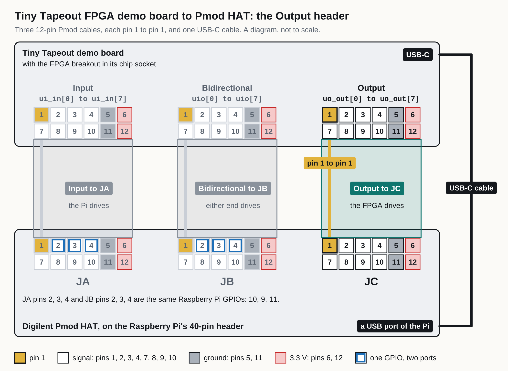

<!-- Generated by fpgas.online-test-designs docs/wiring/tt-fpga/gen.py from wiring.toml. Edit wiring.toml there, not this file. -->

For the person at the bench with a Tiny Tapeout demo board that has the FPGA breakout in its chip socket, joined to a Raspberry Pi carrying a Digilent Pmod HAT. This part covers the pins that load the FPGA, the seven-segment display, the clock, the reset and the LED.

### Loading the FPGA: its configuration pins

**The FPGA is loaded by streaming only.** The demo board's microcontroller reads the bitstream from the Raspberry Pi over the USB-C cable and passes it straight to the FPGA. No code of ours writes, replaces or deletes a file on a Tiny Tapeout demo board.

The FPGA breakout has no SPI flash (no memory chip that keeps a design), so the FPGA is loaded again after every power-up. Its four configuration pins go only to the demo board's microcontroller. None is on a Pmod header: no cable carries them, and the Raspberry Pi cannot reach them.

| iCE40 pin | The iCE40's name for it |
|---|---|
| 14 | `SPI_SO` |
| 15 | `SPI_SCK` |
| 16 | `SPI_SS` |
| 17 | `SPI_SI` |

The pins of the microcontroller (an RP2350 on a version 3 demo board) that our loader drives:

| RP2350 pin | What our loader uses it for |
|---|---|
| GPIO1 | the FPGA's configuration reset (CRESET_B): pulled low, then released, before a load |
| GPIO3 | data out of the microcontroller: the bitstream |
| GPIO5 | select |
| GPIO6 | clock |

Which microcontroller pin is wired to which of the four iCE40 pins is not recorded in this repository and has not been measured by us.

### The seven-segment display

The display is on the eight `uo_out` signals, the same ones that go to the Output header: whatever a design puts on `uo_out` shows on the display and reaches the Raspberry Pi too. Segments a to f are the six outer bars in order round the ring, g is the middle bar, and the dot is the decimal point.

**Finding the headers.** The demo board has three 12-pin Pmod headers side by side along its bottom edge. Seen from above, they are: Input (`ui_in`) on the left, Bidirectional (`uio`) in the middle, Output (`uo_out`) on the right. The Digilent Pmod HAT has three ports: JA, JB and JC. A 12-pin Pmod cable joins the header to its port, pin 1 to pin 1: Output to JC. A USB-C cable joins the demo board to a USB port of the Raspberry Pi.

**Not checked by us against a board:** the order of the headers (it is from Tiny Tapeout's documents), what is printed beside each header and each port, and where pin 1 is on each connector. Input, Bidirectional and Output are this page's names for the headers; JA, JB and JC are Digilent's names for the ports. On a Pmod connector pins 1 to 6 are one row and pins 7 to 12 the other; pins 5 and 11 are ground and pins 6 and 12 are 3.3 V. Whether the cables in use join the 3.3 V pins of the two boards is not recorded.

| Segment | Signal | iCE40 pin | Demo board | Pmod HAT | Pi GPIO |
|---|---|---|---|---|---|
| a | `uo_out[0]` | 38 | Output pin 1 | JC pin 1 | GPIO16 |
| b | `uo_out[1]` | 42 | Output pin 2 | JC pin 2 | GPIO14 |
| c | `uo_out[2]` | 43 | Output pin 3 | JC pin 3 | GPIO15 |
| d | `uo_out[3]` | 44 | Output pin 4 | JC pin 4 | GPIO17 |
| e | `uo_out[4]` | 45 | Output pin 7 | JC pin 7 | GPIO4 |
| f | `uo_out[5]` | 46 | Output pin 8 | JC pin 8 | GPIO12 |
| g | `uo_out[6]` | 47 | Output pin 9 | JC pin 9 | GPIO5 |
| dot | `uo_out[7]` | 48 | Output pin 10 | JC pin 10 | GPIO6 |

**Checked.** *measured*: read with the pin identification design (each FPGA pin sends its own pin number, and the Raspberry Pi reads which number arrives on which GPIO) on 29 September 2026, and again by the boot check (`fpgas-verify`) on 4 October 2026, on the three Tiny Tapeout FPGA boards seen at welland's sw2 p33, p35 and p36 on those days; a fourth, seen at p34, was not powered either time. The measurement joins the iCE40 pin to the Pi GPIO; the connector pin numbers in between are from the two boards' documents. Which segment each signal lights is from Tiny Tapeout's board specification; not verified by us segment by segment.

### The clock, the reset and the LED

None of these is on a Pmod header: no cable carries them, and the Raspberry Pi cannot reach them. *Name in our designs* is the name in `designs/_shared/tt_fpga_platform.py`.

| iCE40 pin | Name in our designs | What it is | RP2350 pin |
|---|---|---|---|
| 20 | `clk_rp2040` | the clock into the design: 50 MHz, made by the microcontroller | GPIO16 |
| 37 | `rst_n` | the design's reset: low resets it | GPIO14 (not verified by us) |
| 39 | `rgb_led.r` | red of the three-colour LED: low lights it | none |
| 40 | `rgb_led.g` | green of the three-colour LED: low lights it | none |
| 41 | `rgb_led.b` | blue of the three-colour LED: low lights it | none |

### The same 24 signals at the microcontroller

For a version 3 demo board, whose microcontroller is an RP2350; a version 2 demo board has an RP2040 with other pin numbers, and our loader is written for version 3. Bit 0 is on the first GPIO of each range and bit 7 on the last.

| Signals | RP2350 pins |
|---|---|
| `ui_in[0]` to `ui_in[7]` | GPIO17 to GPIO24 |
| `uio[0]` to `uio[7]` | GPIO25 to GPIO32 |
| `uo_out[0]` to `uo_out[7]` | GPIO33 to GPIO40 |

After a load made with `--gpio-release` (every Pmod test uses it), our loader sets these 24 pins to inputs, so that only the FPGA and the Raspberry Pi drive the signals.
