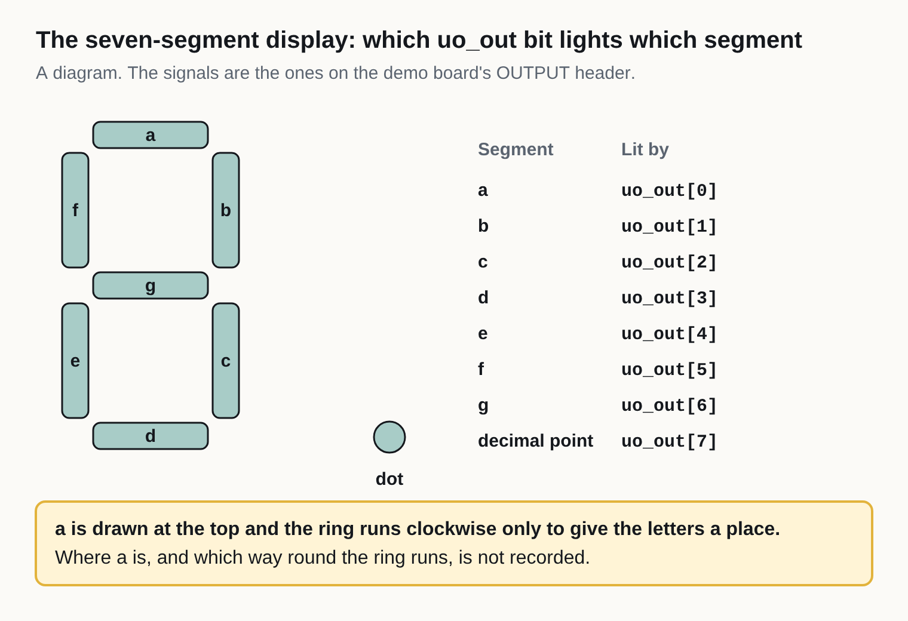
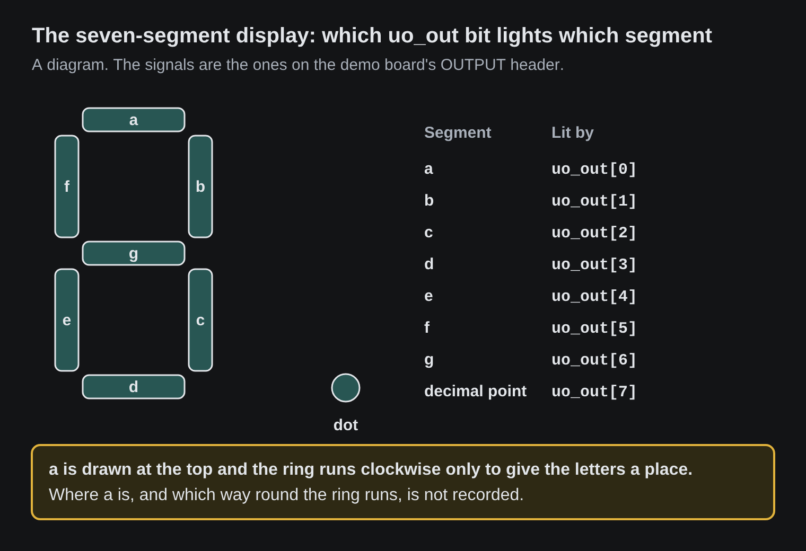

<!-- Generated by fpgas.online-test-designs docs/wiring/tt-fpga/gen.py from wiring.toml. Edit wiring.toml there, not this file. -->

For the person at the bench with a Tiny Tapeout demo board that has the FPGA breakout in its chip socket, joined to a Raspberry Pi carrying a Digilent Pmod HAT. This part covers the pins that load the FPGA, the seven-segment display, the clock, the reset and the LED.

### Loading the FPGA: its configuration pins

**The rule here: an FPGA on a demo board is loaded by streaming only**, and no code of ours may write, replace or delete a file on a demo board. The loader and the tests in fpgas.online-test-designs do not: the demo board's microcontroller reads the bitstream from the Raspberry Pi over the USB-C cable and passes it straight to the FPGA.

The FPGA breakout has no SPI flash (no memory chip that keeps a design), so the FPGA is loaded again after every power-up. Its four configuration pins go only to the demo board's microcontroller. None is on a Pmod header: no cable carries them, and the Raspberry Pi cannot reach them.

| iCE40 pin | The iCE40's name for it |
|---|---|
| 14 | `SPI_SO` |
| 15 | `SPI_SCK` |
| 16 | `SPI_SS` |
| 17 | `SPI_SI` |

The pins of the microcontroller (an RP2350 on a version 3 demo board) that our loader drives:

| RP2350 pin | What our loader uses it for |
|---|---|
| GPIO1 | the FPGA's configuration reset (CRESET_B): pulled low, then released, before a load |
| GPIO3 | data out of the microcontroller: the bitstream |
| GPIO5 | select |
| GPIO6 | clock |

Which microcontroller pin is wired to which of the four iCE40 pins is not recorded in this repository and has not been measured by us.

### The seven-segment display

The display is on the eight `uo_out` signals, the same ones that go to the OUTPUT header: whatever a design puts on `uo_out` shows on the display and reaches the Raspberry Pi too. Segments a to f are the six bars of the outer ring, in the order `designs/tt-display` runs round it; where a is, and which way round the ring that order goes, is not recorded and not verified by us. g is the middle bar and the dot is the decimal point.

{.only-light}
{.only-dark}

**Finding the headers.** The demo board's three Pmod connectors are printed INPUT (`ui_in`), BIDIR (`uio`) and OUTPUT (`uo_out`). They are on the bottom edge, in that order from left to right, with the board held so that its "Tiny Tapeout Demoboard" text reads upright. A ribbon cable, its 3.3 V pins expected not to be connected, joins the header to its port on the Digilent Pmod HAT, pin 1 to pin 1: OUTPUT to JC. A USB-C cable joins the demo board to a USB port of the Raspberry Pi.

How the sockets and cables are made, and what is not yet known about the cables: see [the cables page](tt-fpga-cables.md).

| Segment | Signal | iCE40 pin | Demo board | Pmod HAT | Pi GPIO |
|---|---|---|---|---|---|
| a | `uo_out[0]` | 38 | OUTPUT pin 1 | JC pin 1 | GPIO16 |
| b | `uo_out[1]` | 42 | OUTPUT pin 2 | JC pin 2 | GPIO14 |
| c | `uo_out[2]` | 43 | OUTPUT pin 3 | JC pin 3 | GPIO15 |
| d | `uo_out[3]` | 44 | OUTPUT pin 4 | JC pin 4 | GPIO17 |
| e | `uo_out[4]` | 45 | OUTPUT pin 7 | JC pin 7 | GPIO4 |
| f | `uo_out[5]` | 46 | OUTPUT pin 8 | JC pin 8 | GPIO12 |
| g | `uo_out[6]` | 47 | OUTPUT pin 9 | JC pin 9 | GPIO5 |
| dot | `uo_out[7]` | 48 | OUTPUT pin 10 | JC pin 10 | GPIO6 |

**Checked.** *measured*: read on boards on 29 September 2026 and 4 October 2026; for where and how, see [Sources](tt-fpga-sources.md). Which segment each signal lights is from Tiny Tapeout's board specification; not verified by us segment by segment.

### The clock, the reset and the LED

None of these is on a Pmod header: no cable carries them, and the Raspberry Pi cannot reach them. *Name in our designs* is the name in `designs/_shared/tt_fpga_platform.py`.

| iCE40 pin | Name in our designs | What it is | RP2350 pin |
|---|---|---|---|
| 20 | `clk_rp2040` | the clock into the design, made by the microcontroller: 50 MHz | GPIO16 |
| 37 | `rst_n` | the design's reset: low resets it | GPIO14 (not verified by us) |
| 39 | `rgb_led.r` | red of the three-colour LED: low lights it | not recorded |
| 40 | `rgb_led.g` | green of the three-colour LED: low lights it | not recorded |
| 41 | `rgb_led.b` | blue of the three-colour LED: low lights it | not recorded |

### The same 24 signals at the microcontroller

For a version 3 demo board, whose microcontroller is an RP2350; a version 2 demo board has an RP2040 with other pin numbers, and our loader is written for version 3. Bit 0 is on the first GPIO of each range and bit 7 on the last.

| Signals | RP2350 pins |
|---|---|
| `ui_in[0]` to `ui_in[7]` | GPIO17 to GPIO24 |
| `uio[0]` to `uio[7]` | GPIO25 to GPIO32 |
| `uo_out[0]` to `uo_out[7]` | GPIO33 to GPIO40 |

After a load made with `--gpio-release`, our loader sets these 24 pins to inputs, so that only the FPGA and the Raspberry Pi drive the signals.
