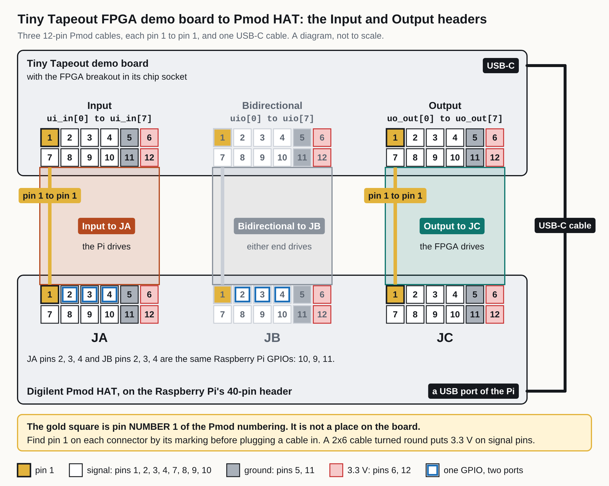

<!-- Generated by fpgas.online-test-designs docs/wiring/tt-fpga/gen.py from wiring.toml. Edit wiring.toml there, not this file. -->

For the person at the bench with a Tiny Tapeout demo board that has the FPGA breakout in its chip socket, joined to a Raspberry Pi carrying a Digilent Pmod HAT. This part covers the design's eight inputs (`ui_in`) and the design's eight outputs (`uo_out`), wire by wire.

**Pin 1 on the picture.** The gold square is pin NUMBER 1 of the Pmod numbering. It is not a place on the board. Find pin 1 on each connector by its marking before plugging a cable in. A 2x6 cable turned round puts 3.3 V on signal pins.

**Finding the headers.** The demo board has three 12-pin Pmod headers side by side along its bottom edge. Seen from above, they are: Input (`ui_in`) on the left, Bidirectional (`uio`) in the middle, Output (`uo_out`) on the right. The Digilent Pmod HAT has three ports: JA, JB and JC. A 12-pin Pmod cable joins each header to its port, pin 1 to pin 1: Input to JA and Output to JC. A USB-C cable joins the demo board to a USB port of the Raspberry Pi.

**Not checked by us against a board:** the order of the headers (it is from Tiny Tapeout's documents), what is printed beside each header and each port, and where pin 1 is on each connector. Input, Bidirectional and Output are this page's names for the headers; JA, JB and JC are Digilent's names for the ports. On a Pmod connector pins 1 to 6 are one row and pins 7 to 12 the other; pins 5 and 11 are ground and pins 6 and 12 are 3.3 V. Each board puts its own 3.3 V supply on those pins (the Digilent Pmod HAT from the Raspberry Pi's). Whether the cables in use join the 3.3 V pins of the two boards is not recorded, and nor is the kind of cable (what is on each of its ends).

**Reading the table.** *iCE40 pin* is the pin number of the FPGA itself (a Lattice iCE40UP5K in its 48-pin SG48 package). *Signal* is the Tiny Tapeout name a design uses. *Demo board* and *Pmod HAT* give the connector and its pin; a cable joins pins of the same number. *Pi GPIO* is the Raspberry Pi's GPIO number (the BCM number), not a position on its 40-pin header.

### `ui_in`: the design's eight inputs

The Raspberry Pi drives these; the FPGA reads them. They are on the demo board's Input header, cabled to Pmod HAT port JA. The demo board's DIP switches are on these signals too (from `docs/hardware/tt-fpga.md`; not verified by us). How the switches must be set while the Raspberry Pi drives these signals is not recorded.

| iCE40 pin | Signal | Demo board | Pmod HAT | Pi GPIO | Checked |
|---|---|---|---|---|---|
| 13 | `ui_in[0]` | Input pin 1 | JA pin 1 | GPIO8 | measured |
| 19 | `ui_in[1]` | Input pin 2 | JA pin 2 | GPIO10 (shared) | from the design |
| 18 | `ui_in[2]` | Input pin 3 | JA pin 3 | GPIO9 (shared) | from the design |
| 21 | `ui_in[3]` | Input pin 4 | JA pin 4 | GPIO11 (shared) | from the design |
| 23 | `ui_in[4]` | Input pin 7 | JA pin 7 | GPIO19 | measured |
| 25 | `ui_in[5]` | Input pin 8 | JA pin 8 | GPIO21 | measured |
| 26 | `ui_in[6]` | Input pin 9 | JA pin 9 | GPIO20 | measured |
| 27 | `ui_in[7]` | Input pin 10 | JA pin 10 | GPIO18 | measured |

**Checked.** *measured*: read on boards on 29 September 2026 and 4 October 2026; for where and how, see Sources (`tt-fpga-sources.md`). *from the design*: not read on a board; it follows the pattern of the measured wires (bit n of a group on the pin of that place in its header and port); not measured by us.

**Shared GPIOs.** The Digilent Pmod HAT joins some pins of two ports to one Raspberry Pi GPIO, so the two signals on them are one wire at the Raspberry Pi: GPIO10 is JA pin 2 and JB pin 2 (`ui_in[1]` and `uio[1]`); GPIO9 is JA pin 3 and JB pin 3 (`ui_in[2]` and `uio[2]`); GPIO11 is JA pin 4 and JB pin 4 (`ui_in[3]` and `uio[3]`). Whatever the Raspberry Pi puts on such a GPIO reaches both signals. A design that drives one of these `uio` signals drives the signal it shares with too, and the Raspberry Pi must then leave that GPIO as an input.

### `uo_out`: the design's eight outputs

The FPGA drives these; the Raspberry Pi reads them. The same eight signals light the demo board's seven-segment display. They are on the demo board's Output header, cabled to Pmod HAT port JC.

| iCE40 pin | Signal | Demo board | Pmod HAT | Pi GPIO | Checked |
|---|---|---|---|---|---|
| 38 | `uo_out[0]` | Output pin 1 | JC pin 1 | GPIO16 | measured |
| 42 | `uo_out[1]` | Output pin 2 | JC pin 2 | GPIO14 | measured |
| 43 | `uo_out[2]` | Output pin 3 | JC pin 3 | GPIO15 | measured |
| 44 | `uo_out[3]` | Output pin 4 | JC pin 4 | GPIO17 | measured |
| 45 | `uo_out[4]` | Output pin 7 | JC pin 7 | GPIO4 | measured |
| 46 | `uo_out[5]` | Output pin 8 | JC pin 8 | GPIO12 | measured |
| 47 | `uo_out[6]` | Output pin 9 | JC pin 9 | GPIO5 | measured |
| 48 | `uo_out[7]` | Output pin 10 | JC pin 10 | GPIO6 | measured |

**Checked.** *measured*: read on boards on 29 September 2026 and 4 October 2026; for where and how, see Sources (`tt-fpga-sources.md`).
